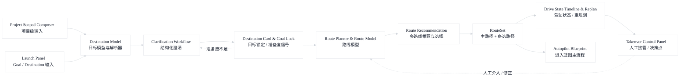

# 02. 目标澄清与路线规划图

```mermaid
%%{init: {'theme':'base','flowchart': {'curve': 'basis', 'htmlLabels': true}, 'themeVariables': {
  'background':'transparent',
  'primaryColor':'#ffffff',
  'primaryTextColor':'#111827',
  'primaryBorderColor':'#e5e7eb',
  'secondaryColor':'#ffffff',
  'tertiaryColor':'#ffffff',
  'lineColor':'#d1d5db',
  'defaultLinkColor':'#d1d5db',
  'clusterBkg':'transparent',
  'clusterBorder':'#d1d5db',
  'mainBkg':'#ffffff',
  'nodeBorder':'#e5e7eb',
  'fontSize':'16px',
  'fontFamily':'Arial, PingFang SC, Microsoft YaHei, sans-serif'
}} }%%
flowchart LR
    COMPOSER[Project Scoped Composer<br/>项目级输入] --> DEST[Destination Model<br/>目标模型与解析器]
    LAUNCH[Launch Panel<br/>Goal / Destination 输入] --> DEST
    DEST --> CLARIFY[Clarification Workflow<br/>结构化澄清]
    CLARIFY --> GOAL_LOCK[Destination Card & Goal Lock<br/>目标锁定 / 准备度信号]
    GOAL_LOCK --> ROUTE_MODEL[Route Planner & Route Model<br/>路线模型]
    ROUTE_MODEL --> ROUTE_REC[Route Recommendation<br/>多路线推荐与选择]
    ROUTE_REC --> ROUTE_SET[RouteSet<br/>主路径 + 备选路径]
    ROUTE_SET --> REPLAN[Drive State Timeline & Replan<br/>驾驶状态 / 重规划]
    REPLAN --> TAKEOVER[Takeover Control Panel<br/>人工接管 / 决策点]
    TAKEOVER -.人工介入 / 修正.-> ROUTE_MODEL
    GOAL_LOCK -.准备度不足.-> CLARIFY
    ROUTE_SET --> AP[Autopilot Blueprint<br/>进入蓝图主流程]
```
