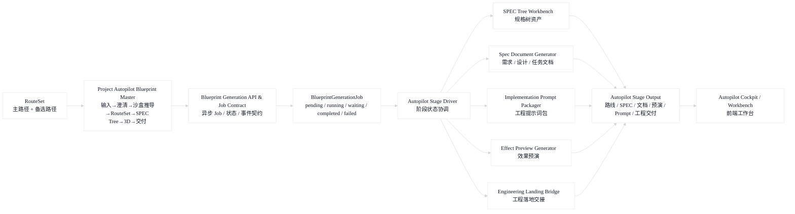

# 03. Autopilot Blueprint 主流程图

```mermaid
%%{init: {'theme':'base','flowchart': {'curve': 'basis', 'htmlLabels': true}, 'themeVariables': {
  'background':'transparent',
  'primaryColor':'#ffffff',
  'primaryTextColor':'#111827',
  'primaryBorderColor':'#e5e7eb',
  'secondaryColor':'#ffffff',
  'tertiaryColor':'#ffffff',
  'lineColor':'#d1d5db',
  'defaultLinkColor':'#d1d5db',
  'clusterBkg':'transparent',
  'clusterBorder':'#d1d5db',
  'mainBkg':'#ffffff',
  'nodeBorder':'#e5e7eb',
  'fontSize':'16px',
  'fontFamily':'Arial, PingFang SC, Microsoft YaHei, sans-serif'
}} }%%
flowchart LR
    ROUTE_SET[RouteSet<br/>主路径 + 备选路径] --> AP_MASTER[Project Autopilot Blueprint Master<br/>输入→澄清→沙盒推导→RouteSet→SPEC Tree→3D→交付]
    AP_MASTER --> GEN_API[Blueprint Generation API & Job Contract<br/>异步 Job / 状态 / 事件契约]
    GEN_API --> JOB[BlueprintGenerationJob<br/>pending / running / waiting / completed / failed]
    JOB --> STAGE[Autopilot Stage Driver<br/>阶段状态协调]
    STAGE --> SPEC_TREE[SPEC Tree Workbench<br/>规格树资产]
    STAGE --> SPEC_DOC[Spec Document Generator<br/>需求 / 设计 / 任务文档]
    STAGE --> PROMPT_PACK[Implementation Prompt Packager<br/>工程提示词包]
    STAGE --> EFFECT_PREVIEW[Effect Preview Generator<br/>效果预演]
    STAGE --> HANDOFF[Engineering Landing Bridge<br/>工程落地交接]
    SPEC_TREE --> AP_OUT[Autopilot Stage Output<br/>路线 / SPEC / 文档 / 预演 / Prompt / 工程交付]
    SPEC_DOC --> AP_OUT
    PROMPT_PACK --> AP_OUT
    EFFECT_PREVIEW --> AP_OUT
    HANDOFF --> AP_OUT
    AP_OUT --> COCKPIT[Autopilot Cockpit / Workbench<br/>前端工作台]
```
