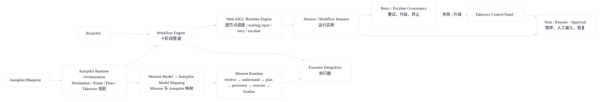

# 04. Runtime / Mission / Workflow 编排图

```mermaid
%%{init: {'theme':'base','flowchart': {'curve': 'basis', 'htmlLabels': true}, 'themeVariables': {
  'background':'transparent',
  'primaryColor':'#ffffff',
  'primaryTextColor':'#111827',
  'primaryBorderColor':'#e5e7eb',
  'secondaryColor':'#ffffff',
  'tertiaryColor':'#ffffff',
  'lineColor':'#d1d5db',
  'defaultLinkColor':'#d1d5db',
  'clusterBkg':'transparent',
  'clusterBorder':'#d1d5db',
  'mainBkg':'#ffffff',
  'nodeBorder':'#e5e7eb',
  'fontSize':'16px',
  'fontFamily':'Arial, PingFang SC, Microsoft YaHei, sans-serif'
}} }%%
flowchart LR
    AP_MASTER[Autopilot Blueprint] --> RUNTIME_ORCH[Autopilot Runtime Orchestration<br/>Destination / Route / Fleet / Takeover 投影]
    RUNTIME_ORCH --> MISSION_MAP[Mission Model → Autopilot Model Mapping<br/>Mission 与 Autopilot 映射]
    MISSION_MAP --> MISSION_RT[Mission Runtime<br/>receive → understand → plan → provision → execute → finalize]
    RUNTIME_ORCH --> WORKFLOW_ENGINE[Workflow Engine<br/>十阶段管道]
    ROUTE_SET[RouteSet] --> WORKFLOW_ENGINE
    WORKFLOW_ENGINE --> WEB_AIGC_RT[Web-AIGC Runtime Engine<br/>图节点调度 / waiting input / retry / escalate]
    WEB_AIGC_RT --> INSTANCE[Session / Workflow Instance<br/>运行实例]
    INSTANCE --> WAIT_RESUME[Wait / Resume / Approval<br/>暂停、人工输入、恢复]
    INSTANCE --> RETRY_ESC[Retry / Escalate Governance<br/>重试、升级、终止]
    TAKEOVER[Takeover Control Panel] --> WAIT_RESUME
    RETRY_ESC -.失败 / 升级.-> TAKEOVER
    MISSION_RT --> EXEC[Executor Integration<br/>执行器]
    WORKFLOW_ENGINE --> EXEC
```
