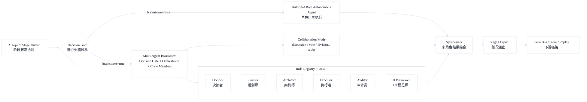

# 05. 多 Agent 协作总图

```mermaid
%%{init: {'theme':'base','flowchart': {'curve': 'basis', 'htmlLabels': true}, 'themeVariables': {
  'background':'transparent',
  'primaryColor':'#ffffff',
  'primaryTextColor':'#111827',
  'primaryBorderColor':'#e5e7eb',
  'secondaryColor':'#ffffff',
  'tertiaryColor':'#ffffff',
  'lineColor':'#d1d5db',
  'defaultLinkColor':'#d1d5db',
  'clusterBkg':'transparent',
  'clusterBorder':'#d1d5db',
  'mainBkg':'#ffffff',
  'nodeBorder':'#e5e7eb',
  'fontSize':'16px',
  'fontFamily':'Arial, PingFang SC, Microsoft YaHei, sans-serif'
}} }%%
flowchart LR
    STAGE[Autopilot Stage Driver<br/>阶段状态协调] --> DG{Decision Gate<br/>是否头脑风暴}
    DG -->|brainstorm=false| ROLE_AGENT[Autopilot Role Autonomous Agent<br/>角色自主执行]
    DG -->|brainstorm=true| BRAINSTORM[Multi-Agent Brainstorm<br/>Decision Gate + Orchestrator + Crew Members]
    subgraph ROLES[Role Registry / Crew]
      DECIDER[Decider<br/>决策者]
      PLANNER[Planner<br/>规划师]
      ARCH[Architect<br/>架构师]
      EXEC[Executor<br/>执行者]
      AUD[Auditor<br/>审计员]
      UIP[UI Previewer<br/>UI 预览师]
    end
    BRAINSTORM --> COLLAB[Collaboration Mode<br/>discussion / vote / division / audit]
    BRAINSTORM --> ROLES
    ROLE_AGENT --> SYNTH[Synthesizer<br/>多角色结果综合]
    ROLES --> SYNTH
    COLLAB --> SYNTH
    SYNTH --> STAGE_OUT[Stage Output<br/>阶段输出]
    STAGE_OUT --> EVENTS[EventBus / Store / Replay<br/>下游链路]
```
