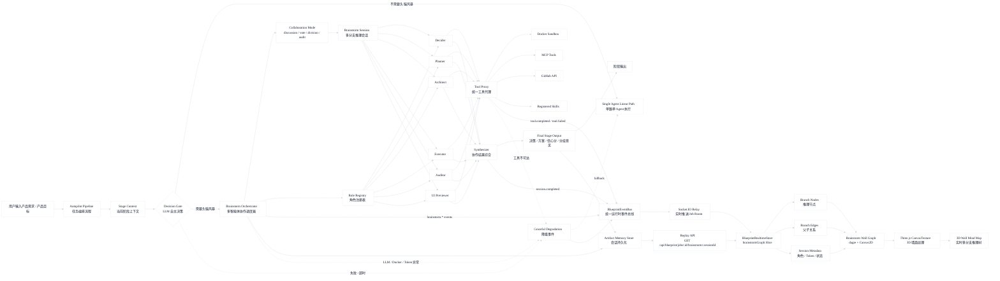

# 06. 多 Agent Brainstorm 细节图

```mermaid
%%{init: {'theme':'base','flowchart': {'curve': 'basis', 'htmlLabels': true}, 'themeVariables': {
  'background':'transparent',
  'primaryColor':'#ffffff',
  'primaryTextColor':'#111827',
  'primaryBorderColor':'#e5e7eb',
  'secondaryColor':'#ffffff',
  'tertiaryColor':'#ffffff',
  'lineColor':'#d1d5db',
  'defaultLinkColor':'#d1d5db',
  'clusterBkg':'transparent',
  'clusterBorder':'#d1d5db',
  'mainBkg':'#ffffff',
  'nodeBorder':'#e5e7eb',
  'fontSize':'16px',
  'fontFamily':'Arial, PingFang SC, Microsoft YaHei, sans-serif'
}} }%%
flowchart LR
    U[用户输入产品需求 / 产品目标] --> AP[Autopilot Pipeline<br/>任务编排流程]
    AP --> SC[Stage Context<br/>当前阶段上下文]
    SC --> DG{Decision Gate<br/>LLM 自主决策}
    DG -->|不需要头脑风暴| SA[Single Agent Linear Path<br/>单路单 Agent 执行]
    DG -->|需要头脑风暴| BO[Brainstorm Orchestrator<br/>多智能体协作调度器]
    BO --> MODE[Collaboration Mode<br/>discussion / vote / division / audit]
    BO --> RR[Role Registry<br/>角色注册表]
    MODE --> BS[Brainstorm Session<br/>多分支推理会话]
    RR --> D[Decider]
    RR --> P[Planner]
    RR --> A[Architect]
    RR --> E[Executor]
    RR --> AU[Auditor]
    RR --> UI[UI Previewer]
    BS --> D
    BS --> P
    BS --> A
    BS --> E
    BS --> AU
    BS --> UI
    D --> TP[Tool Proxy<br/>统一工具代理]
    P --> TP
    A --> TP
    E --> TP
    AU --> TP
    UI --> TP
    TP --> DOCKER[Docker Sandbox]
    TP --> MCP[MCP Tools]
    TP --> GH[GitHub API]
    TP --> SK[Registered Skills]
    D --> SYN[Synthesizer<br/>协作结果综合]
    P --> SYN
    A --> SYN
    E --> SYN
    AU --> SYN
    UI --> SYN
    SYN --> RESULT[Final Stage Output<br/>决策 / 方案 / 信心分 / 分歧意见]
    RESULT --> SA_OUT[阶段输出]
    BO -->|brainstorm.* events| EB[BlueprintEventBus<br/>统一运行时事件总线]
    TP -->|tool.completed / tool.failed| EB
    SYN -->|session.completed| EB
    EB --> SOCKET[Socket.IO Relay<br/>实时推送 Job Room]
    SOCKET --> STORE[BlueprintRealtimeStore<br/>brainstormGraph Slice]
    STORE --> NODES[Branch Nodes<br/>推理节点]
    STORE --> EDGES[Branch Edges<br/>父子关系]
    STORE --> META[Session Metadata<br/>角色 / Token / 状态]
    NODES --> WG[Brainstorm Wall Graph<br/>dagre + Canvas2D]
    EDGES --> WG
    META --> WG
    WG --> TEX[Three.js CanvasTexture<br/>3D 墙面纹理]
    TEX --> WALL[3D Wall Mind Map<br/>实时多分支推理树]
    BO --> MS[Artifact Memory Store<br/>会话持久化]
    RESULT --> MS
    MS --> REPLAY[Replay API<br/>GET /api/blueprint/jobs/:id/brainstorm/:sessionId]
    REPLAY --> STORE
    DG -.失败 / 超时.-> DEG[Graceful Degradation<br/>降级事件]
    BO -.LLM / Docker / Token 异常.-> DEG
    TP -.工具不可达.-> DEG
    DEG -.fallback.-> SA
    DEG --> EB
```
