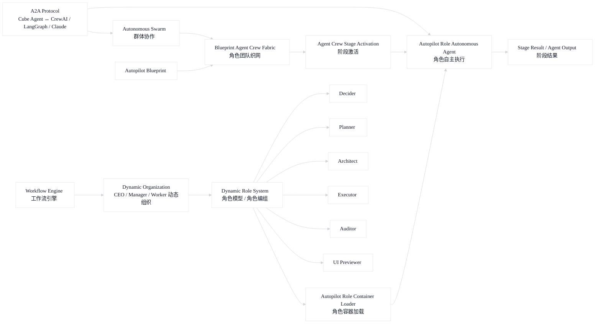

# 07. 角色系统与动态组织图

```mermaid
%%{init: {'theme':'base','flowchart': {'curve': 'basis', 'htmlLabels': true}, 'themeVariables': {
  'background':'transparent',
  'primaryColor':'#ffffff',
  'primaryTextColor':'#111827',
  'primaryBorderColor':'#e5e7eb',
  'secondaryColor':'#ffffff',
  'tertiaryColor':'#ffffff',
  'lineColor':'#d1d5db',
  'defaultLinkColor':'#d1d5db',
  'clusterBkg':'transparent',
  'clusterBorder':'#d1d5db',
  'mainBkg':'#ffffff',
  'nodeBorder':'#e5e7eb',
  'fontSize':'16px',
  'fontFamily':'Arial, PingFang SC, Microsoft YaHei, sans-serif'
}} }%%
flowchart LR
    WORKFLOW[Workflow Engine<br/>工作流引擎] --> DYN_ORG[Dynamic Organization<br/>CEO / Manager / Worker 动态组织]
    DYN_ORG --> ROLE_SYS[Dynamic Role System<br/>角色模型 / 角色编组]
    ROLE_SYS --> ROLE_CONTAINER[Autopilot Role Container Loader<br/>角色容器加载]
    ROLE_CONTAINER --> ROLE_AGENT[Autopilot Role Autonomous Agent<br/>角色自主执行]
    AP_MASTER[Autopilot Blueprint] --> CREW_FABRIC[Blueprint Agent Crew Fabric<br/>角色团队织网]
    CREW_FABRIC --> STAGE_ACT[Agent Crew Stage Activation<br/>阶段激活]
    STAGE_ACT --> ROLE_AGENT
    ROLE_SYS --> DECIDER[Decider]
    ROLE_SYS --> PLANNER[Planner]
    ROLE_SYS --> ARCH[Architect]
    ROLE_SYS --> EXEC[Executor]
    ROLE_SYS --> AUD[Auditor]
    ROLE_SYS --> UIP[UI Previewer]
    A2A[A2A Protocol<br/>Cube Agent ↔ CrewAI / LangGraph / Claude] --> ROLE_AGENT
    A2A --> SWARM[Autonomous Swarm<br/>群体协作]
    SWARM --> CREW_FABRIC
    ROLE_AGENT --> OUTPUT[Stage Result / Agent Output<br/>阶段结果]
```
