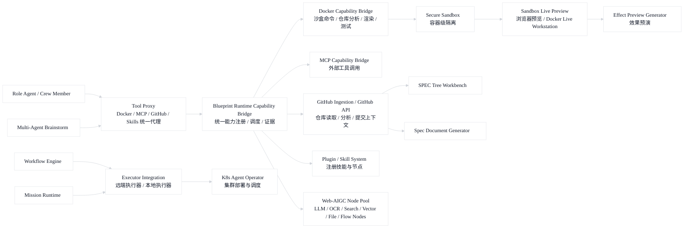

# 08. 工具代理与能力桥图

```mermaid
%%{init: {'theme':'base','flowchart': {'curve': 'basis', 'htmlLabels': true}, 'themeVariables': {
  'background':'transparent',
  'primaryColor':'#ffffff',
  'primaryTextColor':'#111827',
  'primaryBorderColor':'#e5e7eb',
  'secondaryColor':'#ffffff',
  'tertiaryColor':'#ffffff',
  'lineColor':'#d1d5db',
  'defaultLinkColor':'#d1d5db',
  'clusterBkg':'transparent',
  'clusterBorder':'#d1d5db',
  'mainBkg':'#ffffff',
  'nodeBorder':'#e5e7eb',
  'fontSize':'16px',
  'fontFamily':'Arial, PingFang SC, Microsoft YaHei, sans-serif'
}} }%%
flowchart LR
    ROLE_AGENT[Role Agent / Crew Member] --> TOOL_PROXY[Tool Proxy<br/>Docker / MCP / GitHub / Skills 统一代理]
    BRAINSTORM[Multi-Agent Brainstorm] --> TOOL_PROXY
    TOOL_PROXY --> CAP_BRIDGE[Blueprint Runtime Capability Bridge<br/>统一能力注册 / 调度 / 证据]
    CAP_BRIDGE --> DOCKER[Docker Capability Bridge<br/>沙盒命令 / 仓库分析 / 渲染 / 测试]
    CAP_BRIDGE --> MCP[MCP Capability Bridge<br/>外部工具调用]
    CAP_BRIDGE --> GH[GitHub Ingestion / GitHub API<br/>仓库读取 / 分析 / 提交上下文]
    CAP_BRIDGE --> SKILL[Plugin / Skill System<br/>注册技能与节点]
    CAP_BRIDGE --> NODE_POOL[Web-AIGC Node Pool<br/>LLM / OCR / Search / Vector / File / Flow Nodes]
    DOCKER --> SECURE_SANDBOX[Secure Sandbox<br/>容器级隔离]
    SECURE_SANDBOX --> PREVIEW[Sandbox Live Preview<br/>浏览器预览 / Docker Live Workstation]
    PREVIEW --> EFFECT[Effect Preview Generator<br/>效果预演]
    WORKFLOW[Workflow Engine] --> EXEC[Executor Integration<br/>远端执行器 / 本地执行器]
    MISSION[Mission Runtime] --> EXEC
    EXEC --> K8S[K8s Agent Operator<br/>集群部署与调度]
    GH --> SPEC_TREE[SPEC Tree Workbench]
    GH --> SPEC_DOC[Spec Document Generator]
```
