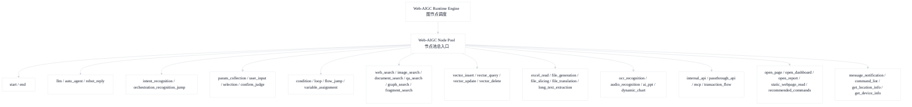

# 09. Web-AIGC 节点池图

```mermaid
%%{init: {'theme':'base','flowchart': {'curve': 'basis', 'htmlLabels': true}, 'themeVariables': {
  'background':'transparent',
  'primaryColor':'#ffffff',
  'primaryTextColor':'#111827',
  'primaryBorderColor':'#e5e7eb',
  'secondaryColor':'#ffffff',
  'tertiaryColor':'#ffffff',
  'lineColor':'#d1d5db',
  'defaultLinkColor':'#d1d5db',
  'clusterBkg':'transparent',
  'clusterBorder':'#d1d5db',
  'mainBkg':'#ffffff',
  'nodeBorder':'#e5e7eb',
  'fontSize':'16px',
  'fontFamily':'Arial, PingFang SC, Microsoft YaHei, sans-serif'
}} }%%
flowchart TB
    NODE_POOL[Web-AIGC Node Pool<br/>节点池总入口]
    NODE_POOL --> START[start / end]
    NODE_POOL --> LLM[llm / auto_agent / robot_reply]
    NODE_POOL --> INTENT[intent_recognition / orchestration_recognition_jump]
    NODE_POOL --> PARAM[param_collection / user_input / selection / confirm_judge]
    NODE_POOL --> FLOW[condition / loop / flow_jump / variable_assignment]
    NODE_POOL --> SEARCH[web_search / image_search / document_search / qa_search / graph_search / fragment_search]
    NODE_POOL --> VECTOR[vector_insert / vector_query / vector_update / vector_delete]
    NODE_POOL --> FILE[excel_read / file_generation / file_slicing / file_translation / long_text_extraction]
    NODE_POOL --> MEDIA[ocr_recognition / audio_recognition / ai_ppt / dynamic_chart]
    NODE_POOL --> API[internal_api / passthrough_api / mcp / transaction_flow]
    NODE_POOL --> UI[open_page / open_dashboard / open_report / static_webpage_read / recommended_commands]
    NODE_POOL --> NOTIFY[message_notification / command_list / get_location_info / get_device_info]
    RT[Web-AIGC Runtime Engine<br/>图节点调度] --> NODE_POOL
```
