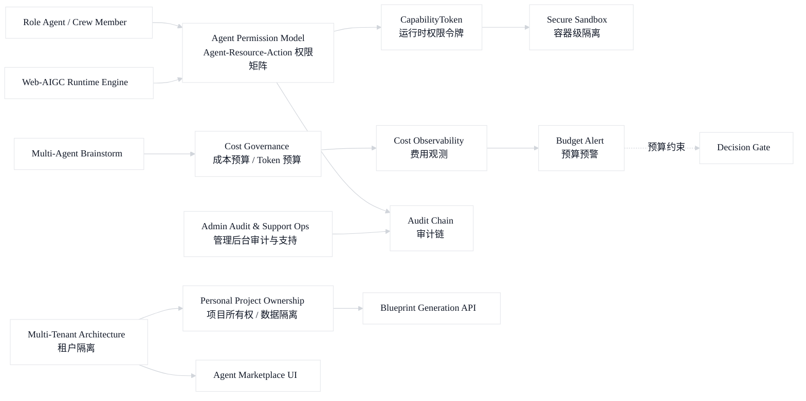

# 10. 权限安全与成本治理图

```mermaid
%%{init: {'theme':'base','flowchart': {'curve': 'basis', 'htmlLabels': true}, 'themeVariables': {
  'background':'transparent',
  'primaryColor':'#ffffff',
  'primaryTextColor':'#111827',
  'primaryBorderColor':'#e5e7eb',
  'secondaryColor':'#ffffff',
  'tertiaryColor':'#ffffff',
  'lineColor':'#d1d5db',
  'defaultLinkColor':'#d1d5db',
  'clusterBkg':'transparent',
  'clusterBorder':'#d1d5db',
  'mainBkg':'#ffffff',
  'nodeBorder':'#e5e7eb',
  'fontSize':'16px',
  'fontFamily':'Arial, PingFang SC, Microsoft YaHei, sans-serif'
}} }%%
flowchart LR
    ROLE_AGENT[Role Agent / Crew Member] --> PERMISSION[Agent Permission Model<br/>Agent-Resource-Action 权限矩阵]
    WEB_AIGC_RT[Web-AIGC Runtime Engine] --> PERMISSION
    PERMISSION --> CAP_TOKEN[CapabilityToken<br/>运行时权限令牌]
    CAP_TOKEN --> SECURE_SANDBOX[Secure Sandbox<br/>容器级隔离]
    BRAINSTORM[Multi-Agent Brainstorm] --> COST_GOV[Cost Governance<br/>成本预算 / Token 预算]
    COST_GOV --> COST_OBS[Cost Observability<br/>费用观测]
    PERMISSION --> AUDIT_CHAIN[Audit Chain<br/>审计链]
    SUPPORT[Admin Audit & Support Ops<br/>管理后台审计与支持] --> AUDIT_CHAIN
    TENANT[Multi-Tenant Architecture<br/>租户隔离] --> PROJECT_ISO[Personal Project Ownership<br/>项目所有权 / 数据隔离]
    PROJECT_ISO --> API[Blueprint Generation API]
    TENANT --> MARKET_UI[Agent Marketplace UI]
    COST_OBS --> ALERT[Budget Alert<br/>预算预警]
    ALERT -.预算约束.-> DG[Decision Gate]
```
