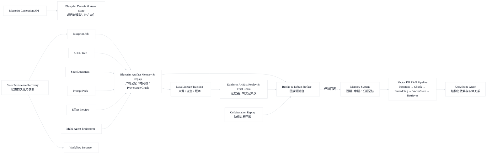

# 11. 数据记忆与证据回放图

```mermaid
%%{init: {'theme':'base','flowchart': {'curve': 'basis', 'htmlLabels': true}, 'themeVariables': {
  'background':'transparent',
  'primaryColor':'#ffffff',
  'primaryTextColor':'#111827',
  'primaryBorderColor':'#e5e7eb',
  'secondaryColor':'#ffffff',
  'tertiaryColor':'#ffffff',
  'lineColor':'#d1d5db',
  'defaultLinkColor':'#d1d5db',
  'clusterBkg':'transparent',
  'clusterBorder':'#d1d5db',
  'mainBkg':'#ffffff',
  'nodeBorder':'#e5e7eb',
  'fontSize':'16px',
  'fontFamily':'Arial, PingFang SC, Microsoft YaHei, sans-serif'
}} }%%
flowchart LR
    GEN_API[Blueprint Generation API] --> DOMAIN[Blueprint Domain & Asset Store<br/>项目域模型 / 资产索引]
    JOB[Blueprint Job] --> ARTIFACT[Blueprint Artifact Memory & Replay<br/>产物记忆 / 时间线 / Provenance Graph]
    SPEC_TREE[SPEC Tree] --> ARTIFACT
    SPEC_DOC[Spec Document] --> ARTIFACT
    PROMPT_PACK[Prompt Pack] --> ARTIFACT
    EFFECT[Effect Preview] --> ARTIFACT
    BRAINSTORM[Multi-Agent Brainstorm] --> ARTIFACT
    MEMORY[Memory System<br/>短期 / 中期 / 长期记忆] --> VECTOR[Vector DB RAG Pipeline<br/>Ingestion → Chunk → Embedding → VectorStore → Retriever]
    VECTOR --> KG[Knowledge Graph<br/>结构化依赖与实体关系]
    ARTIFACT --> LINEAGE[Data Lineage Tracking<br/>来源 / 派生 / 版本]
    LINEAGE --> EVIDENCE[Evidence Artifact Replay & Trust Chain<br/>证据链 / 驾驶记录仪]
    ARTIFACT --> REPLAY[Replay & Debug Surface<br/>回放调试台]
    EVIDENCE --> REPLAY
    COLLAB[Collaboration Replay<br/>协作过程回放] --> REPLAY
    STATE[State Persistence Recovery<br/>状态持久化与恢复] --> JOB
    STATE --> INSTANCE[Workflow Instance]
    REPLAY -.经验回填.-> MEMORY
```
