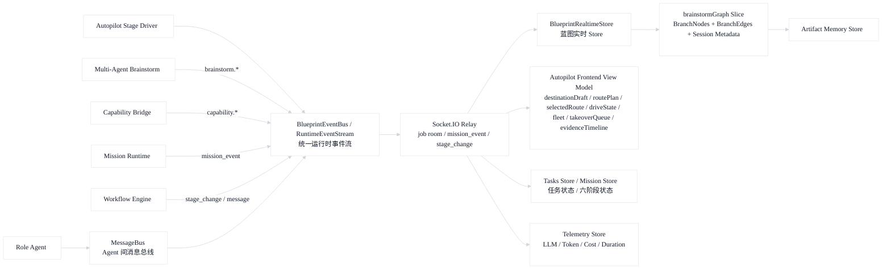

# 12. 事件总线与前端实时 Store 图

```mermaid
%%{init: {'theme':'base','flowchart': {'curve': 'basis', 'htmlLabels': true}, 'themeVariables': {
  'background':'transparent',
  'primaryColor':'#ffffff',
  'primaryTextColor':'#111827',
  'primaryBorderColor':'#e5e7eb',
  'secondaryColor':'#ffffff',
  'tertiaryColor':'#ffffff',
  'lineColor':'#d1d5db',
  'defaultLinkColor':'#d1d5db',
  'clusterBkg':'transparent',
  'clusterBorder':'#d1d5db',
  'mainBkg':'#ffffff',
  'nodeBorder':'#e5e7eb',
  'fontSize':'16px',
  'fontFamily':'Arial, PingFang SC, Microsoft YaHei, sans-serif'
}} }%%
flowchart LR
    STAGE[Autopilot Stage Driver] --> EVENT_BUS[BlueprintEventBus / RuntimeEventStream<br/>统一运行时事件流]
    BRAINSTORM[Multi-Agent Brainstorm] -->|brainstorm.*| EVENT_BUS
    CAP_BRIDGE[Capability Bridge] -->|capability.*| EVENT_BUS
    MISSION_RT[Mission Runtime] -->|mission_event| EVENT_BUS
    WORKFLOW[Workflow Engine] -->|stage_change / message| EVENT_BUS
    ROLE_AGENT[Role Agent] --> MSG_BUS[MessageBus<br/>Agent 间消息总线]
    MSG_BUS --> EVENT_BUS
    EVENT_BUS --> SOCKET[Socket.IO Relay<br/>job room / mission_event / stage_change]
    SOCKET --> FRONT_STORE[BlueprintRealtimeStore<br/>蓝图实时 Store]
    SOCKET --> AUTO_VM[Autopilot Frontend View Model<br/>destinationDraft / routePlan / selectedRoute / driveState / fleet / takeoverQueue / evidenceTimeline]
    SOCKET --> TASK_STORE[Tasks Store / Mission Store<br/>任务状态 / 六阶段状态]
    SOCKET --> TELEMETRY[Telemetry Store<br/>LLM / Token / Cost / Duration]
    FRONT_STORE --> BRAIN_GRAPH[brainstormGraph Slice<br/>BranchNodes + BranchEdges + Session Metadata]
    BRAIN_GRAPH --> ARTIFACT[Artifact Memory Store]
```
