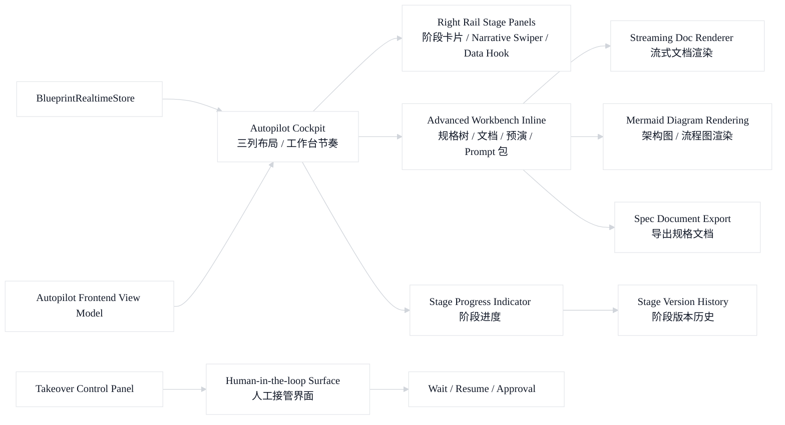

# 13. 前端工作台信息架构图

```mermaid
%%{init: {'theme':'base','flowchart': {'curve': 'basis', 'htmlLabels': true}, 'themeVariables': {
  'background':'transparent',
  'primaryColor':'#ffffff',
  'primaryTextColor':'#111827',
  'primaryBorderColor':'#e5e7eb',
  'secondaryColor':'#ffffff',
  'tertiaryColor':'#ffffff',
  'lineColor':'#d1d5db',
  'defaultLinkColor':'#d1d5db',
  'clusterBkg':'transparent',
  'clusterBorder':'#d1d5db',
  'mainBkg':'#ffffff',
  'nodeBorder':'#e5e7eb',
  'fontSize':'16px',
  'fontFamily':'Arial, PingFang SC, Microsoft YaHei, sans-serif'
}} }%%
flowchart LR
    FRONT_STORE[BlueprintRealtimeStore] --> COCKPIT[Autopilot Cockpit<br/>三列布局 / 工作台节奏]
    AUTO_VM[Autopilot Frontend View Model] --> COCKPIT
    COCKPIT --> RIGHT_RAIL[Right Rail Stage Panels<br/>阶段卡片 / Narrative Swiper / Data Hook]
    COCKPIT --> WORKBENCH[Advanced Workbench Inline<br/>规格树 / 文档 / 预演 / Prompt 包]
    WORKBENCH --> DOC_RENDERER[Streaming Doc Renderer<br/>流式文档渲染]
    WORKBENCH --> MERMAID_RENDER[Mermaid Diagram Rendering<br/>架构图 / 流程图渲染]
    WORKBENCH --> SPEC_EXPORT[Spec Document Export<br/>导出规格文档]
    COCKPIT --> STAGE_PROGRESS[Stage Progress Indicator<br/>阶段进度]
    STAGE_PROGRESS --> VERSION_HISTORY[Stage Version History<br/>阶段版本历史]
    TAKEOVER[Takeover Control Panel] --> HUMAN[Human-in-the-loop Surface<br/>人工接管界面]
    HUMAN --> WAIT[Wait / Resume / Approval]
```
