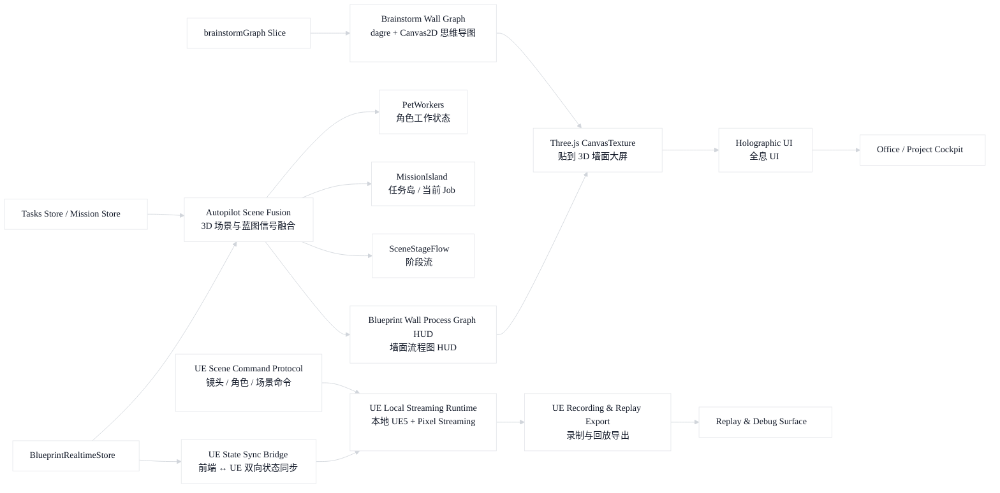

# 14. 3D 场景与墙面渲染图

```mermaid
%%{init: {'theme':'base','flowchart': {'curve': 'basis', 'htmlLabels': true}, 'themeVariables': {
  'background':'transparent',
  'primaryColor':'#ffffff',
  'primaryTextColor':'#111827',
  'primaryBorderColor':'#e5e7eb',
  'secondaryColor':'#ffffff',
  'tertiaryColor':'#ffffff',
  'lineColor':'#d1d5db',
  'defaultLinkColor':'#d1d5db',
  'clusterBkg':'transparent',
  'clusterBorder':'#d1d5db',
  'mainBkg':'#ffffff',
  'nodeBorder':'#e5e7eb',
  'fontSize':'16px',
  'fontFamily':'Arial, PingFang SC, Microsoft YaHei, sans-serif'
}} }%%
flowchart LR
    FRONT_STORE[BlueprintRealtimeStore] --> SCENE_FUSION[Autopilot Scene Fusion<br/>3D 场景与蓝图信号融合]
    TASK_STORE[Tasks Store / Mission Store] --> SCENE_FUSION
    BRAIN_GRAPH[brainstormGraph Slice] --> BRAIN_WALL[Brainstorm Wall Graph<br/>dagre + Canvas2D 思维导图]
    SCENE_FUSION --> PET[PetWorkers<br/>角色工作状态]
    SCENE_FUSION --> ISLAND[MissionIsland<br/>任务岛 / 当前 Job]
    SCENE_FUSION --> STAGE_FLOW[SceneStageFlow<br/>阶段流]
    SCENE_FUSION --> WALL_HUD[Blueprint Wall Process Graph HUD<br/>墙面流程图 HUD]
    WALL_HUD --> CANVAS[Three.js CanvasTexture<br/>贴到 3D 墙面大屏]
    BRAIN_WALL --> CANVAS
    CANVAS --> HOLO[Holographic UI<br/>全息 UI]
    HOLO --> HOME[Office / Project Cockpit]
    FRONT_STORE --> UE_SYNC[UE State Sync Bridge<br/>前端 ↔ UE 双向状态同步]
    UE_SYNC --> UE_LOCAL[UE Local Streaming Runtime<br/>本地 UE5 + Pixel Streaming]
    UE_CMD[UE Scene Command Protocol<br/>镜头 / 角色 / 场景命令] --> UE_LOCAL
    UE_LOCAL --> UE_RECORD[UE Recording & Replay Export<br/>录制与回放导出]
    UE_RECORD --> REPLAY[Replay & Debug Surface]
```
