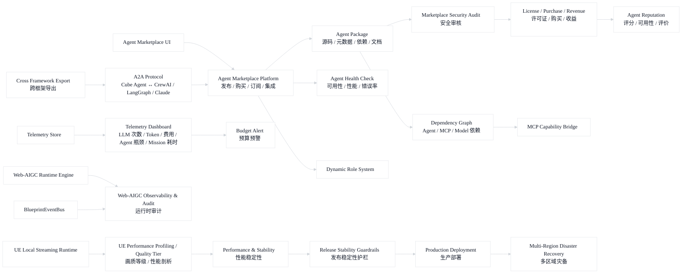

# 15. Marketplace / 生态 / 发布观测图

```mermaid
%%{init: {'theme':'base','flowchart': {'curve': 'basis', 'htmlLabels': true}, 'themeVariables': {
  'background':'transparent',
  'primaryColor':'#ffffff',
  'primaryTextColor':'#111827',
  'primaryBorderColor':'#e5e7eb',
  'secondaryColor':'#ffffff',
  'tertiaryColor':'#ffffff',
  'lineColor':'#d1d5db',
  'defaultLinkColor':'#d1d5db',
  'clusterBkg':'transparent',
  'clusterBorder':'#d1d5db',
  'mainBkg':'#ffffff',
  'nodeBorder':'#e5e7eb',
  'fontSize':'16px',
  'fontFamily':'Arial, PingFang SC, Microsoft YaHei, sans-serif'
}} }%%
flowchart LR
    MARKET_UI[Agent Marketplace UI] --> MARKET[Agent Marketplace Platform<br/>发布 / 购买 / 订阅 / 集成]
    MARKET --> PACKAGE[Agent Package<br/>源码 / 元数据 / 依赖 / 文档]
    PACKAGE --> SEC_AUDIT[Marketplace Security Audit<br/>安全审核]
    SEC_AUDIT --> LICENSE[License / Purchase / Revenue<br/>许可证 / 购买 / 收益]
    LICENSE --> REP[Agent Reputation<br/>评分 / 可用性 / 评价]
    PACKAGE --> DEP[Dependency Graph<br/>Agent / MCP / Model 依赖]
    MARKET --> HEALTH[Agent Health Check<br/>可用性 / 性能 / 错误率]
    MARKET --> ROLE_SYS[Dynamic Role System]
    DEP --> MCP[MCP Capability Bridge]
    CROSS[Cross Framework Export<br/>跨框架导出] --> A2A[A2A Protocol<br/>Cube Agent ↔ CrewAI / LangGraph / Claude]
    A2A --> MARKET
    TELEMETRY[Telemetry Store] --> DASH[Telemetry Dashboard<br/>LLM 次数 / Token / 费用 / Agent 瓶颈 / Mission 耗时]
    WEB_AIGC_RT[Web-AIGC Runtime Engine] --> OBS[Web-AIGC Observability & Audit<br/>运行时审计]
    EVENT_BUS[BlueprintEventBus] --> OBS
    DASH --> COST_ALERT[Budget Alert<br/>预算预警]
    PERF[Performance & Stability<br/>性能稳定性] --> RELEASE[Release Stability Guardrails<br/>发布稳定性护栏]
    RELEASE --> PROD[Production Deployment<br/>生产部署]
    PROD --> DR[Multi-Region Disaster Recovery<br/>多区域灾备]
    UE_LOCAL[UE Local Streaming Runtime] --> QUALITY[UE Performance Profiling / Quality Tier<br/>画质等级 / 性能剖析]
    QUALITY --> PERF
```
