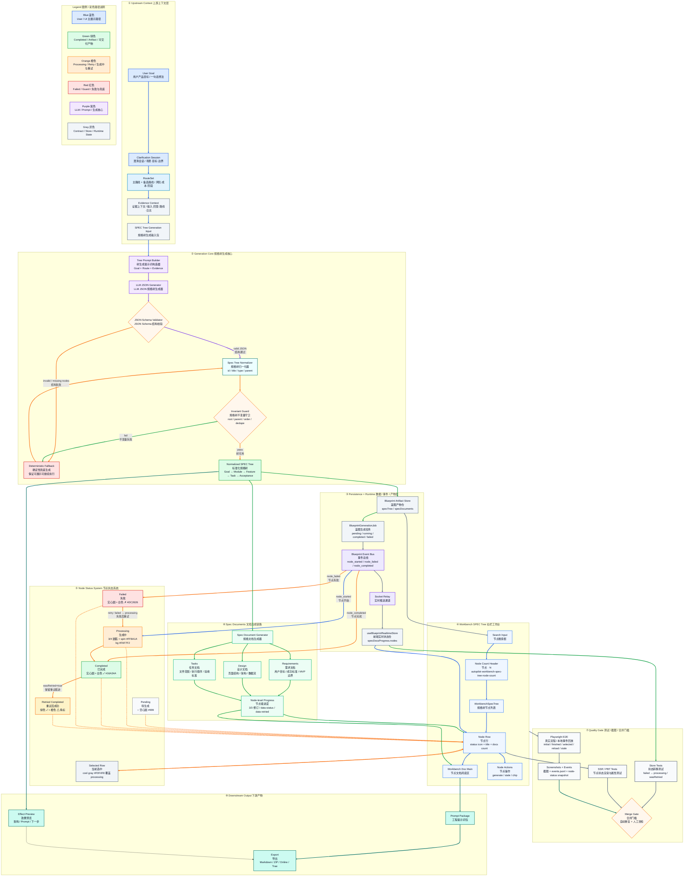

```mermaid
flowchart TB
  %% =========================================================
  %% SPEC Tree 规格树｜彩色路径双语完整版架构图
  %% Source: SPEC Tree 规格文档 / WhyBuddy Autopilot
  %% =========================================================

  %% =========================
  %% ① Upstream Context
  %% =========================
  subgraph UP["① Upstream Context 上游上下文层"]
    direction LR

    U["User Goal<br/>用户产品目标 / 一句话想法"]:::user
    CLARIFY["Clarification Session<br/>澄清会话 / 场景·目标·边界"]:::user
    ROUTE["RouteSet<br/>主路线 + 备选路线 / 风险·成本·阶段"]:::route
    EVIDENCE["Evidence Context<br/>证据上下文 / 输入·回答·路线·日志"]:::store
    SPEC_INPUT["SPEC Tree Generation Input<br/>规格树生成输入包"]:::contract
  end

  U --> CLARIFY
  CLARIFY --> ROUTE
  ROUTE --> EVIDENCE
  EVIDENCE --> SPEC_INPUT

  %% =========================
  %% ② Generation Core
  %% =========================
  subgraph CORE["② Generation Core 规格树生成核心"]
    direction TB

    PROMPT["Tree Prompt Builder<br/>树生成提示词构造器<br/>Goal + Route + Evidence"]:::llm
    LLM["LLM JSON Generator<br/>LLM JSON 规格树生成器"]:::llm
    SCHEMA{"JSON Schema Validator<br/>JSON Schema 结构校验"}:::gate
    NORMALIZE["Spec Tree Normalizer<br/>规格树归一化器<br/>id / title / type / parent"]:::process
    INVARIANT{"Invariant Guard<br/>规格树不变量守卫<br/>root / parent / order / dedupe"}:::gate
    FALLBACK["Deterministic Fallback<br/>确定性兜底生成<br/>保证可展示可继续执行"]:::fallback
    TREE["Normalized SPEC Tree<br/>标准化规格树<br/>Goal → Module → Feature → Task → Acceptance"]:::artifact
  end

  SPEC_INPUT --> PROMPT
  PROMPT --> LLM
  LLM --> SCHEMA
  SCHEMA -->|valid JSON<br/>结构通过| NORMALIZE
  SCHEMA -->|invalid / missing nodes<br/>结构失败| FALLBACK
  FALLBACK --> NORMALIZE
  NORMALIZE --> INVARIANT
  INVARIANT -->|pass<br/>树可用| TREE
  INVARIANT -->|fail<br/>不变量失败| FALLBACK

  %% =========================
  %% ③ Persistence + Runtime Events
  %% =========================
  subgraph DATA["③ Persistence + Runtime 数据 / 事件 / 产物层"]
    direction LR

    ARTIFACT["Blueprint Artifact Store<br/>蓝图产物仓<br/>specTree / specDocuments"]:::store
    JOB["BlueprintGenerationJob<br/>蓝图生成任务<br/>pending / running / completed / failed"]:::store
    EVENTBUS["Blueprint Event Bus<br/>事件总线<br/>node_started / node_failed / node_completed"]:::event
    SOCKET["Socket Relay<br/>实时推送通道"]:::event
    RTSTORE["useBlueprintRealtimeStore<br/>前端实时状态仓<br/>specDocsProgress.nodes"]:::store
  end

  TREE --> ARTIFACT
  ARTIFACT --> JOB
  JOB --> EVENTBUS
  EVENTBUS --> SOCKET
  SOCKET --> RTSTORE

  %% =========================
  %% ④ Workbench UI
  %% =========================
  subgraph UI["④ Workbench SPEC Tree 右栏工作台"]
    direction TB

    SEARCH["Search Input<br/>节点搜索框"]:::ui
    HEADER["Node Count Header<br/>节点 · N<br/>autopilot-workbench-spec-tree-node-count"]:::ui
    TREE_UI["WorkbenchSpecTree<br/>规格树节点列表"]:::ui
    NODE_ROW["Node Row<br/>节点行<br/>status icon + title + docs count"]:::ui
    DOC_MAIN["Workbench Doc Main<br/>节点文档阅读区"]:::ui
    ACTIONS["Node Actions<br/>节点操作<br/>generate / stale / chip"]:::ui
  end

  ARTIFACT --> SEARCH
  SEARCH --> HEADER
  HEADER --> TREE_UI
  TREE_UI --> NODE_ROW
  NODE_ROW --> DOC_MAIN
  NODE_ROW --> ACTIONS
  RTSTORE --> NODE_ROW

  %% =========================
  %% ⑤ Node Status System
  %% =========================
  subgraph STATUS["⑤ Node Status System 节点状态系统"]
    direction LR

    PENDING["Pending<br/>待生成<br/>○ 空心圆 #999"]:::pending
    PROCESSING["Processing<br/>生成中<br/>3/4 圆弧 + spin #FF8A1A<br/>bg #FAF7F2"]:::processing
    COMPLETED["Completed<br/>已完成<br/>实心圆 + 白色 ✓ #16A34A"]:::completed
    FAILED["Failed<br/>失败<br/>实心圆 + 白色 ✗ #DC2626"]:::failed
    RETRIED["Retried Completed<br/>重试后成功<br/>绿色 ✓ + 橙色 ⚠ 角标"]:::retried
    SELECTED["Selected Row<br/>当前选中<br/>cool gray #F0F4F8 覆盖 processing"]:::selected
  end

  EVENTBUS -->|node_started<br/>节点开始| PROCESSING
  EVENTBUS -->|node_completed<br/>节点完成| COMPLETED
  EVENTBUS -->|node_failed<br/>节点失败| FAILED
  FAILED -->|retry: failed → processing<br/>失败后重试| PROCESSING
  PROCESSING --> COMPLETED
  COMPLETED -->|wasRetried=true<br/>保留重试痕迹| RETRIED
  NODE_ROW --> SELECTED

  PENDING -.-> NODE_ROW
  PROCESSING -.-> NODE_ROW
  COMPLETED -.-> NODE_ROW
  FAILED -.-> NODE_ROW
  RETRIED -.-> NODE_ROW
  SELECTED -.-> NODE_ROW

  %% =========================
  %% ⑥ Spec Documents
  %% =========================
  subgraph DOCS["⑥ Spec Documents 文档生成链路"]
    direction LR

    DOCGEN["Spec Document Generator<br/>规格文档生成器"]:::doc
    REQ["Requirements<br/>需求文档<br/>用户目标 / 成功标准 / MVP 边界"]:::doc
    DESIGN["Design<br/>设计文档<br/>页面结构 / 架构 / 数据流"]:::doc
    TASKS["Tasks<br/>任务文档<br/>文件范围 / 执行顺序 / 验收标准"]:::doc
    PROGRESS["Node-level Progress<br/>节点级进度<br/>3/3 修订 / data-status / data-retried"]:::doc
  end

  TREE --> DOCGEN
  DOCGEN --> REQ
  DOCGEN --> DESIGN
  DOCGEN --> TASKS
  REQ --> PROGRESS
  DESIGN --> PROGRESS
  TASKS --> PROGRESS
  PROGRESS --> NODE_ROW
  PROGRESS --> DOC_MAIN

  %% =========================
  %% ⑦ Quality Gate
  %% =========================
  subgraph QA["⑦ Quality Gate 测试 / 截图 / 合并门槛"]
    direction TB

    STORE_TEST["Store Tests<br/>状态转移测试<br/>failed → processing / wasRetried"]:::qa
    SSR_TEST["SSR / PBT Tests<br/>节点状态渲染与属性测试"]:::qa
    E2E["Playwright E2E<br/>真实流程 / 本地事件回放<br/>initial / finished / selected / reload / stale"]:::qa
    SNAPSHOT["Screenshots + Events<br/>截图 + events.jsonl + node-status snapshot"]:::qa
    MERGE_GATE{"Merge Gate<br/>合并门槛<br/>自动断言 + 人工目检"}:::gate
  end

  RTSTORE --> STORE_TEST
  NODE_ROW --> SSR_TEST
  UI --> E2E
  E2E --> SNAPSHOT
  STORE_TEST --> MERGE_GATE
  SSR_TEST --> MERGE_GATE
  SNAPSHOT --> MERGE_GATE

  %% =========================
  %% ⑧ Downstream Output
  %% =========================
  subgraph OUT["⑧ Downstream Output 下游产物"]
    direction LR

    EFFECT["Effect Preview<br/>效果预览<br/>架构 / Prompt / 下一步"]:::output
    PROMPT_PACK["Prompt Package<br/>工程提示词包"]:::output
    EXPORT["Export<br/>导出<br/>Markdown / ZIP / Online / Trae"]:::output
  end

  TREE --> EFFECT
  DOC_MAIN --> PROMPT_PACK
  PROMPT_PACK --> EXPORT
  EFFECT --> EXPORT

  %% =========================
  %% Legend
  %% =========================
  subgraph LEGEND["Legend 图例 / 彩色路径说明"]
    direction LR

    LG_BLUE["Blue 蓝色<br/>User / UI 主展示路径"]:::user
    LG_GREEN["Green 绿色<br/>Completed / Artifact / 可交付产物"]:::completed
    LG_ORANGE["Orange 橙色<br/>Processing / Retry / 生成中与重试"]:::processing
    LG_RED["Red 红色<br/>Failed / Guard / 失败与兜底"]:::failed
    LG_PURPLE["Purple 紫色<br/>LLM / Prompt / 生成核心"]:::llm
    LG_GRAY["Gray 灰色<br/>Contract / Store / Runtime State"]:::contract
  end

  %% =========================
  %% Node Styles
  %% =========================
  classDef user fill:#DBEAFE,stroke:#2563EB,stroke-width:2px,color:#0F172A;
  classDef route fill:#E0F2FE,stroke:#0284C7,stroke-width:2px,color:#0F172A;
  classDef llm fill:#F3E8FF,stroke:#7C3AED,stroke-width:2px,color:#0F172A;
  classDef gate fill:#FFF7ED,stroke:#F97316,stroke-width:2px,color:#0F172A;
  classDef process fill:#ECFEFF,stroke:#0F766E,stroke-width:2px,color:#0F172A;
  classDef fallback fill:#FEE2E2,stroke:#DC2626,stroke-width:2px,color:#0F172A;
  classDef artifact fill:#DCFCE7,stroke:#16A34A,stroke-width:2px,color:#0F172A;
  classDef store fill:#F1F5F9,stroke:#64748B,stroke-width:2px,color:#0F172A;
  classDef event fill:#EDE9FE,stroke:#7C3AED,stroke-width:2px,color:#0F172A;
  classDef ui fill:#EFF6FF,stroke:#3B82F6,stroke-width:2px,color:#0F172A;
  classDef pending fill:#F8FAFC,stroke:#999999,stroke-width:2px,color:#0F172A;
  classDef processing fill:#FFEDD5,stroke:#FF8A1A,stroke-width:2px,color:#0F172A;
  classDef completed fill:#DCFCE7,stroke:#16A34A,stroke-width:2px,color:#0F172A;
  classDef failed fill:#FEE2E2,stroke:#DC2626,stroke-width:2px,color:#0F172A;
  classDef retried fill:#FEF3C7,stroke:#F97316,stroke-width:2px,color:#0F172A;
  classDef selected fill:#F0F4F8,stroke:#64748B,stroke-width:2px,color:#0F172A;
  classDef doc fill:#ECFDF5,stroke:#10B981,stroke-width:2px,color:#0F172A;
  classDef qa fill:#F8FAFC,stroke:#475569,stroke-width:2px,color:#0F172A;
  classDef output fill:#CCFBF1,stroke:#0F766E,stroke-width:2px,color:#0F172A;
  classDef contract fill:#F1F5F9,stroke:#64748B,stroke-width:2px,color:#0F172A;

  %% =========================
  %% Link Styles
  %% Main path: blue
  %% Generation path: purple
  %% Validation / fallback: red + orange
  %% Artifact / docs: green
  %% Runtime events: orange
  %% UI display: blue
  %% =========================

  linkStyle 0,1,2,3,4 stroke:#2563EB,stroke-width:3px;
  linkStyle 5,6,7 stroke:#7C3AED,stroke-width:3px;
  linkStyle 8,9,10,11 stroke:#F97316,stroke-width:3px;
  linkStyle 12,13,14 stroke:#16A34A,stroke-width:3px;
  linkStyle 15,16,17,18 stroke:#64748B,stroke-width:3px;
  linkStyle 19,20,21,22,23,24,25 stroke:#2563EB,stroke-width:3px;
  linkStyle 26,27,28,29,30,31,32,33,34,35,36,37 stroke:#F97316,stroke-width:3px;
  linkStyle 38,39,40,41,42,43,44,45,46,47 stroke:#16A34A,stroke-width:3px;
  linkStyle 48,49,50,51,52 stroke:#64748B,stroke-width:3px;
  linkStyle 53,54,55,56 stroke:#0F766E,stroke-width:3px;
```