# WhyBuddy Architecture Subgraphs

## 01. 用户入口与项目驾驶舱图

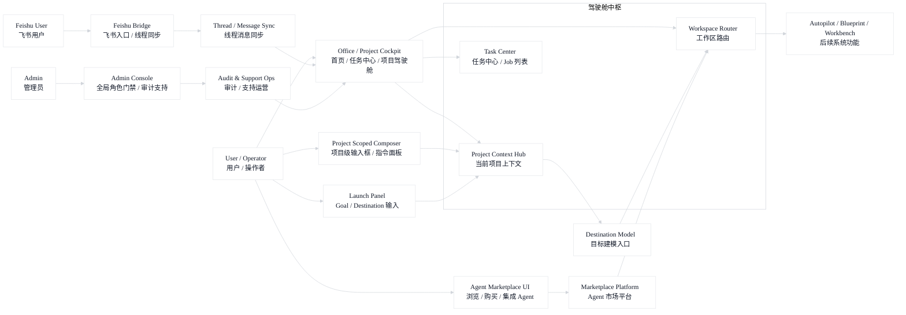

## 02. 目标澄清与路线规划图

```mermaid
%%{init: {'theme':'base','flowchart': {'curve': 'basis', 'htmlLabels': true}, 'themeVariables': {
  'background':'transparent',
  'primaryColor':'#ffffff',
  'primaryTextColor':'#111827',
  'primaryBorderColor':'#e5e7eb',
  'secondaryColor':'#ffffff',
  'tertiaryColor':'#ffffff',
  'lineColor':'#d1d5db',
  'defaultLinkColor':'#d1d5db',
  'clusterBkg':'transparent',
  'clusterBorder':'#d1d5db',
  'mainBkg':'#ffffff',
  'nodeBorder':'#e5e7eb',
  'fontSize':'16px',
  'fontFamily':'Arial, PingFang SC, Microsoft YaHei, sans-serif'
}} }%%
flowchart LR
    COMPOSER[Project Scoped Composer<br/>项目级输入] --> DEST[Destination Model<br/>目标模型与解析器]
    LAUNCH[Launch Panel<br/>Goal / Destination 输入] --> DEST
    DEST --> CLARIFY[Clarification Workflow<br/>结构化澄清]
    CLARIFY --> GOAL_LOCK[Destination Card & Goal Lock<br/>目标锁定 / 准备度信号]
    GOAL_LOCK --> ROUTE_MODEL[Route Planner & Route Model<br/>路线模型]
    ROUTE_MODEL --> ROUTE_REC[Route Recommendation<br/>多路线推荐与选择]
    ROUTE_REC --> ROUTE_SET[RouteSet<br/>主路径 + 备选路径]
    ROUTE_SET --> REPLAN[Drive State Timeline & Replan<br/>驾驶状态 / 重规划]
    REPLAN --> TAKEOVER[Takeover Control Panel<br/>人工接管 / 决策点]
    TAKEOVER -.人工介入 / 修正.-> ROUTE_MODEL
    GOAL_LOCK -.准备度不足.-> CLARIFY
    ROUTE_SET --> AP[Autopilot Blueprint<br/>进入蓝图主流程]
```

## 03. Autopilot Blueprint 主流程图

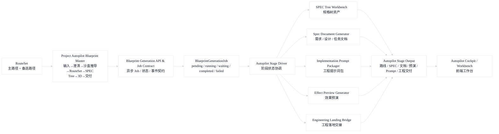

## 04. Runtime / Mission / Workflow 编排图

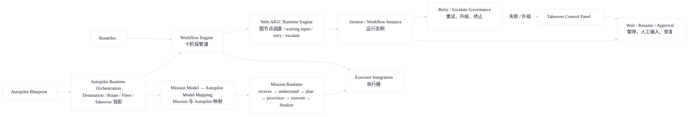

## 05. 多 Agent 协作总图

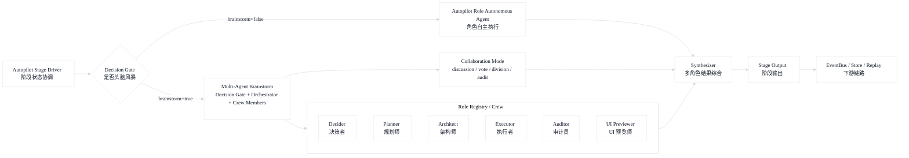

## 06. 多 Agent Brainstorm 细节图

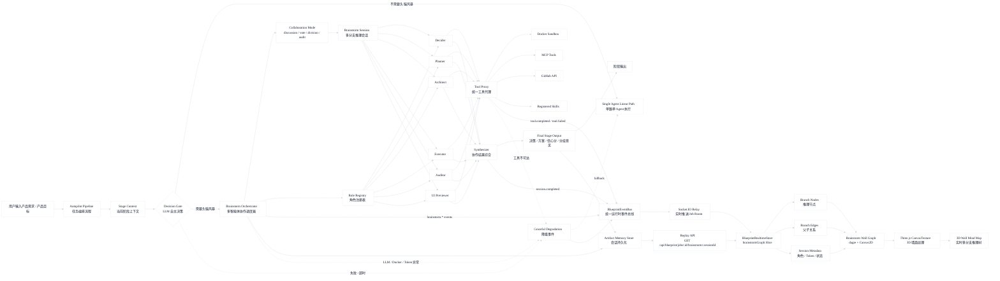

## 07. 角色系统与动态组织图

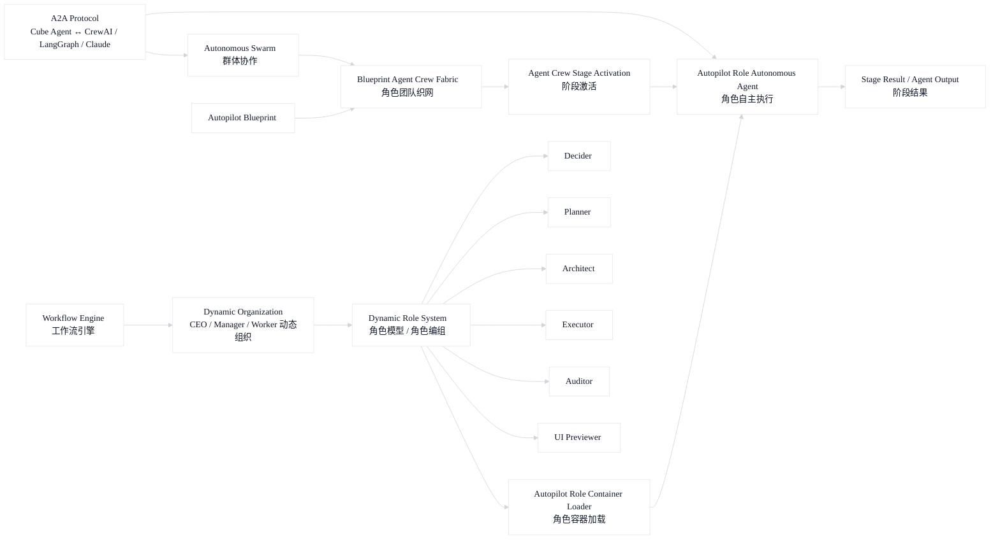

## 08. 工具代理与能力桥图

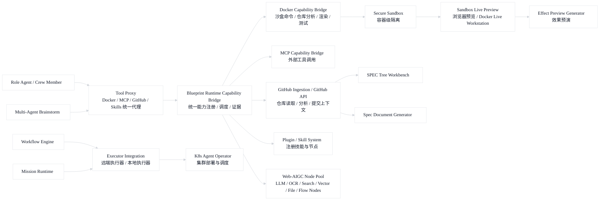

## 09. Web-AIGC 节点池图

```mermaid
%%{init: {'theme':'base','flowchart': {'curve': 'basis', 'htmlLabels': true}, 'themeVariables': {
  'background':'transparent',
  'primaryColor':'#ffffff',
  'primaryTextColor':'#111827',
  'primaryBorderColor':'#e5e7eb',
  'secondaryColor':'#ffffff',
  'tertiaryColor':'#ffffff',
  'lineColor':'#d1d5db',
  'defaultLinkColor':'#d1d5db',
  'clusterBkg':'transparent',
  'clusterBorder':'#d1d5db',
  'mainBkg':'#ffffff',
  'nodeBorder':'#e5e7eb',
  'fontSize':'16px',
  'fontFamily':'Arial, PingFang SC, Microsoft YaHei, sans-serif'
}} }%%
flowchart TB
    NODE_POOL[Web-AIGC Node Pool<br/>节点池总入口]
    NODE_POOL --> START[start / end]
    NODE_POOL --> LLM[llm / auto_agent / robot_reply]
    NODE_POOL --> INTENT[intent_recognition / orchestration_recognition_jump]
    NODE_POOL --> PARAM[param_collection / user_input / selection / confirm_judge]
    NODE_POOL --> FLOW[condition / loop / flow_jump / variable_assignment]
    NODE_POOL --> SEARCH[web_search / image_search / document_search / qa_search / graph_search / fragment_search]
    NODE_POOL --> VECTOR[vector_insert / vector_query / vector_update / vector_delete]
    NODE_POOL --> FILE[excel_read / file_generation / file_slicing / file_translation / long_text_extraction]
    NODE_POOL --> MEDIA[ocr_recognition / audio_recognition / ai_ppt / dynamic_chart]
    NODE_POOL --> API[internal_api / passthrough_api / mcp / transaction_flow]
    NODE_POOL --> UI[open_page / open_dashboard / open_report / static_webpage_read / recommended_commands]
    NODE_POOL --> NOTIFY[message_notification / command_list / get_location_info / get_device_info]
    RT[Web-AIGC Runtime Engine<br/>图节点调度] --> NODE_POOL
```

## 10. 权限安全与成本治理图

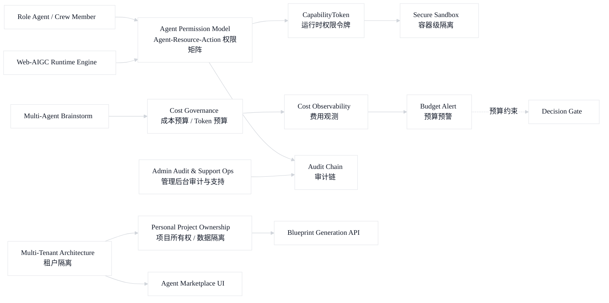

## 11. 数据记忆与证据回放图

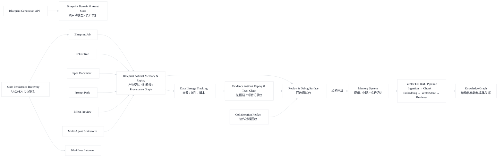

## 12. 事件总线与前端实时 Store 图

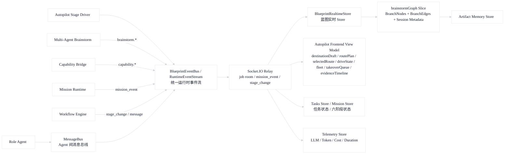

## 13. 前端工作台信息架构图

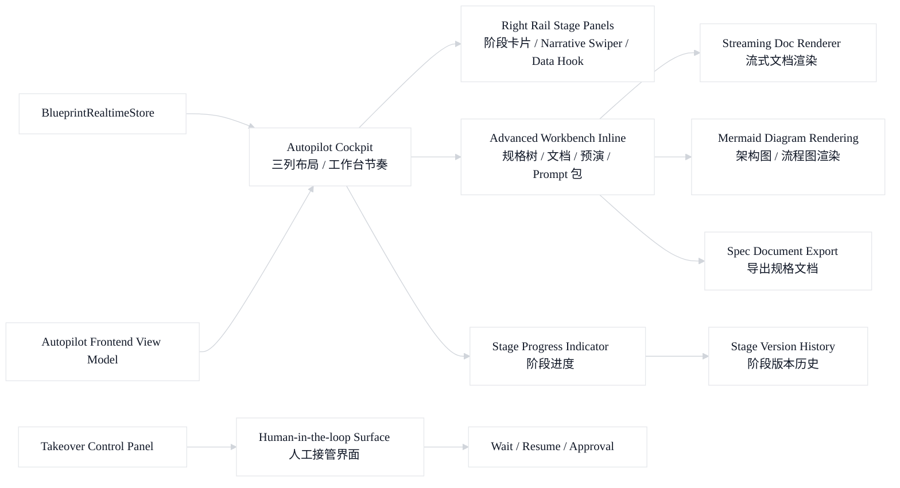

## 14. 3D 场景与墙面渲染图

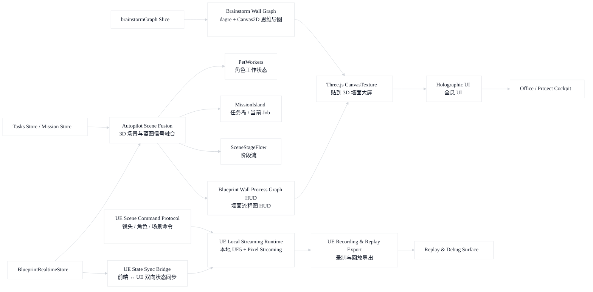

## 15. Marketplace / 生态 / 发布观测图

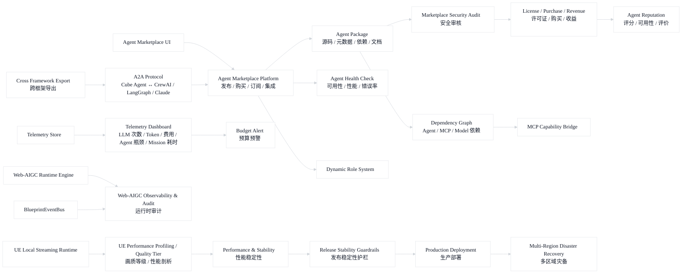

