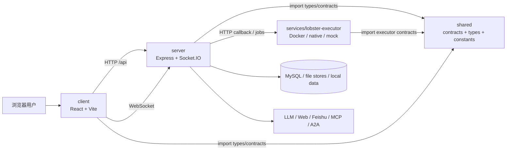
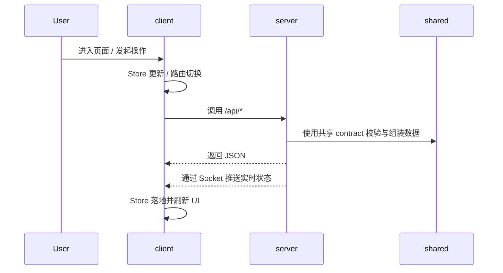
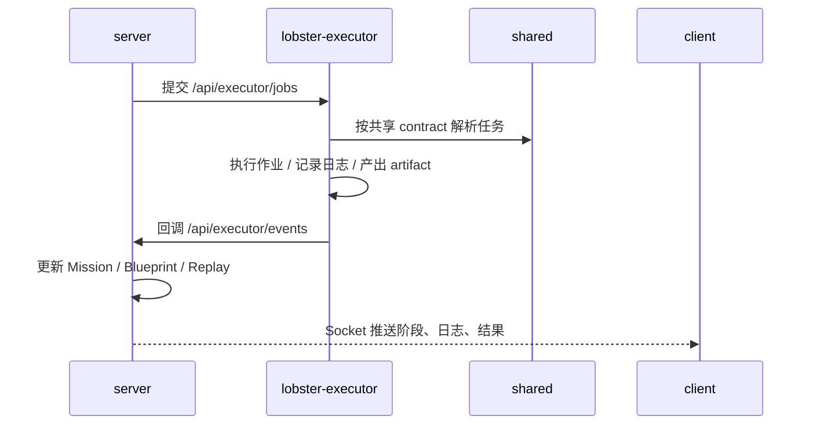

# 01. 仓库总览与整体架构

## 1. 项目定位

`sliderule` 是一个以产品推演与规格生成为核心的全栈 TypeScript 单仓项目。它同时包含：

- 一个 React + Vite 前端应用，用于项目工作台、任务中心、Autopilot、SlideRule 页面与管理后台
- 一个 Node.js + Express + Socket.IO 主服务，用于业务 API、任务编排、知识/RAG、权限、回放与实时事件
- 一个独立的执行器服务 `lobster-executor`，用于在 Docker、本机或 Mock 模式下执行作业
- 一个 `shared/` 共享协议层，用于统一前后端与执行器之间的类型、常量、事件与 API 契约

从代码组织上看，它不是典型的微服务仓库，而是“单仓主应用 + 共享契约 + 独立执行子系统”的组合架构。

## 2. 一级目录地图

```text
.
├─ client/                     前端应用
├─ server/                     主服务端
├─ shared/                     跨端共享协议与领域模型
├─ services/lobster-executor/  独立执行器服务
├─ scripts/                    开发、构建、冒烟、运维脚本
├─ docs/                       架构图、设计说明、历史文档
├─ data/                       本地数据与运行期文件
├─ skills/                     Skill 包与相关资源
├─ package.json                根脚本与依赖
├─ vite.config.ts              前端构建与代理配置
├─ docker-compose.yml          容器编排
└─ Dockerfile                  生产镜像构建
```

## 3. 分层心智模型



可以把系统理解成四层：

1. 展示与交互层：`client/`
2. 业务与编排层：`server/`
3. 协议与领域层：`shared/`
4. 执行与沙箱层：`services/lobster-executor/`

## 4. 技术栈概览

### 4.1 前端

- React 19
- Vite 7
- TypeScript
- Wouter 路由
- Zustand 状态管理
- Tailwind CSS 4
- Radix UI
- Socket.IO Client
- Three.js / `@react-three/fiber` / `@react-three/drei`

### 4.2 后端

- Node.js
- Express
- Socket.IO
- TSX 开发时热重载
- esbuild 生产打包
- Dockerode
- Nodemailer
- MySQL 驱动 `mysql2`

### 4.3 工程与测试

- Vitest
- Playwright
- Prettier
- pnpm / npm 脚本并存

## 5. 关键入口

### 5.1 前端入口

- `client/src/main.tsx`
  - 挂载 React 根节点
  - 在应用启动前执行本地存储迁移
  - 按环境变量注入前端分析脚本
- `client/src/App.tsx`
  - 定义全局路由
  - 组织 AppShell、鉴权守卫、恢复弹窗、移动端导航
  - 将 SlideRule V5 路径与旧工作台路径解耦

### 5.2 构建入口

- `vite.config.ts`
  - 指定前端根目录为 `client/`
  - 输出到 `dist/public`
  - 开发时把 `/api` 与 `/socket.io` 代理到 `http://localhost:3001`
  - 注入调试日志与 CSP 相关插件

### 5.3 主服务入口

- `server/index.ts`
  - 整个服务端的 composition root
  - 在一个入口中集中初始化 Express、HTTP Server、Socket.IO、任务运行时、权限系统、知识/RAG、蓝图上下文、A2A、回放、Lineage、Executor Client 等依赖
  - 再按业务域挂载 `/api/*` 路由

### 5.4 执行器入口

- `services/lobster-executor/src/index.ts`
  - 读取执行器配置
  - 探测 Docker 是否可用
  - 在 `real` 不可用时自动回退到 `native`
  - 启动执行器 HTTP 服务

## 6. 目录职责拆解

### 6.1 `client/`

负责用户界面与交互逻辑，重点包括：

- 项目工作台
- Autopilot 路由页与右侧工作台
- 任务中心与任务详情
- SlideRule 沉浸式页面
- 管理后台
- 调试页、血缘页、回放页

### 6.2 `server/`

负责业务装配与对外 API，重点包括：

- 任务编排与 Mission Runtime
- Workflow Engine 多阶段执行
- Blueprint / SlideRule 规格生成
- 权限、审计、知识图谱、RAG、Lineage
- Socket 实时广播
- 与执行器、A2A、Feishu、Web 能力的集成

### 6.3 `shared/`

负责系统“真相源”级别的协议定义，重点包括：

- Mission contract
- Executor API 与事件 contract
- Blueprint/Autopilot 类型出口
- Permission、Knowledge、RAG、Replay、Telemetry 等跨层模型

### 6.4 `services/lobster-executor/`

负责真正执行作业，重点包括：

- 作业受理与队列管理
- Docker / Native / Mock 运行模式
- 安全审计
- 技能注册
- 执行回调与能力声明

## 7. 主业务链路

### 7.1 前端到服务端



### 7.2 服务端到执行器



## 8. 路由与子系统分组

主服务并不是只有单一业务域，而是把很多能力集中挂载在同一 Express 宿主中。按职责可以分为几组：

- 工作流与任务：`/api/workflows`、`/api/tasks`、`/api/replay`
- SlideRule / Blueprint：`/api/blueprint`、`/api/sliderule`
- 鉴权与项目：`/api/auth`、`/api/projects`、`/api/admin`
- 知识与数据治理：`/api/knowledge`、`/api/rag`、`/api/audit`、`/api/lineage`
- 通用 AI/工具能力：`/api/web-search`、`/api/vision`、`/api/voice`、`/api/skills`、`/api/nl-command`
- 执行器集成：`/api/executor/events`

这意味着 `server/index.ts` 不仅是启动文件，也是系统集成的核心接线面。

## 9. 依赖关系总表

| 层/模块 | 主要依赖 | 说明 |
| --- | --- | --- |
| `client` | `shared`、`/api`、`socket.io` | 依赖共享类型和服务端能力 |
| `server` | `shared`、数据库、外部服务、执行器 | 业务中心与编排中心 |
| `shared` | 几乎不依赖运行时模块 | 提供类型、常量、contract，避免循环业务依赖 |
| `lobster-executor` | `shared/executor`、Docker、本地文件 | 独立执行作业并向主服务回调 |
| `scripts` | 根脚本、Node、Docker | 开发编排、构建、冒烟、运维 |

## 10. 设计特点

### 10.1 单仓但非简单单体

虽然代码在一个仓库里，但实际上由多个逻辑子系统组成：

- 前端应用
- 主服务端宿主
- 蓝图/SlideRule 子系统
- 任务运行时与工作流系统
- 执行器服务
- 共享协议层

### 10.2 手工装配优先

项目没有使用 NestJS、Inversify、tsyringe 这类容器框架，而是采用：

- `server/index.ts` 手工创建依赖
- `createXRouter(deps)` 的路由工厂模式
- Blueprint 子系统使用专门的 `BlueprintServiceContext` 作为局部依赖容器

这让依赖关系更显式，但也意味着理解系统时要重点阅读入口装配过程。

### 10.3 协议先行

`shared/` 的存在不是辅助工具，而是系统边界的基础：

- 前端与后端靠 `shared/*` 对齐结构
- 后端与执行器靠 `shared/executor/*` 对齐 API 和事件
- 复杂业务域如 Blueprint 使用 barrel 导出保持下游 import 稳定

### 10.4 实时态很重要

这是一个强实时感系统，而不是纯 CRUD 应用：

- 任务状态通过 Socket 推送
- 执行器日志与产物会流式回传
- Workflow、Mission、Blueprint 都会持续演进而不是一次性返回

## 11. 建议的源码阅读路径

如果第一次接触该仓库，建议按下面顺序阅读：

1. `package.json`
2. `vite.config.ts`
3. `client/src/main.tsx`
4. `client/src/App.tsx`
5. `server/index.ts`
6. `server/tasks/mission-runtime.ts`
7. `server/core/workflow-engine.ts`
8. `server/routes/blueprint/context.ts`
9. `shared/mission/contracts.ts`
10. `shared/executor/api.ts`
11. `shared/blueprint/index.ts`
12. `services/lobster-executor/src/index.ts`
13. `services/lobster-executor/src/app.ts`

## 12. 本 Wiki 后续对应关系

- 若想理解页面、store、API 对应关系，继续看 `02-frontend.md`
- 若想理解路由、核心类、依赖注入与任务编排，继续看 `03-backend.md`
- 若想理解共享类型与契约边界，继续看 `04-shared-contracts.md`
- 若想理解作业执行与安全边界，继续看 `05-executor.md`
- 若要实际启动项目，直接看 `06-runbook.md`
