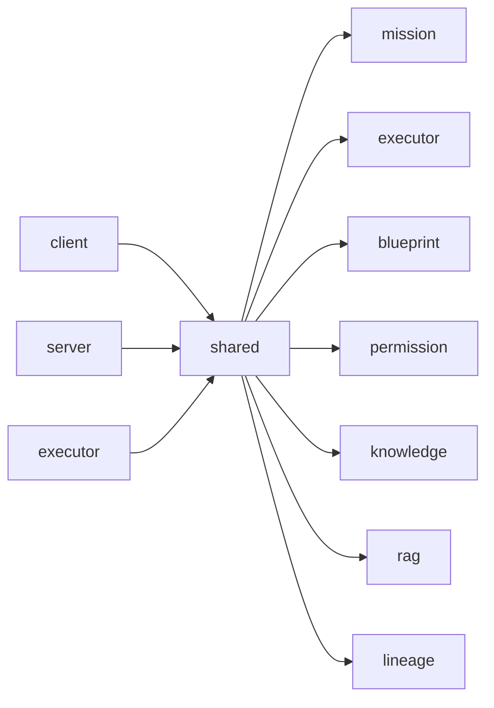

# 04. 共享协议层 `shared/`

## 1. 为什么 `shared/` 很关键

`shared/` 不是一个可有可无的工具目录，而是这个仓库跨层协作的协议中心。它解决的是三类问题：

- 前端与后端如何对齐类型与常量
- 主服务与执行器如何对齐 API、事件和状态
- 复杂业务域如何在不暴露内部实现的前提下稳定导出类型边界

如果把 `client/`、`server/`、`services/lobster-executor/` 看作三个运行时，那么 `shared/` 就是它们之间的语言。

## 2. 目录概览

```text
shared
├─ audit/
├─ blueprint/
├─ demo/
├─ env/
├─ executor/
├─ export/
├─ knowledge/
├─ lineage/
├─ llm/
├─ memory/
├─ mission/
├─ nl-command/
├─ permission/
├─ rag/
├─ replay/
├─ scene-command/
├─ skill/
├─ telemetry/
├─ ue/
├─ web-qa/
└─ __tests__/
```

从命名可见，`shared/` 不是单一协议文件，而是覆盖多个业务域的共享模型层。

## 3. 设计原则

## 3.1 共享“边界”，不共享“实现”

`shared/` 主要放：

- type/interface
- 常量
- 枚举
- contract
- barrel export
- 纯函数级轻逻辑

通常不放强运行时副作用实现，不直接依赖具体数据库、Express 或 React 细节。

## 3.2 稳定导出优先

例如 `shared/blueprint/index.ts` 作为统一 barrel，对下游承诺：

- 下游通过单一入口拿类型
- 即使内部文件结构迁移，也尽量不影响 import 路径

这对大型业务域非常重要。

## 3.3 协议先于实现

先把契约收敛在 `shared/`，再让多端围绕契约实现，能减少：

- 口头对齐成本
- 前后端字段漂移
- 执行器接口变化带来的破坏性影响

## 4. 核心共享域

## 4.1 `shared/mission/`

这是任务系统的共享契约层。

### 主要内容

- Mission 状态枚举
- Stage 状态
- Operator 动作类型
- 事件类型
- HITL 字段与表单模型
- 任务记录、事件记录、投影链接等领域对象

### 关键常量

| 常量 | 说明 |
| --- | --- |
| `MISSION_CONTRACT_VERSION` | Mission 协议版本 |
| `MISSION_STATUSES` | 任务状态集合 |
| `MISSION_STAGE_STATUSES` | 任务阶段状态集合 |
| `MISSION_OPERATOR_ACTION_TYPES` | 操作员动作类型 |
| `MISSION_EVENT_TYPES` | Mission 事件类型 |

### 作用

- 后端 `MissionRuntime` 依赖这些定义维护状态机
- 前端 `tasks-store` 与任务页面依赖这些定义渲染状态
- Socket 与回放系统围绕这些事件模型通信

## 4.2 `shared/executor/`

这是主服务与执行器之间的协议边界。

### 主要内容

- 执行器 API 路径
- 作业请求/响应结构
- 能力声明
- 执行事件
- 回调头约定

### `api.ts` 中最关键的内容

| 符号 | 说明 |
| --- | --- |
| `EXECUTOR_API_ROUTES` | 执行器 HTTP 路径常量 |
| `EXECUTOR_CALLBACK_HEADERS` | 执行器回调头字段 |
| `CreateExecutorJobResponse` | 创建作业返回结构 |
| `CancelExecutorJobResponse` | 取消作业返回结构 |
| `ExecutorCapabilitiesResponse` | 能力探测返回结构 |
| `SubmitExecutorEventRequest` | 回调事件请求结构 |

### 作用

- 主服务按这些 contract 调用执行器
- 执行器按这些 contract 返回与回调
- 两端可以相对独立演进，但只要合同不破，集成就稳定

## 4.3 `shared/blueprint/`

这是复杂度最高的共享业务域之一，用于承载 Autopilot / Blueprint / SlideRule 相关类型出口。

### 特点

- 通过 `index.ts` barrel 统一导出
- 下游优先 `import type { ... } from "@shared/blueprint"`
- 内部按子域拆分，例如：
  - `intake`
  - `clarification`
  - `jobs`
  - `agent-crew`
  - `routeset`
  - `spec-documents`
  - `downstream`
  - `artifact-memory`
  - `checks-ledger`
  - `companion`
  - `traceability-matrix`
  - `preview-audit`

### 设计意义

- 业务域很大，但对外导出路径稳定
- 允许内部逐步重构，不影响使用方
- 把复杂 Autopilot 类型系统收敛到统一命名空间

## 4.4 `shared/permission/`

承载权限相关协议与模型，用于：

- 前端权限 UI 与能力开关
- 后端权限校验与审计
- Token/Policy 的结构约束

## 4.5 `shared/knowledge/` 与 `shared/rag/`

承载知识图谱与 RAG 相关的跨层数据结构，用于：

- 前端展示知识结果
- 后端返回统一结构
- 保持知识与检索增强模块的模型一致

## 4.6 `shared/lineage/` 与 `shared/replay/`

承载：

- 血缘记录模型
- 回放事件模型
- 跨端展示与持久化结构

## 4.7 `shared/telemetry/`

承载系统级运行态数据结构，用于：

- Socket 广播 telemetry
- 前端 telemetry store 消费
- 服务端快照对齐

## 5. 共享层依赖关系



重要特征：

- `client` 依赖 `shared`
- `server` 依赖 `shared`
- `executor` 依赖 `shared`
- `shared` 尽量不反向依赖三者的具体实现

## 6. 为什么 barrel export 很重要

以 `shared/blueprint/index.ts` 为例，它的价值不只是在“方便导入”，而是在“收敛变化”：

- 内部文件可以拆分
- 子域可以物理迁移
- 下游 import 语句保持稳定
- 大型重构可以先改内部，再保外部兼容

这是一种很典型的“稳定边界层”策略。

## 7. 共享层在系统中的实际作用

## 7.1 前后端字段一致性

前端展示任务状态、后端返回任务状态、Socket 推送任务状态，都必须围绕同一套定义，否则极易出现：

- 字段名不一致
- 状态值不一致
- 页面判断分支失效

`shared/mission/*` 正是为此存在。

## 7.2 主服务与执行器解耦

主服务不需要知道执行器内部怎么跑 Docker，执行器也不需要知道主服务内部怎么组织 Express。它们只需要一致地理解：

- 请求路径
- 回调路径
- 状态与事件字段
- 错误结构

`shared/executor/*` 就是这个契约层。

## 7.3 复杂领域的分层治理

Blueprint/SlideRule 类型非常多，如果全都散落在 `server/` 或 `client/` 中，会导致：

- 重复定义
- 同名异义
- 迁移困难

将其统一放在 `shared/blueprint/`，可以显著降低跨层复杂度。

## 8. 典型共享符号速查

| 文件/符号 | 角色 | 说明 |
| --- | --- | --- |
| `shared/mission/contracts.ts` | 任务领域契约 | Mission 状态、事件、操作员动作 |
| `shared/mission/socket.ts` | Socket 契约 | Mission 实时事件定义 |
| `shared/executor/api.ts` | 执行器 API 契约 | 路径、请求/响应、回调头 |
| `shared/executor/contracts.ts` | 执行器领域模型 | 作业、事件、artifact 等结构 |
| `shared/blueprint/index.ts` | barrel 入口 | Blueprint 类型统一出口 |
| `shared/permission/*` | 权限协议 | 角色、策略、令牌相关结构 |
| `shared/lineage/*` | 血缘协议 | 变更追踪、查询结构 |
| `shared/telemetry/*` | 遥测协议 | 系统运行快照结构 |

## 9. 使用建议

### 9.1 新增跨端字段时

优先做法：

1. 先更新 `shared/` 中对应类型
2. 再改后端返回
3. 最后改前端消费

不建议先在某一端“临时补字段”。

### 9.2 新增执行器接口时

优先做法：

1. 先更新 `shared/executor/api.ts` 和 `contracts.ts`
2. 再实现 `server` 调用侧
3. 再实现 `lobster-executor` 服务侧

### 9.3 Blueprint 相关类型扩展时

优先做法：

1. 先确认是否属于已有子域
2. 若是跨多个子域复用的对外类型，则通过 `shared/blueprint/index.ts` 统一暴露
3. 保持 barrel 导出稳定

## 10. 风险与维护点

### 10.1 共享层一旦漂移，影响面很大

一处 contract 变更，可能同时影响：

- 前端页面
- 后端路由
- Socket 事件
- 执行器集成
- 测试快照

### 10.2 类型过大时要防止成为“杂物间”

`shared/` 应继续坚持：

- 面向边界
- 面向协议
- 面向跨层共识

而不是把任何工具函数都堆进去。

## 11. 阅读建议

建议优先阅读：

1. `shared/mission/contracts.ts`
2. `shared/mission/socket.ts`
3. `shared/executor/api.ts`
4. `shared/executor/contracts.ts`
5. `shared/blueprint/index.ts`
6. `shared/permission/*`
7. `shared/telemetry/*`
