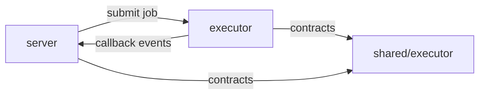

# 05. 执行器子系统 `services/lobster-executor/`

## 1. 子系统定位

`services/lobster-executor/` 是独立于主服务的执行器子系统，负责把“要执行的任务”真正落到运行环境中。

它的职责不是生成业务方案，而是：

- 接收作业
- 选择执行模式
- 启动作业运行
- 管理暂停、恢复、取消
- 记录安全审计
- 回传执行事件、日志和 artifact

从系统位置看，它是“执行面”，而 `server/` 是“编排面”。

## 2. 目录结构

```text
services/lobster-executor
├─ src/
│  ├─ app.ts
│  ├─ index.ts
│  ├─ service.ts
│  ├─ config.ts
│  ├─ docker-runner.ts
│  ├─ native-runner.ts
│  ├─ mock-runner.ts
│  ├─ runner.ts
│  ├─ capabilities.ts
│  ├─ callback-sender.ts
│  ├─ skill-registry.ts
│  ├─ security-audit.ts
│  ├─ security-policy.ts
│  ├─ credential-*
│  ├─ screenshot-utils.ts
│  └─ types.ts
├─ skills/              沙箱技能
├─ ai-bridge/           AI 桥接相关资源
├─ agent-image/         执行镜像与脚本
├─ Dockerfile.*         镜像定义
└─ vitest.config.ts     执行器测试配置
```

## 3. 启动链路

## 3.1 `src/index.ts`

执行器的启动入口负责：

- 读取执行器配置
- 判断请求的执行模式
- 当配置为 `real` 时探测 Docker 是否可达
- Docker 不可达时自动从 `real` 回退到 `native`
- 创建 `LobsterExecutorService`
- 创建 Express 应用并监听端口

这意味着执行器具备较强的本地容错能力，不会因为 Docker 临时不可用就完全无法开发。

## 3.2 执行模式

执行器支持至少三种模式：

| 模式 | 含义 | 场景 |
| --- | --- | --- |
| `real` | 基于 Docker 的真实执行 | 完整沙箱、接近生产 |
| `native` | 在宿主机原生执行 | Docker 不可达时本地开发回退 |
| `mock` | 模拟执行 | 测试、联调、低成本演示 |

### 模式决策逻辑

- 若显式请求 `mock` 或 `native`，直接使用
- 若请求 `real` 且 Docker 可达，使用 `real`
- 若请求 `real` 但 Docker 不可达，自动改为 `native`

## 4. HTTP API 结构

执行器通过 `src/app.ts` 暴露 API。

## 4.1 健康检查

- `GET /health`

返回：

- 服务名
- 协议版本
- 时间戳
- 数据根目录
- 队列状态
- Docker 状态
- 能力摘要
- AI 能力开关

## 4.2 能力探测

- `GET /api/executor/capabilities`

返回：

- 当前支持的能力列表
- Docker 状态相关能力
- 技能根目录
- 技能索引

## 4.3 技能列表

- `GET /api/executor/skills`

返回：

- 技能清单
- 能力索引
- 兼容性/启用状态
- 运行时与安全信息

## 4.4 作业管理

- `GET /api/executor/jobs`
- `GET /api/executor/jobs/:id`
- `POST /api/executor/jobs`
- `POST /api/executor/jobs/:id/cancel`
- `POST /api/executor/jobs/:id/pause`
- `POST /api/executor/jobs/:id/resume`

## 4.5 安全审计

- `GET /api/executor/security-audit`

可按 `jobId` 查询，或返回全部安全审计记录。

## 5. 核心模块职责

## 5.1 `service.ts`

核心职责：

- 接收提交请求
- 维护作业状态与队列
- 调度具体 runner
- 处理取消、暂停、恢复
- 提供作业列表和详情查询

可以把它理解为执行器的“应用服务层”。

## 5.2 `runner.ts`

定义执行 runner 的抽象边界，用于屏蔽不同执行模式的差异。

## 5.3 `docker-runner.ts`

职责：

- 基于 Docker 创建与管理运行环境
- 配合安全策略运行作业
- 在容器中收集日志、截图、artifact

这是最接近“真实执行”路径的实现。

## 5.4 `native-runner.ts`

职责：

- 在宿主机直接执行任务
- 作为本地开发或 Docker 降级路径

## 5.5 `mock-runner.ts`

职责：

- 快速生成模拟执行结果
- 支持测试、联调与演示

## 5.6 `callback-sender.ts`

职责：

- 把作业执行过程中的事件发送回主服务
- 统一回调格式与签名机制

## 5.7 `capabilities.ts`

职责：

- 基于当前配置、模式、Docker 状态生成能力声明
- 对外暴露执行器是否支持某类执行能力

## 5.8 `skill-registry.ts`

职责：

- 扫描技能目录
- 构建技能快照
- 判断技能兼容性与禁用状态
- 输出 capability index

## 5.9 `security-audit.ts` 与 `security-policy.ts`

职责：

- 记录安全审计事件
- 定义执行时的安全边界与策略

执行器之所以能承担“沙箱”角色，这两部分很关键。

## 6. 关键类与函数速查

| 符号 | 类型 | 说明 |
| --- | --- | --- |
| `startLobsterExecutorServer()` | 启动函数 | 执行器服务入口 |
| `resolveEffectiveExecutionMode()` | 函数 | 在 `real` 不可用时回退执行模式 |
| `createLobsterExecutorApp()` | 工厂函数 | 创建执行器 Express 应用 |
| `createLobsterExecutorService()` | 工厂函数 | 创建作业服务 |
| `SandboxSkillRegistry` | 类 | 技能注册与快照管理 |
| `SecurityAuditLogger` | 类 | 安全审计读取与记录 |
| `createExecutorCapabilities()` | 函数 | 生成能力声明 |

## 7. 与主服务的协作关系

## 7.1 调用方向



## 7.2 协作步骤

1. 主服务把任务转换为执行器作业请求
2. 执行器受理后返回 `accepted`
3. 执行器内部 runner 开始执行
4. 执行器持续向主服务回调阶段、日志、截图、artifact
5. 主服务更新 Mission/Replay/Blueprint
6. 前端经 Socket 获得实时反馈

## 7.3 契约边界

双方主要通过 `shared/executor/*` 协作，包括：

- API 路径
- 头部签名字段
- 事件结构
- job 状态
- artifact 结构

## 8. 数据与安全边界

执行器涉及几个重要边界：

### 8.1 数据根目录

执行器会维护自己的 `dataRoot`，用于：

- 作业数据
- 日志文件
- 审计记录

### 8.2 回调签名

主服务侧会校验：

- `x-cube-executor-timestamp`
- `x-cube-executor-signature`

这样可以避免未授权或过期回调污染任务状态。

### 8.3 能力声明

执行器不会假设自己永远具备全部能力，而是通过 `/capabilities` 明确暴露：

- 运行模式
- Docker 可用性
- 技能可用性
- 回调签名支持

### 8.4 安全审计

安全审计是执行器的内建能力，而不是后置补丁。对于真实执行链路，这非常关键。

## 9. 设计特点

### 9.1 独立部署但协议绑定

执行器可以独立启动、测试、部署，但它与主服务通过共享契约紧密绑定。

### 9.2 模式可降级

`real -> native` 的自动回退大幅改善了开发体验，也减少了 Docker 成为单点阻塞的问题。

### 9.3 面向能力而非面向实现

执行器对外暴露的是“能力”，而不是“内部怎么做”。这让主服务更容易根据能力做路由与兼容。

### 9.4 安全与执行并列设计

从目录就能看出：

- 执行
- 技能
- 凭证
- 安全
- 截图与日志

这些能力是一起设计的，不是单纯跑个 shell。

## 10. 阅读建议

建议按以下顺序阅读：

1. `services/lobster-executor/src/index.ts`
2. `services/lobster-executor/src/app.ts`
3. `services/lobster-executor/src/service.ts`
4. `services/lobster-executor/src/config.ts`
5. `services/lobster-executor/src/runner.ts`
6. `services/lobster-executor/src/docker-runner.ts`
7. `services/lobster-executor/src/native-runner.ts`
8. `services/lobster-executor/src/callback-sender.ts`
9. `services/lobster-executor/src/skill-registry.ts`
10. `services/lobster-executor/src/security-audit.ts`
