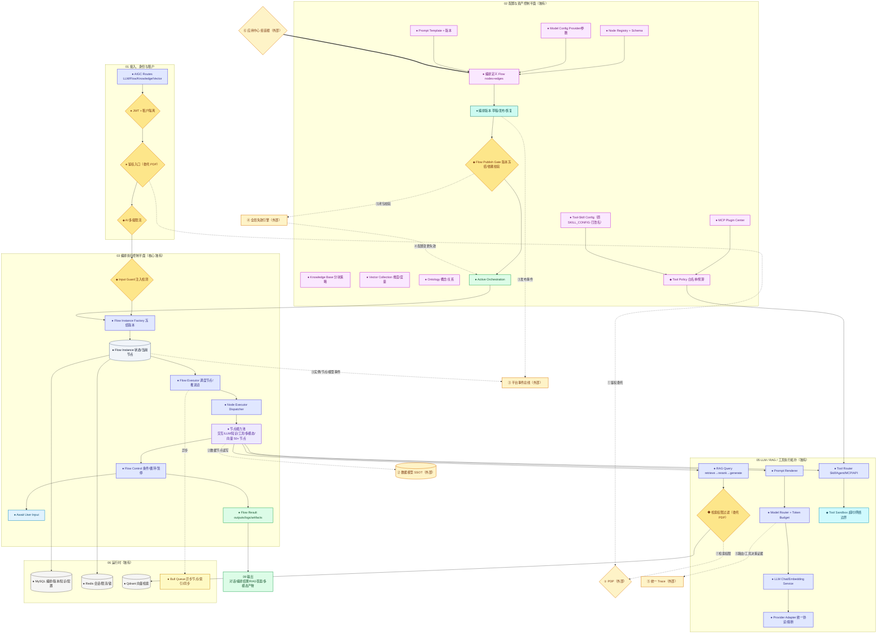

# AIGC 中台 · V2 标准详图（样板）

> 本系统在 V2 中为**执行点（PEP）**。保留它真正独有的：Agent 编排执行、节点能力池、LLM/RAG/工具运行时。
> V2 相对 V1 的关键改动：
> - **P0-1**：`RBAC_GATE / RETRIEVAL_AUTH`（知识库/文档/片段级权限过滤）的**判定委托 PDP**。
> - **P0-3**：`Model Datasource / 数据节点`读写业务数据，绑定数据中台 SSOT。
> - **P0-2/P1-7**：实例/节点/模型事件进**平台总线**；配置变更被**全局依赖图**失效；决策证据进**统一 Trace**。
> - **P2-9**：`SKILL_CONFIG` 已改名 `TOOL_SKILL_CONFIG`，与「Skill 能力」区分。

