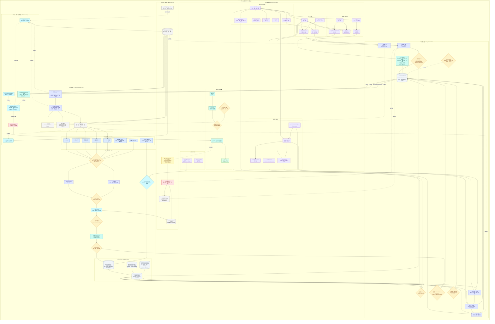

> 🔧 **V2 修订说明**：本图是详图。本系统在 V2 中是**单一决策点 PDP 的宿主**——其它系统的权限判定都应委托到这里；需补「角色继承 / SoD / Fail-Closed」。详见《平台架构 V2 修订版 - 公共内核与接缝治理》（P0-1/P1-4）。

```mermaid
%% RBAC 多租户权限管理系统 · 完整架构图
%% ● = 当前项目已有能力
%% ◆ = 建议补齐 / 收敛能力
%% 实线 = 主请求与执行链路
%% 虚线 = 策略加载、缓存、审计、失效或异步链路

flowchart TB

subgraph ARCH["RBAC 多租户权限管理系统 · 完整架构"]
direction TB

%% =====================================================
%% 00 Surface
%% =====================================================
subgraph SURFACE["00 交互与接入面 / Surface"]
direction LR
WEB_MAIN["● 主门户<br/>web-main"]:::surface
WEB_WORKFLOW["● 工作流中心<br/>web-workflow"]:::surface
WEB_DESIGNER["● 页面设计器<br/>web-designer"]:::surface
WEB_DATA["● 数据中台<br/>web-dataplatform"]:::surface
WEB_AIGC["● AIGC 工作台<br/>web-aigc"]:::surface
ADMIN["● 权限管理中心<br/>用户 · 角色 · 菜单 · 组织 · 数据权限"]:::surface
SDK["● 外部 API / SDK"]:::surface
APP_CLIENT["● 工作流应用调用方<br/>app_key + app_secret + IP 白名单"]:::surface
end

%% =====================================================
%% 01 Ingress
%% =====================================================
subgraph INGRESS["01 接入与身份边界 / Ingress"]
direction LR
GATEWAY{"◆ API Gateway / BFF<br/>TLS · CORS · WAF · 全局限流 · API 版本"}:::gate
ROUTER["● Express Routes<br/>/api · /v1"]:::core
AUTH["● 认证服务<br/>登录 · 注册 · 刷新 · 登出"]:::core
JWT{"● JWT 验证<br/>Cookie / Bearer Token"}:::gate
TOKEN_GUARD["● Token Guard<br/>Redis 黑名单 · 强制下线"]:::trust
USER_STATUS{"● 用户状态校验<br/>active / inactive / locked"}:::gate
TENANT_SWITCH["● 租户切换上下文<br/>originalTenantId / effectiveTenantId"]:::ledger
TENANT_GUARD{"● tenantIsolation<br/>租户存在 · 状态有效"}:::gate
APP_ACCESS{"● WorkflowAccess<br/>app_key · app_secret · IP 白名单"}:::trust
end

%% =====================================================
%% 02 Context
%% =====================================================
subgraph CONTEXT["02 请求上下文 / Request Context"]
direction LR
PRINCIPAL[("● Principal Context<br/>userId · tenantId · originalTenantId<br/>roles · roleIds · permissions<br/>isSwitchedView")]:::state
RESOURCE[("◆ Resource Context<br/>route · resource · action<br/>modelId · recordId · fieldSet")]:::state
ENVIRONMENT[("◆ Environment Context<br/>IP · device · time · clientType<br/>traceId · requestId")]:::state
DECISION_INPUT[("◆ Decision Input<br/>principal + resource + environment")]:::state
end

%% =====================================================
%% 03 Policy Control Plane
%% =====================================================
subgraph POLICY["03 策略控制平面 / Policy Control Plane"]
direction TB

subgraph TENANT_IDENTITY["租户、身份与组织"]
direction LR
TENANT["● Tenant<br/>状态 · 设置 · 资源上限"]:::policy
TENANT_QUOTA["● TenantQuota<br/>用户 · 角色 · 部门 · 菜单配额"]:::policy
USER["● User<br/>用户身份与状态"]:::policy
DEPARTMENT["● Department<br/>部门树 · 主部门"]:::policy
POSITION["● Position<br/>岗位"]:::policy
USER_GROUP["● UserGroup<br/>用户组"]:::policy
end

subgraph RBAC_CORE["RBAC 核心"]
direction LR
ROLE["● Role<br/>租户角色"]:::policy
USER_ROLE["● UserRole<br/>用户绑定角色"]:::policy
PERMISSION["● Permission<br/>resource + action"]:::policy
ROLE_PERMISSION["● RolePermission<br/>角色功能授权"]:::policy
end

subgraph UI_APP_POLICY["菜单与应用权限"]
direction LR
MENU["● Menu<br/>页面 · 路由 · 按钮"]:::policy
ROLE_MENU["● RoleMenu<br/>菜单可见性"]:::policy
APPLICATION["● Application<br/>业务应用"]:::policy
APP_ROLE["● AppRole<br/>应用角色绑定"]:::policy
APP_FEATURE["● AppFeaturePermission<br/>功能开关"]:::policy
end

subgraph DATA_POLICY["数据权限策略"]
direction LR
DATA_SCOPE["● DataScopeConfig<br/>all / department / children<br/>self / custom"]:::policy
DATA_RULE["● DataRule<br/>数据规则表达式"]:::policy
DATA_RULE_CONDITION["● DataRuleCondition<br/>规则条件"]:::policy
ROW_PERMISSION["● RowPermission<br/>model + role + scope + priority"]:::policy
FIELD_PERMISSION["● FieldPermission<br/>hidden / readonly / editable"]:::policy
end

subgraph WORKFLOW_POLICY["流程与系统访问"]
direction LR
WORKFLOW_ACCESS["● WorkflowAccess<br/>应用凭证 · IP 白名单"]:::policy
DELEGATION["● DelegationRule<br/>委托授权"]:::policy
end

subgraph POLICY_LIFECYCLE["策略生命周期 ◆"]
direction LR
POLICY_DRAFT["◆ Draft<br/>草稿"]:::ledger
POLICY_PREVIEW["◆ Preview<br/>模拟授权结果"]:::ledger
POLICY_REVIEW{"◆ Review Gate<br/>高风险策略审批"}:::gate
POLICY_VERSION["◆ Policy Version<br/>发布人 · 生效时间 · 回滚点"]:::ledger
POLICY_EFFECTIVE["◆ Effective<br/>当前生效版本"]:::done
SOD{"◆ SoD 职责分离<br/>禁止自授予 · 双人复核"}:::gate
end

end

%% =====================================================
%% 04 PDP
%% =====================================================
subgraph PDP["04 策略决策层 / Policy Decision Point"]
direction TB
PERMISSION_LOADER["● 权限装载器<br/>User → Roles → Permissions"]:::core
TENANT_MATCH{"◆ Tenant Match Gate<br/>路径 / Body / Record tenant_id<br/>必须匹配 effectiveTenantId"}:::gate
FUNCTION_GATE{"● 功能权限 Gate<br/>hasPermission / hasAnyPermission<br/>hasRole / hasAnyRole"}:::gate
QUOTA_GATE{"● 配额 Gate<br/>租户资源上限校验"}:::gate
MENU_RESOLVER["● 菜单解析器<br/>RoleMenu + permission_code"]:::core
DATA_CONTEXT["● 数据权限上下文<br/>部门树 · 主部门 · 自定义范围"]:::core
MODEL_GATE{"● 数据模型权限 Gate<br/>PermissionManager<br/>read / write"}:::gate
ROW_FILTER["● 行级过滤器<br/>Query Filter + Record Access Check"]:::core
FIELD_FILTER["● 字段级过滤器<br/>隐藏 · 只读 · 更新校验"]:::core
PRECEDENCE["◆ 决策优先级<br/>租户边界 → 身份状态 → 功能权限<br/>模型权限 → 数据范围 → 行权限<br/>字段权限 → 配额<br/>Deny 覆盖 Allow"]:::ledger
FAIL_CLOSED{"◆ Fail Closed<br/>策略异常 / 上下文缺失 / 缓存失效 → DENY"}:::gate
DECISION[("◆ Authorization Decision<br/>ALLOW / DENY / FILTER / MASK<br/>reason · policyVersion · traceId")]:::state
end

%% =====================================================
%% 05 PEP
%% =====================================================
subgraph PEP["05 策略执行点 / Policy Enforcement Point"]
direction LR
MIDDLEWARE["● + ◆ Middleware Chain<br/>authenticate → tenantIsolation → RBAC<br/>quota → dataScope → row → field"]:::core
SERVICE["● 业务服务与控制器<br/>用户 · 角色 · 菜单 · 工作流<br/>设计器 · 数据中台 · 集成 · AIGC"]:::core
READ_PATH["● 查询执行<br/>tenant_id + dataFilter + rowFilter"]:::runtime
WRITE_PATH["● 写入执行<br/>tenant scoped write<br/>record access + field validation"]:::runtime
RESPONSE_PATH["● 响应投影<br/>菜单过滤 · 字段脱敏 · 功能开关"]:::runtime
end

%% =====================================================
%% 06 Runtime
%% =====================================================
subgraph RUNTIME["06 运行时、缓存与配置分发 / Runtime"]
direction LR
MYSQL[("● MySQL / Sequelize<br/>身份 · 授权 · 组织 · 策略 · 审计")]:::runtime
REDIS[("● Redis<br/>Token 黑名单 · 强制下线")]:::runtime
POLICY_CACHE[("◆ Permission Cache<br/>principal × tenant × policyVersion")]:::runtime
EVENT_BUS["◆ Policy Event Bus<br/>role.changed · permission.changed<br/>membership.changed · tenant.switched"]:::bus
INVALIDATION["◆ 权限失效器<br/>缓存失效 · 会话撤销 · 菜单刷新"]:::reentry
JOB_QUEUE["● BullMQ / Async Jobs<br/>导入导出 · 批量任务 · 通知"]:::runtime
end

%% =====================================================
%% 07 Trust
%% =====================================================
subgraph TRUST["07 信任、审计与失效重入 / Trust & Re-entry"]
direction LR
OP_LOG["● OperationLog<br/>管理员操作 · 权限变更"]:::trust
DENY_LOG["● PermissionDeniedLog<br/>越权访问 · 数据拒绝"]:::trust
CHANGE_LOG["● DataChangeHistory<br/>数据变更 · 恢复操作"]:::trust
DECISION_LEDGER["◆ Authorization Decision Ledger<br/>谁访问 · 为什么允许/拒绝<br/>命中策略 · 资源 · traceId"]:::ledger
MONITOR["◆ Security Monitor<br/>租户穿透 · 高频拒绝 · 暴力探测<br/>配额异常 · 高风险授权"]:::trust
ROLLBACK["◆ Policy Rollback<br/>策略回滚 · 应急封禁"]:::reentry
end

%% =====================================================
%% Surface → Ingress
%% =====================================================
WEB_MAIN --> GATEWAY
WEB_WORKFLOW --> GATEWAY
WEB_DESIGNER --> GATEWAY
WEB_DATA --> GATEWAY
WEB_AIGC --> GATEWAY
ADMIN --> GATEWAY
SDK --> GATEWAY
APP_CLIENT --> APP_ACCESS

GATEWAY --> ROUTER
GATEWAY --> AUTH
ROUTER --> JWT
AUTH --> JWT
JWT --> TOKEN_GUARD
TOKEN_GUARD --> USER_STATUS
USER_STATUS --> TENANT_SWITCH
TENANT_SWITCH --> TENANT_GUARD
TENANT_GUARD --> PRINCIPAL
APP_ACCESS --> PRINCIPAL

%% =====================================================
%% Context
%% =====================================================
PRINCIPAL --> DECISION_INPUT
RESOURCE --> DECISION_INPUT
ENVIRONMENT --> DECISION_INPUT

%% =====================================================
%% Policy entity relationships
%% =====================================================
TENANT --> TENANT_QUOTA
TENANT --> USER
TENANT --> ROLE
TENANT --> MENU
TENANT --> DEPARTMENT
TENANT --> USER_GROUP
TENANT --> DATA_RULE

USER --> USER_ROLE
ROLE --> USER_ROLE
ROLE --> ROLE_PERMISSION
PERMISSION --> ROLE_PERMISSION

ROLE --> ROLE_MENU
MENU --> ROLE_MENU

ROLE --> APP_ROLE
APPLICATION --> APP_ROLE
APPLICATION --> APP_FEATURE

DATA_SCOPE --> DATA_RULE
DATA_RULE --> DATA_RULE_CONDITION
ROLE --> ROW_PERMISSION
ROLE --> FIELD_PERMISSION
DATA_RULE --> ROW_PERMISSION

WORKFLOW_ACCESS --> APP_ACCESS

POLICY_DRAFT --> POLICY_PREVIEW
POLICY_PREVIEW --> POLICY_REVIEW
POLICY_REVIEW --> POLICY_VERSION
POLICY_VERSION --> POLICY_EFFECTIVE
SOD --> POLICY_REVIEW

%% =====================================================
%% Policy → Decision
%% =====================================================
MYSQL -.加载策略.-> PERMISSION_LOADER
POLICY_CACHE -.缓存命中.-> PERMISSION_LOADER

ROLE_PERMISSION --> PERMISSION_LOADER
USER_ROLE --> PERMISSION_LOADER
TENANT --> QUOTA_GATE
TENANT_QUOTA --> QUOTA_GATE
ROLE_MENU --> MENU_RESOLVER
APP_FEATURE --> FUNCTION_GATE
DATA_SCOPE --> DATA_CONTEXT
DATA_RULE --> DATA_CONTEXT
ROW_PERMISSION --> ROW_FILTER
FIELD_PERMISSION --> FIELD_FILTER

DECISION_INPUT --> TENANT_MATCH
DECISION_INPUT --> FUNCTION_GATE
DECISION_INPUT --> QUOTA_GATE
DECISION_INPUT --> DATA_CONTEXT
DECISION_INPUT --> MODEL_GATE
DECISION_INPUT --> ROW_FILTER
DECISION_INPUT --> FIELD_FILTER

PERMISSION_LOADER --> FUNCTION_GATE
TENANT_GUARD --> TENANT_MATCH
DATA_CONTEXT --> ROW_FILTER
ROW_FILTER --> FIELD_FILTER

TENANT_MATCH --> DECISION
FUNCTION_GATE --> DECISION
QUOTA_GATE --> DECISION
MODEL_GATE --> DECISION
ROW_FILTER --> DECISION
FIELD_FILTER --> DECISION
PRECEDENCE --> DECISION
FAIL_CLOSED -.异常兜底.-> DECISION

%% =====================================================
%% Decision → Enforcement
%% =====================================================
DECISION -->|ALLOW / FILTER / MASK| MIDDLEWARE
DECISION -->|DENY| DENY_LOG

MIDDLEWARE --> SERVICE
SERVICE --> READ_PATH
SERVICE --> WRITE_PATH
SERVICE --> RESPONSE_PATH

READ_PATH --> MYSQL
WRITE_PATH --> MYSQL
RESPONSE_PATH --> WEB_MAIN
RESPONSE_PATH --> WEB_WORKFLOW
RESPONSE_PATH --> WEB_DESIGNER
RESPONSE_PATH --> WEB_DATA
RESPONSE_PATH --> WEB_AIGC

MENU_RESOLVER -.菜单投影.-> RESPONSE_PATH
FIELD_FILTER -.字段投影.-> RESPONSE_PATH
WRITE_PATH -.数据变更.-> CHANGE_LOG

%% =====================================================
%% Runtime & Invalidation
%% =====================================================
TOKEN_GUARD --> REDIS
POLICY_VERSION -.发布事件.-> EVENT_BUS
EVENT_BUS --> INVALIDATION
INVALIDATION --> POLICY_CACHE
INVALIDATION --> REDIS
INVALIDATION -.触发重载.-> PERMISSION_LOADER
JOB_QUEUE -.异步审计与通知.-> OP_LOG

%% =====================================================
%% Audit & Re-entry
%% =====================================================
DECISION -.授权决策.-> DECISION_LEDGER
MIDDLEWARE -.请求审计.-> OP_LOG
SERVICE -.业务审计.-> OP_LOG

OP_LOG --> MYSQL
DENY_LOG --> MYSQL
CHANGE_LOG --> MYSQL
DECISION_LEDGER --> MYSQL

DENY_LOG -.异常模式.-> MONITOR
OP_LOG -.高风险操作.-> MONITOR
DECISION_LEDGER -.越权趋势.-> MONITOR
MONITOR -.应急封禁 / 回滚.-> ROLLBACK
ROLLBACK --> POLICY_VERSION

end

%% =====================================================
%% Styles
%% =====================================================
classDef surface fill:#dbeafe,stroke:#2563eb,color:#172554,stroke-width:1.5px
classDef core fill:#e0e7ff,stroke:#4f46e5,color:#312e81,stroke-width:1.5px
classDef policy fill:#ede9fe,stroke:#7c3aed,color:#4c1d95,stroke-width:1.5px
classDef gate fill:#fef3c7,stroke:#d97706,color:#78350f,stroke-width:1.5px
classDef trust fill:#cffafe,stroke:#0891b2,color:#164e63,stroke-width:1.5px
classDef ledger fill:#ccfbf1,stroke:#0f766e,color:#134e4a,stroke-width:1.5px
classDef runtime fill:#f5f5f4,stroke:#78716c,color:#292524,stroke-width:1.5px
classDef state fill:#f1f5f9,stroke:#64748b,color:#0f172a,stroke-width:1.5px
classDef reentry fill:#fee2e2,stroke:#dc2626,color:#7f1d1d,stroke-width:1.5px
classDef bus fill:#fef9c3,stroke:#ca8a04,color:#713f12,stroke-width:1.5px
classDef done fill:#dcfce7,stroke:#16a34a,color:#14532d,stroke-width:1.5px
```
