# 工作流中心 · V2 标准详图（样板）

> 这是按《平台架构 V2 修订版》重画的**第一张标准详图**，其余 5 张照此搬。
> 与 V1 的关键差异（已修接缝问题）：
> - **P0-1**：删掉本地 `FORM_PERMISSION / DATA_SCOPE` 判定 → 改为「鉴权委托 PDP」「审批人=角色 由 PDP 解析」。
> - **P0-3**：删掉 `FORM_TEMPLATE` 自带字段 Schema → 改为「表单绑定 SSOT 字段」。
> - **P0-2**：删掉本地 `INVALIDATION` → 改为「发布事件进平台总线」「被全局依赖图精准失效」。
> - **P1-7**：删掉本地 `DECISION_LEDGER` → 决策证据写「统一 Trace」。
> - **P1-5/6**：被「应用中心组装根」组装并钉版本；`PUBLISH_GATE` 调全局依赖图做闭包校验。
> - **保留**：工作流真正独有的——引擎、节点、实例状态机、任务生命周期、审批模式、超时/委托/抄送、统计。

```mermaid
flowchart TB

%% ===== 平台公共内核（外部 · 本系统委托，不自己实现）=====
subgraph KERNEL["平台公共内核 / Platform Kernel（外部·委托）"]
direction LR
  PDP{"① PDP 单一决策点<br/>角色解析·行级·字段级"}:::kernel
  SSOT[("② 数据模型 SSOT<br/>实体·字段")]:::kernel
  BUS["③ 平台事件总线"]:::kernel
  DEP["④ 全局依赖图 + 失效引擎"]:::kernel
  TRACE["⑤ 统一 Trace 账本"]:::kernel
  COMPOSE{"⑥ 应用中心 组装根·钉版本"}:::kernel
end

%% ===== 00 接入与协作 =====
subgraph INGRESS["00 接入与协作 / Ingress"]
direction LR
  ROUTER["● workflowRoutes / version / statistics"]:::core
  AUTH{"● JWT + 租户隔离"}:::gate
  RBAC_GATE{"● 鉴权入口（委托 PDP）"}:::gate
  SOCKET["● 协作 Socket + 冲突合并"]:::runtime
end

%% ===== 02 流程设计控制平面（独有）=====
subgraph DESIGN["02 流程设计控制平面（独有）"]
direction LR
  PROCESS_GROUP["● 流程分组"]:::policy
  PROCESS_CONFIG["● 流程配置"]:::policy
  FLOW_TEMPLATE["● 流程模板<br/>nodes + edges + layout"]:::policy
  FORM_BIND["● 表单绑定<br/>引用 SSOT 字段（不再自带字段Schema）"]:::policy
  NODE_CONFIG["● 节点配置<br/>审批人·时限·条件·抄送"]:::policy
  START_NODE["开始"]:::cap
  APPROVAL_NODE["审批·会签/或签/顺签"]:::cap
  GATEWAY_NODE["网关·条件/并行/汇聚"]:::cap
  AUTO_NODE["自动·HTTP/数据操作"]:::cap
  SUBPROCESS_NODE["子流程"]:::cap
  CC_NODE["抄送"]:::cap
  END_NODE["结束"]:::cap
  VALIDATOR["● 流程校验器<br/>连通性·变量引用·绑定存在"]:::core
  SIMULATOR["● 流程模拟器<br/>路径覆盖·审批人解析"]:::core
  PUBLISH_GATE{"● 发布 Gate<br/>结构·权限·绑定·闭包通过"}:::gate
  PROCESS_VERSION["● 流程版本（钉版本/回滚点）"]:::ledger
end

%% ===== 03 执行控制平面（核心·独有）=====
subgraph EXEC["03 执行控制平面（核心·独有）"]
direction LR
  TRIGGER["● 触发器"]:::core
  INSTANCE_FACTORY["● 实例工厂<br/>冻结流程版本 + 表单快照"]:::core
  INSTANCE_STATE[("● 实例状态机<br/>running/suspended/completed/rejected")]:::state
  ENGINE["● 工作流引擎<br/>推进节点·选下一节点"]:::core
  VAR_CONTEXT[("● 流程变量上下文")]:::state
  CONDITION["● 条件求值"]:::core
  GATEWAY_HANDLER["● 网关处理"]:::core
  ASSIGNEE["● 审批人解析<br/>用户/角色/部门/上级"]:::core
  APPROVAL_MODE["● 审批模式·会签/或签/比例"]:::core
  TASK_FACTORY["● 任务工厂"]:::core
  TASK_STATE[("● 任务状态<br/>pending/approved/rejected/transferred")]:::state
  TASK_ACTION["● 任务动作<br/>同意/驳回/转交/加签"]:::core
  TIMEOUT["● 超时服务 + 自动动作"]:::core
  DELEGATION["● 委托服务"]:::core
  AUTO_EXECUTOR["● 自动节点执行器"]:::core
  SUBPROCESS_MGR["● 子流程管理"]:::core
end

%% ===== 04 运行时（独有；审计/失效已并入内核）=====
subgraph RUNTIME["04 运行时（独有）"]
direction LR
  MYSQL[("● MySQL 模板·实例·任务·历史")]:::runtime
  REDIS[("● Redis 缓存/锁")]:::runtime
  QUEUE["● BullMQ 异步节点·超时·通知"]:::bus
  PROCESSOR["● workflow.processor"]:::runtime
end

%% ===== 05 输出 =====
subgraph OUTPUT["05 输出"]
direction LR
  TASK_OUTPUT["● 待办/已办/抄送"]:::report
  FORM_OUTPUT["● 审批结果/数据回写"]:::report
  AUDIT_OUTPUT["● 审批轨迹"]:::report
  STAT_OUTPUT["● 统计分析"]:::report
end

%% ----- 接入 -----
ROUTER --> AUTH
AUTH --> RBAC_GATE
SOCKET --> FLOW_TEMPLATE

%% ----- 设计 -----
PROCESS_GROUP --> PROCESS_CONFIG
PROCESS_CONFIG --> FLOW_TEMPLATE
START_NODE --> FLOW_TEMPLATE
APPROVAL_NODE --> FLOW_TEMPLATE
GATEWAY_NODE --> FLOW_TEMPLATE
AUTO_NODE --> FLOW_TEMPLATE
SUBPROCESS_NODE --> FLOW_TEMPLATE
CC_NODE --> FLOW_TEMPLATE
END_NODE --> FLOW_TEMPLATE
FLOW_TEMPLATE --> VALIDATOR
FORM_BIND --> VALIDATOR
NODE_CONFIG --> VALIDATOR
VALIDATOR --> SIMULATOR
SIMULATOR --> PUBLISH_GATE
PUBLISH_GATE --> PROCESS_VERSION

%% ----- 执行 -----
RBAC_GATE --> TRIGGER
TRIGGER --> INSTANCE_FACTORY
PROCESS_VERSION -.已发布版本+快照.-> INSTANCE_FACTORY
INSTANCE_FACTORY --> INSTANCE_STATE
INSTANCE_FACTORY --> VAR_CONTEXT
INSTANCE_STATE --> ENGINE
VAR_CONTEXT --> ENGINE
ENGINE --> CONDITION
CONDITION --> GATEWAY_HANDLER
GATEWAY_HANDLER --> ENGINE
ENGINE --> ASSIGNEE
APPROVAL_MODE --> TASK_FACTORY
ASSIGNEE --> TASK_FACTORY
TASK_FACTORY --> TASK_STATE
TASK_STATE --> TASK_ACTION
TASK_ACTION --> ENGINE
ENGINE --> TIMEOUT
TIMEOUT --> ENGINE
DELEGATION --> ASSIGNEE
ENGINE --> AUTO_EXECUTOR
ENGINE --> SUBPROCESS_MGR
SUBPROCESS_MGR --> INSTANCE_FACTORY

%% ----- 运行时 -----
INSTANCE_STATE --> MYSQL
TASK_STATE --> MYSQL
ENGINE -.异步.-> QUEUE
QUEUE --> PROCESSOR
PROCESSOR --> ENGINE
MYSQL -.缓存/锁.-> REDIS

%% ----- 输出 -----
TASK_STATE --> TASK_OUTPUT
ENGINE --> FORM_OUTPUT
ENGINE --> AUDIT_OUTPUT
MYSQL --> STAT_OUTPUT

%% ===== 与内核的委托/绑定/事件（V2 关键改动）=====
RBAC_GATE -.①鉴权委托.-> PDP
ASSIGNEE -.①审批人=角色·解析.-> PDP
FORM_BIND -.②字段绑定.-> SSOT
AUTO_EXECUTOR -.②读写业务数据.-> SSOT
PROCESS_VERSION -.③发布事件.-> BUS
DEP -.③精准失效.-> PROCESS_VERSION
COMPOSE ==> PROCESS_CONFIG
PUBLISH_GATE -.⑤闭包校验.-> DEP
ENGINE -.⑤决策证据.-> TRACE
ASSIGNEE -.⑤审批人解析证据.-> TRACE

classDef kernel fill:#fef3c7,stroke:#d97706,color:#78350f,stroke-width:1.5px
classDef core fill:#e0e7ff,stroke:#4f46e5,color:#312e81,stroke-width:1.5px
classDef cap fill:#ede9fe,stroke:#7c3aed,color:#4c1d95,stroke-width:1.5px
classDef policy fill:#fae8ff,stroke:#c026d3,color:#701a75,stroke-width:1.5px
classDef gate fill:#fde68a,stroke:#d97706,color:#78350f,stroke-width:1.5px
classDef ledger fill:#ccfbf1,stroke:#0f766e,color:#134e4a,stroke-width:1.5px
classDef runtime fill:#f5f5f4,stroke:#78716c,color:#292524,stroke-width:1.5px
classDef state fill:#f1f5f9,stroke:#64748b,color:#0f172a,stroke-width:1.5px
classDef bus fill:#fef9c3,stroke:#ca8a04,color:#713f12,stroke-width:1.5px
classDef report fill:#dcfce7,stroke:#16a34a,color:#14532d,stroke-width:1.5px
```

---

## 照搬到其余 5 张的「替换清单」

| 原图本地框（删/改） | 换成 |
|---|---|
| 任何本地 `*_PERMISSION` / `DATA_SCOPE` / `FIELD_FILTER` 决策 | `-.鉴权委托.-> PDP` |
| 任何自带「字段 Schema / 字段定义」 | `-.字段绑定.-> SSOT` |
| 任何本地 `INVALIDATION` / 本地依赖图 | `-.发布事件.-> BUS` + `DEP -.精准失效.->` |
| 任何本地 `DECISION_LEDGER` | `-.决策证据.-> TRACE` |
| 任何 `PUBLISH_GATE` | 末尾加 `-.闭包校验.-> DEP` |
| 顶层入口（被谁组装） | `COMPOSE ==> 本系统配置根` |
