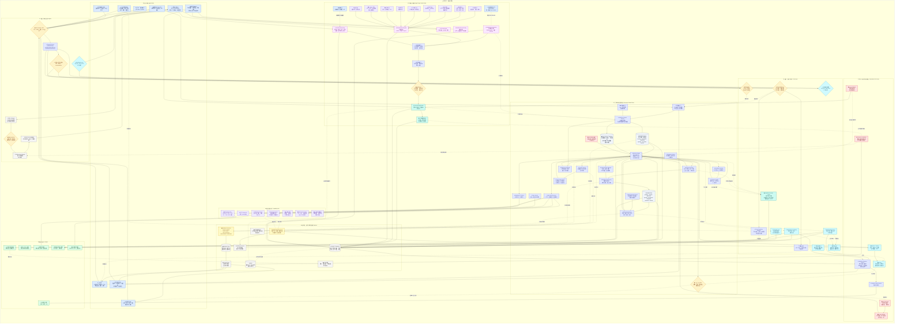

> 🔧 **V2 修订说明**：本图是详图。本系统在 V2 中为**执行点（PEP）**：`FORM_PERMISSION/DATA_SCOPE` 改为委托 PDP；`FORM_TEMPLATE` 字段改为绑定数据模型 SSOT；本地失效改为订阅平台事件总线（P0-1/P0-3/P0-2）。详见《平台架构 V2 修订版 - 公共内核与接缝治理》。

```mermaid
%% 工作流中心 / Workflow Center · 完整架构图
%% ● = 当前项目已有能力
%% ◆ = 建议补齐、服务化或平台化能力
%% 实线 = 主链路
%% 虚线 = 异步、缓存、审计、同步、回退或重入链路

flowchart TB

subgraph ARCH["工作流中心 · 完整架构图"]
direction TB

%% =====================================================
%% 00 交互与接入
%% =====================================================
subgraph SURFACE["00 交互与接入面 / Surface"]
direction LR

PORTAL["● 主门户 / 微前端容器<br/>web-main + qiankun"]:::surface
DESIGNER["● 流程设计中心<br/>AntV X6 FlowEditor<br/>画布 · 节点面板 · 属性配置"]:::surface
TEMPLATE_CENTER["● 模板与版本中心<br/>流程模板 · 表单模板 · 流程分组<br/>草稿 · 发布 · 历史版本"]:::surface
TICKET_CENTER["● 工单中心<br/>发起流程 · 我的待办 · 已办<br/>我发起的 · 抄送 · 委托"]:::surface
TASK_CENTER["● 审批任务中心<br/>处理 · 转交 · 加签 · 退回<br/>批量审批 · 催办"]:::surface
SIMULATION["● 流程模拟与测试<br/>路径模拟 · 节点调试 · 测试实例"]:::surface
ANALYTICS_UI["● 统计分析中心<br/>完成率 · 平均耗时 · 节点瓶颈<br/>审批效率 · 导出报表"]:::surface
ADMIN_UI["● 工作流管理后台<br/>流程配置 · 权限 · 超时<br/>委托 · 通知 · 模板库"]:::surface
MOBILE_API["◆ 移动端 / Open API<br/>移动审批 · 外部发起 · API 触发"]:::surface

end

%% =====================================================
%% 01 接入、身份、实时协作
%% =====================================================
subgraph INGRESS["01 接入与协作边界 / Ingress"]
direction LR

GATEWAY{"◆ API Gateway / BFF<br/>TLS · CORS · 限流 · API 版本"}:::gate
ROUTER["● Express Routes<br/>workflowRoutes<br/>workflowStatisticsRoutes<br/>workflowVersionRoutes"]:::core
AUTH{"● 身份认证与多租户<br/>JWT · RBAC · tenantIsolation"}:::gate
WORKFLOW_ACCESS{"● WorkflowAccess<br/>app_key · app_secret<br/>IP 白名单"}:::trust
SOCKET["● WebSocket 协作通道<br/>协作者光标 · 选区 · 实时编辑"]:::runtime
COLLAB["● Collaboration Manager<br/>多人协同编辑<br/>冲突感知"]:::runtime
OFFLINE["● Offline Manager<br/>localStorage 缓存<br/>离线变更自动同步"]:::runtime
SYNC_GATE{"◆ 协作合并 Gate<br/>版本冲突 · 乐观锁<br/>冲突提示 / 合并策略"}:::gate

end

%% =====================================================
%% 02 设计控制平面
%% =====================================================
subgraph DESIGN_PLANE["02 流程设计控制平面 / Design Control Plane"]
direction TB

PROCESS_GROUP["● ProcessGroup<br/>流程分类 · 业务域 · 标签"]:::policy

FLOW_TEMPLATE["● WorkflowFlowTemplate<br/>流程图定义<br/>nodes + edges + layout"]:::policy

FORM_TEMPLATE["● WorkflowFormTemplate<br/>表单模板引用<br/>字段 Schema · 权限 Schema"]:::policy

PROCESS_CONFIG["● WorkflowProcessConfig<br/>流程配置<br/>名称 · 发起权限 · 流程规则"]:::policy

PROCESS_VERSION["● ProcessConfigVersion<br/>草稿 · 已发布 · 历史版本<br/>回滚点"]:::ledger

NODE_CONFIG["● WorkflowNodeConfig<br/>审批人 · 角色 · 部门 · 时限<br/>条件 · 自动动作 · 抄送"]:::policy

START_NODE["● 开始节点<br/>发起表单 · 发起人规则"]:::cap
APPROVAL_NODE["● 审批节点<br/>会签 · 或签 · 顺签<br/>转交 · 加签 · 退回"]:::cap
AUTO_NODE["● 自动节点<br/>HTTP 请求 · 数据操作<br/>数据同步"]:::cap
GATEWAY_NODE["● 网关节点<br/>条件分支 · 并行分支<br/>汇聚"]:::cap
SUBPROCESS_NODE["● 子流程节点<br/>子流程调用 · 等待返回"]:::cap
CC_NODE["● 抄送节点<br/>通知相关人"]:::cap
TIMER_NODE["◆ 定时节点<br/>延迟 · 定时触发 · SLA"]:::cap
AI_NODE["◆ AI / Agent 节点<br/>LLM · RAG · 文档处理<br/>自动决策建议"]:::cap
END_NODE["● 结束节点<br/>结束状态 · 回写结果"]:::cap

FORM_DESIGNER["● 外部表单设计器<br/>web-designer<br/>唯一输出 Form Schema"]:::surface
DATA_PLATFORM["● 数据中台<br/>数据模型 · 数据源 · API"]:::surface

VALIDATOR["● 流程校验器<br/>节点完整性 · 连通性<br/>变量引用 · 表单绑定"]:::core

SIMULATOR["● 流程模拟器<br/>模拟路径 · 条件命中<br/>审批人解析"]:::core

PUBLISH_GATE{"◆ 发布 Gate<br/>结构校验 · 权限校验<br/>表单存在 · 版本冻结"}:::gate

POLICY_VERSION["◆ 流程策略版本<br/>发布人 · 审批记录<br/>生效时间 · 回滚点"]:::ledger

end

%% =====================================================
%% 03 发起与执行控制平面
%% =====================================================
subgraph EXEC_CONTROL["03 工作流执行控制平面 / Execution Control Plane"]
direction TB

TRIGGER["● 流程触发器<br/>手动发起 · 表单提交<br/>API 发起 · 系统事件"]:::core

SCHEDULE_TRIGGER["◆ 调度触发器<br/>Cron · 定时任务<br/>周期性流程"]:::core

INSTANCE_FACTORY["● Workflow Instance Factory<br/>创建流程实例<br/>冻结流程版本与表单快照"]:::core

INSTANCE_STATE[("● WorkflowInstance<br/>状态机唯一事实源<br/>running · suspended · completed<br/>rejected · cancelled · timeout")]:::state

ENGINE["● Workflow Engine<br/>推进当前节点<br/>选择下一节点<br/>实例状态流转"]:::core

VARIABLE_CONTEXT[("◆ Flow Context / Variables<br/>表单数据 · 发起人 · 节点输出<br/>系统变量 · 外部数据<br/>变量作用域")]:::state

CONDITION_ENGINE["● Condition Evaluator<br/>条件表达式 · 数据判断"]:::core

GATEWAY_HANDLER["● Gateway Handler<br/>排他分支 · 并行分支<br/>汇聚条件"]:::core

ASSIGNEE["● Assignee Resolver<br/>用户 · 角色 · 部门 · 岗位<br/>上级 · 发起人 · 动态规则"]:::core

APPROVAL_MODE["● Approval Mode Manager<br/>会签 · 或签 · 顺签<br/>比例通过 · 驳回策略"]:::core

TASK_FACTORY["● Workflow Task Factory<br/>创建待办任务<br/>分配处理人 · 截止时间"]:::core

TASK_STATE[("● WorkflowTask<br/>pending · claimed · approved<br/>rejected · transferred · delegated<br/>cancelled · expired")]:::state

TASK_ACTION["● Task Action Service<br/>同意 · 驳回 · 退回 · 转交<br/>加签 · 撤回 · 认领"]:::core

BATCH_APPROVAL["● Batch Approval Service<br/>批量同意 · 批量驳回<br/>批量处理校验"]:::core

DELEGATION["● Delegation Service<br/>委托规则 · 委托关系<br/>代理审批"]:::core

CC_SERVICE["● Workflow CC Service<br/>抄送记录 · 已读状态"]:::core

AUTO_EXECUTOR["● Auto Node Executor<br/>HTTP · 数据操作 · 数据同步"]:::core

SUBPROCESS_MANAGER["● Subprocess Manager<br/>子流程启动 · 等待<br/>回传 · 异常处理"]:::core

TIMEOUT_SERVICE["● Timeout Service<br/>到期扫描 · 超时统计<br/>自动动作"]:::core

URGE_SERVICE["● Urge Service<br/>催办 · 催办频率控制"]:::core

AUTO_ACTION["● Timeout Auto Action<br/>自动通过 · 自动拒绝<br/>自动转交 · 升级处理"]:::core

SUSPEND_GATE{"◆ 人工介入 Gate<br/>暂停 · 恢复 · 强制终止<br/>异常转人工"}:::gate

COMPENSATION["◆ 补偿与回滚服务<br/>失败补偿 · 业务撤销<br/>节点级重试"]:::reentry

end

%% =====================================================
%% 04 任务运行时与异步能力
%% =====================================================
subgraph RUNTIME["04 运行时、队列与状态投影 / Runtime"]
direction LR

MYSQL[("● MySQL / Sequelize<br/>模板 · 配置 · 版本 · 实例<br/>任务 · 日志 · 历史 · 统计")]:::runtime

REDIS[("● Redis<br/>缓存 · 锁 · Token 状态<br/>临时协作状态")]:::runtime

WORKFLOW_QUEUE["● BullMQ Workflow Queue<br/>异步节点 · 通知 · 超时检查<br/>批量审批 · 数据同步"]:::bus

WORKFLOW_PROCESSOR["● workflow.processor<br/>后台任务消费<br/>重试 · 失败处理"]:::runtime

EVENT_BUS["◆ Workflow Event Bus<br/>instance.started<br/>task.created · task.completed<br/>node.entered · node.failed"]:::bus

REALTIME_STORE[("◆ Realtime Store<br/>实例进度 · 当前节点<br/>协作状态 · 在线状态")]:::runtime

SOCKET_RELAY["◆ Socket Relay<br/>任务状态推送<br/>设计协作推送"]:::runtime

SEARCH_INDEX["◆ 流程检索索引<br/>实例全文检索 · 审批检索<br/>模板检索"]:::runtime

OBJECT_STORAGE["◆ 对象存储<br/>附件 · 导出文件 · 流程快照<br/>审计归档"]:::runtime

end

%% =====================================================
%% 05 外部集成与能力池
%% =====================================================
subgraph CAPABILITY_POOL["05 集成与能力池 / Capability Pool"]
direction TB

HTTP_CONNECTOR["● HTTP Connector<br/>第三方 API 调用"]:::cap

DATA_SYNC["● Data Sync Service<br/>数据模型同步<br/>字段映射 · 转换规则"]:::cap

INTEGRATION["◆ Integration Hub<br/>Webhook · ERP · CRM<br/>OA · 飞书 · 钉钉 · 邮件"]:::cap

NOTIFICATION["● Notification Service<br/>站内信 · 邮件 · 短信<br/>企业 IM"]:::cap

FILE_SERVICE["◆ 文件与附件服务<br/>附件权限 · 文件预览<br/>归档与导出"]:::cap

AIGC_ORCH["◆ AIGC Orchestration<br/>LLM · RAG · 文档提取<br/>Agent Tool 调用"]:::cap

RULE_ENGINE["◆ 规则引擎<br/>决策表 · 规则集<br/>可视化表达式"]:::cap

end

%% =====================================================
%% 06 权限、信任与审计
%% =====================================================
subgraph TRUST["06 权限、信任与审计 / Trust Layer"]
direction TB

TENANT_GUARD{"● 多租户边界<br/>tenant_id 隔离<br/>租户状态与配额"}:::gate

RBAC_GATE{"● RBAC 权限 Gate<br/>发起权限 · 模板权限<br/>审批权限 · 管理权限"}:::gate

FORM_PERMISSION["● Form Permission Manager<br/>字段可见 · 只读 · 可编辑<br/>节点级表单权限"]:::core

DATA_SCOPE["● 数据权限<br/>部门 · 本人 · 自定义范围<br/>行级过滤"]:::core

WORKFLOW_ACCESS_GUARD{"● 应用访问控制<br/>app_key · app_secret<br/>IP 白名单"}:::trust

VERSION_AUDIT["● 流程版本审计<br/>发布版本 · 模板快照<br/>实例绑定版本"]:::trust

INSTANCE_LOG["● WorkflowInstanceLog<br/>节点流转 · 操作记录<br/>异常与重试"]:::trust

PROCESS_HISTORY["● WorkflowProcessHistory<br/>审批历史 · 意见<br/>操作轨迹"]:::trust

OP_LOG["● Operation Log<br/>后台配置变更<br/>权限与模板操作"]:::trust

DECISION_LEDGER["◆ Workflow Decision Ledger<br/>节点为什么流转<br/>条件命中 · 审批人解析<br/>规则版本 · traceId"]:::ledger

SECURITY_MONITOR["◆ 风险监控<br/>异常审批 · 高频催办<br/>越权访问 · 超时异常"]:::trust

end

%% =====================================================
%% 07 统计、监控、失效重入
%% =====================================================
subgraph OPS["07 统计、监控与失效重入 / Operations & Re-entry"]
direction TB

STATISTICS["● Workflow Statistics Service<br/>执行次数 · 完成率<br/>平均耗时 · 节点瓶颈<br/>审批人效率"]:::core

STAT_EXPORT["● Statistics Export Service<br/>导出统计报表"]:::core

METRICS["◆ Metrics / Tracing<br/>耗时 · 成功率 · 失败率<br/>队列积压 · SLA"]:::trust

ALERTING["◆ Alerting<br/>节点故障 · 队列积压<br/>超时激增 · 集成失败"]:::trust

RETRY["◆ Retry Manager<br/>自动节点重试<br/>指数退避 · 幂等键"]:::reentry

REENTRY["◆ Re-entry Engine<br/>实例重试 · 从节点恢复<br/>回退到上一步"]:::reentry

INVALIDATION["◆ Definition Invalidation<br/>模板发布后缓存失效<br/>协作编辑冲突刷新"]:::reentry

ROLLBACK["◆ Version Rollback<br/>流程版本回滚<br/>应急停用模板"]:::reentry

end

%% =====================================================
%% 08 输出
%% =====================================================
subgraph OUTPUT["08 输出与交付 / Output"]
direction LR

FORM_OUTPUT["● 表单与业务数据<br/>审批结果 · 数据回写"]:::report
TASK_OUTPUT["● 待办 / 已办 / 抄送<br/>任务清单与操作结果"]:::report
NOTIFY_OUTPUT["● 通知与提醒<br/>审批通知 · 催办 · 超时提醒"]:::report
AUDIT_OUTPUT["● 审批轨迹与审计报告<br/>实例日志 · 流程历史"]:::report
ANALYTICS_OUTPUT["● 运营分析报表<br/>效率 · 瓶颈 · SLA"]:::report
INTEGRATION_OUTPUT["◆ 外部系统回调<br/>Webhook · API · 业务事件"]:::report

end

%% =====================================================
%% Surface -> Ingress
%% =====================================================
PORTAL --> GATEWAY
DESIGNER --> GATEWAY
TEMPLATE_CENTER --> GATEWAY
TICKET_CENTER --> GATEWAY
TASK_CENTER --> GATEWAY
SIMULATION --> GATEWAY
ANALYTICS_UI --> GATEWAY
ADMIN_UI --> GATEWAY
MOBILE_API --> GATEWAY

GATEWAY --> ROUTER
ROUTER --> AUTH
AUTH --> TENANT_GUARD
AUTH --> RBAC_GATE
MOBILE_API --> WORKFLOW_ACCESS
WORKFLOW_ACCESS --> WORKFLOW_ACCESS_GUARD

DESIGNER <--> SOCKET
SOCKET <--> COLLAB
DESIGNER <--> OFFLINE
OFFLINE --> SYNC_GATE
SYNC_GATE --> COLLAB

%% =====================================================
%% 设计链路
%% =====================================================
DESIGNER --> FLOW_TEMPLATE
DESIGNER --> NODE_CONFIG
TEMPLATE_CENTER --> PROCESS_GROUP
TEMPLATE_CENTER --> PROCESS_CONFIG
TEMPLATE_CENTER --> PROCESS_VERSION

FORM_DESIGNER -.输出 Form Schema.-> FORM_TEMPLATE
DATA_PLATFORM -.数据模型 / 数据源.-> NODE_CONFIG

START_NODE --> FLOW_TEMPLATE
APPROVAL_NODE --> FLOW_TEMPLATE
AUTO_NODE --> FLOW_TEMPLATE
GATEWAY_NODE --> FLOW_TEMPLATE
SUBPROCESS_NODE --> FLOW_TEMPLATE
CC_NODE --> FLOW_TEMPLATE
TIMER_NODE --> FLOW_TEMPLATE
AI_NODE --> FLOW_TEMPLATE
END_NODE --> FLOW_TEMPLATE

FLOW_TEMPLATE --> VALIDATOR
FORM_TEMPLATE --> VALIDATOR
NODE_CONFIG --> VALIDATOR
VALIDATOR --> SIMULATOR
SIMULATOR --> PUBLISH_GATE
PUBLISH_GATE --> PROCESS_VERSION
PROCESS_VERSION --> POLICY_VERSION

POLICY_VERSION --> MYSQL
POLICY_VERSION -.发布后缓存失效.-> INVALIDATION

%% =====================================================
%% 发起与实例执行
%% =====================================================
TICKET_CENTER --> TRIGGER
MOBILE_API --> TRIGGER
TRIGGER --> INSTANCE_FACTORY
SCHEDULE_TRIGGER --> INSTANCE_FACTORY

PROCESS_VERSION -.已发布版本.-> INSTANCE_FACTORY
FORM_TEMPLATE -.表单快照.-> INSTANCE_FACTORY
RBAC_GATE -.发起校验.-> TRIGGER
TENANT_GUARD -.租户校验.-> TRIGGER

INSTANCE_FACTORY --> INSTANCE_STATE
INSTANCE_FACTORY --> VARIABLE_CONTEXT
INSTANCE_STATE --> ENGINE
VARIABLE_CONTEXT --> ENGINE

ENGINE --> CONDITION_ENGINE
ENGINE --> GATEWAY_HANDLER
ENGINE --> ASSIGNEE
ENGINE --> APPROVAL_MODE
ENGINE --> AUTO_EXECUTOR
ENGINE --> SUBPROCESS_MANAGER
ENGINE --> CC_SERVICE
ENGINE --> TIMEOUT_SERVICE
ENGINE --> SUSPEND_GATE

ASSIGNEE --> TASK_FACTORY
APPROVAL_MODE --> TASK_FACTORY
TASK_FACTORY --> TASK_STATE
TASK_STATE --> TASK_ACTION
TASK_ACTION --> ENGINE

BATCH_APPROVAL --> TASK_ACTION
DELEGATION --> ASSIGNEE
DELEGATION --> TASK_ACTION

TIMEOUT_SERVICE --> AUTO_ACTION
AUTO_ACTION --> ENGINE
URGE_SERVICE --> NOTIFICATION
CC_SERVICE --> NOTIFICATION

CONDITION_ENGINE --> GATEWAY_HANDLER
GATEWAY_HANDLER --> ENGINE

AUTO_EXECUTOR --> HTTP_CONNECTOR
AUTO_EXECUTOR --> DATA_SYNC
AUTO_EXECUTOR --> INTEGRATION
AUTO_EXECUTOR --> RULE_ENGINE
AUTO_EXECUTOR --> AIGC_ORCH

SUBPROCESS_MANAGER --> INSTANCE_FACTORY
SUBPROCESS_MANAGER --> ENGINE

SUSPEND_GATE -.暂停 / 人工处理.-> TASK_CENTER
SUSPEND_GATE -.失败重试.-> RETRY
RETRY --> REENTRY
REENTRY --> ENGINE
COMPENSATION --> ENGINE

%% =====================================================
%% 运行时、异步、事件
%% =====================================================
INSTANCE_STATE --> MYSQL
TASK_STATE --> MYSQL
PROCESS_VERSION --> MYSQL
FLOW_TEMPLATE --> MYSQL
FORM_TEMPLATE --> MYSQL
NODE_CONFIG --> MYSQL

ENGINE -.异步节点.-> WORKFLOW_QUEUE
TIMEOUT_SERVICE -.定期扫描.-> WORKFLOW_QUEUE
NOTIFICATION -.异步通知.-> WORKFLOW_QUEUE
DATA_SYNC -.异步同步.-> WORKFLOW_QUEUE
WORKFLOW_QUEUE --> WORKFLOW_PROCESSOR
WORKFLOW_PROCESSOR --> ENGINE

ENGINE -.状态事件.-> EVENT_BUS
TASK_FACTORY -.任务创建事件.-> EVENT_BUS
TASK_ACTION -.任务处理事件.-> EVENT_BUS
EVENT_BUS --> REALTIME_STORE
REALTIME_STORE --> SOCKET_RELAY
SOCKET_RELAY --> TICKET_CENTER
SOCKET_RELAY --> TASK_CENTER
SOCKET_RELAY --> ANALYTICS_UI

MYSQL -.缓存与分布式锁.-> REDIS
PROCESS_VERSION -.权限与模板缓存.-> REDIS
INSTANCE_STATE -.检索索引.-> SEARCH_INDEX
FORM_OUTPUT -.附件归档.-> OBJECT_STORAGE

%% =====================================================
%% 权限、审计
%% =====================================================
ROUTER --> RBAC_GATE
ROUTER --> TENANT_GUARD
ROUTER --> WORKFLOW_ACCESS_GUARD

RBAC_GATE --> FORM_PERMISSION
RBAC_GATE --> DATA_SCOPE
FORM_PERMISSION -.字段投影.-> FORM_OUTPUT
DATA_SCOPE -.数据过滤.-> TICKET_CENTER

ENGINE -.节点流转.-> INSTANCE_LOG
TASK_ACTION -.审批记录.-> PROCESS_HISTORY
ADMIN_UI -.配置变更.-> OP_LOG
ENGINE -.决策轨迹.-> DECISION_LEDGER
ASSIGNEE -.审批人解析证据.-> DECISION_LEDGER
GATEWAY_HANDLER -.条件命中证据.-> DECISION_LEDGER

INSTANCE_LOG --> MYSQL
PROCESS_HISTORY --> MYSQL
OP_LOG --> MYSQL
DECISION_LEDGER --> MYSQL

INSTANCE_LOG -.异常模式.-> SECURITY_MONITOR
PROCESS_HISTORY -.审批风险.-> SECURITY_MONITOR
SECURITY_MONITOR -.告警.-> ALERTING

%% =====================================================
%% 统计与输出
%% =====================================================
MYSQL --> STATISTICS
INSTANCE_LOG --> STATISTICS
PROCESS_HISTORY --> STATISTICS
STATISTICS --> STAT_EXPORT
STATISTICS --> ANALYTICS_UI
STAT_EXPORT --> ANALYTICS_OUTPUT

ENGINE --> METRICS
WORKFLOW_QUEUE --> METRICS
METRICS --> ALERTING

ENGINE --> FORM_OUTPUT
TASK_STATE --> TASK_OUTPUT
NOTIFICATION --> NOTIFY_OUTPUT
INSTANCE_LOG --> AUDIT_OUTPUT
PROCESS_HISTORY --> AUDIT_OUTPUT
INTEGRATION --> INTEGRATION_OUTPUT

%% =====================================================
%% 失效、回滚与重入
%% =====================================================
INVALIDATION --> REDIS
INVALIDATION -.刷新协作快照.-> COLLAB
ROLLBACK --> PROCESS_VERSION
ROLLBACK -.终止或迁移实例.-> ENGINE
ALERTING -.人工处置.-> SUSPEND_GATE

end

%% =====================================================
%% 样式
%% =====================================================
classDef surface fill:#dbeafe,stroke:#2563eb,color:#172554,stroke-width:1.5px
classDef core fill:#e0e7ff,stroke:#4f46e5,color:#312e81,stroke-width:1.5px
classDef cap fill:#ede9fe,stroke:#7c3aed,color:#4c1d95,stroke-width:1.5px
classDef policy fill:#fae8ff,stroke:#c026d3,color:#701a75,stroke-width:1.5px
classDef gate fill:#fef3c7,stroke:#d97706,color:#78350f,stroke-width:1.5px
classDef trust fill:#cffafe,stroke:#0891b2,color:#164e63,stroke-width:1.5px
classDef ledger fill:#ccfbf1,stroke:#0f766e,color:#134e4a,stroke-width:1.5px
classDef runtime fill:#f5f5f4,stroke:#78716c,color:#292524,stroke-width:1.5px
classDef state fill:#f1f5f9,stroke:#64748b,color:#0f172a,stroke-width:1.5px
classDef reentry fill:#fee2e2,stroke:#dc2626,color:#7f1d1d,stroke-width:1.5px
classDef bus fill:#fef9c3,stroke:#ca8a04,color:#713f12,stroke-width:1.5px
classDef report fill:#dcfce7,stroke:#16a34a,color:#14532d,stroke-width:1.5px
```
