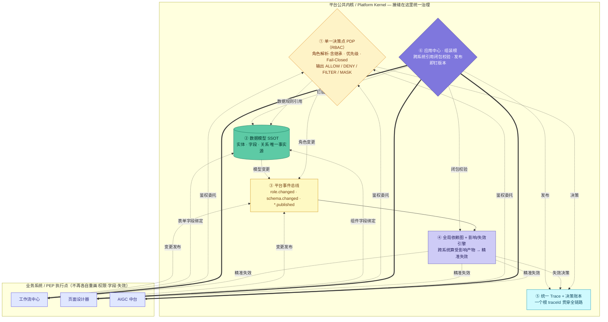

# 平台架构 V2 · 修订版 — 公共内核与接缝治理

> 针对《架构闭环评审-接缝问题与优化建议》里的 P0/P1/P2，这是第一版修订。
> **核心修法**：原 6 张图各自重画了「权限决策 / 字段定义 / 失效重入 / 审计」这些**共享职能**，导致漂移和断裂。
> V2 把这些共享职能**抽成一个「平台公共内核」**，6 个系统降级为**执行点（PEP）委托内核**——接缝从此在一个地方统一治理。

---

## 一、逐条修复对照

| 编号 | 原问题 | V2 怎么修 |
|---|---|---|
| **P0-1** | 权限决策各画各的，无单一 PDP | 抽出 **① 单一决策点 PDP（RBAC）**；工作流/页面/数据/AIGC 改为「鉴权委托」边，**不再自带行级/字段级权限判定** |
| **P0-2** | 失效/重入闭环跨系统断裂 | 加 **③ 平台事件总线 + ④ 全局依赖图/影响失效引擎**；任何系统变更发布到总线，依赖图跨系统算出受影响产物并精准失效（= 已实现的 `orchestrator.impact()`） |
| **P0-3** | 字段/角色定义在多处，破坏 SSOT | **② 数据模型设为字段唯一 SSOT**；表单/页面只「绑定」字段，不再各自定义 |
| **P1-4** | 两套角色模型，继承只在 App 一边 | 角色解析（**含继承**）统一归 PDP；应用中心只做「成员绑定」，不另立继承语义 |
| **P1-5** | App 组装根的跨系统校验是空话 | **⑥ 应用中心组装根**的发布门禁 = 「跨系统引用闭包校验」（workflow.assignee ∈ app.roles；page.binding ∈ app.dataModels），调用依赖图 |
| **P1-6** | App 包版本钉选未定义 | App **发布即钉死**各子产物版本；运行时按 `RELEASE_ARTIFACT` 快照解析，不取最新 |
| **P1-7** | 6 套决策账本，无全局 trace | **⑤ 统一 Trace + 决策账本**：一个根 traceId 贯穿全链路，各系统决策带同一根 traceId |
| **P2-8** | 数据中台口径过大（数仓 vs 建模器） | 标注待定：拆成「应用数据建模器（OLTP）」与「企业数仓（OLAP）」两条线，不混在一张闭环 |
| **P2-9** | AIGC `SKILL_CONFIG` 与「Skill 能力」撞名 | 改名为 `TOOL_SKILL_CONFIG`（工具技能配置），与 Skill 抽象区分 |

---

## 二、V2 架构图（公共内核 + 系统委托）

---

## 三、对原 6 张图的改动指引

V2 不删 6 张详图（它们仍是各系统内部的"放大镜"），但每张要按下表对齐——把**重复画的共享职能换成「委托内核」**：

| 原图 | 删除/降级（改为委托内核） | 保留 |
|---|---|---|
| RBAC | — | 它**就是** PDP 内核的宿主；补上「角色继承」「SoD」「Fail-Closed」 |
| 数据中台 | — | 它**就是** SSOT 内核的宿主；OLAP 数仓部分拆出去（P2-8） |
| 工作流 | `FORM_PERMISSION`/`DATA_SCOPE` 本地判定 → 改为「调 PDP」；`FORM_TEMPLATE` 字段 Schema → 改为「绑 SSOT 字段」；本地 `INVALIDATION` → 订阅平台总线 | 流程引擎、节点、实例状态机（这些是它真正独有的） |
| 页面设计器 | `PERMISSION_RENDER`/`DATA_SCOPE` 决策 → 改为「调 PDP」；`BINDING_SCHEMA` 字段 → 绑 SSOT；本地依赖图 → 并入全局依赖图 | 画布、组件树、渲染流水线 |
| AIGC | `RBAC_GATE`/`RETRIEVAL_AUTH` → 调 PDP；`SKILL_CONFIG` → 改名 `TOOL_SKILL_CONFIG` | 编排执行、节点能力池、RAG/工具运行时 |
| 应用中心 | 把空泛的 `PERMISSION_VALIDATE`/`DEPENDENCY_VALIDATE` → 坐实为「跨系统引用闭包校验」，调全局依赖图 | 应用包、版本、市场（补上版本钉选 P1-6） |

---

## 四、与已落地代码的关系

V2 内核的 **④ 依赖图/影响失效引擎不是纸上谈兵**——它的可执行版已经在
`client/src/lib/skills/orchestrator.ts` 的 `impact()` 里：给定"改/删某资源"，跨系统算出受影响产物。
V2 把它从"评审建议"提升为"架构内核的正式一环"。
