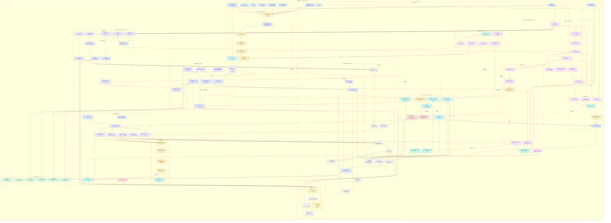

> 🔧 **V2 修订说明**：本图是详图。本系统在 V2 中是**字段 SSOT（单一事实源）的宿主**——表单/页面只能绑定这里的字段，不得各自定义；OLAP 数仓部分（RAW→ADS）建议拆为独立产品（P0-3/P2-8）。详见《平台架构 V2 修订版 - 公共内核与接缝治理》。

```mermaid
flowchart TB

%% =====================================================
%% 数据中台 / Data Platform · 完整架构图
%% ● = 现有或基础能力
%% ◆ = 建议补齐的增强能力
%% 实线 = 主数据链路
%% 虚线 = 治理、审计、缓存、告警、失效链路
%% =====================================================

subgraph ARCH["数据中台 / Data Platform · 完整架构"]
direction TB

%% =====================================================
%% 00 交互与消费面
%% =====================================================
subgraph SURFACE["00 交互与消费面 / Surface"]
direction LR

PORTAL["● 主门户<br/>web-main"]:::surface
DATA_STUDIO["● 数据开发工作台<br/>web-dataplatform"]:::surface
MODEL_DESIGNER["● 数据模型设计器<br/>表、字段、关系、权限"]:::surface
DATA_CATALOG_UI["◆ 数据目录与资产门户<br/>搜索、血缘、标签、收藏"]:::surface
DATA_QUERY_UI["● 数据查询与探索<br/>SQL、筛选、预览、导出"]:::surface
DATA_DASHBOARD["● 数据看板与报表<br/>指标、图表、运营分析"]:::surface
LOW_CODE["● 低代码页面设计器<br/>web-designer"]:::surface
WORKFLOW["● 工作流中心<br/>web-workflow"]:::surface
AIGC["● AIGC 工作台<br/>问数、分析、生成报告"]:::surface
OPEN_API["◆ Open API / SDK<br/>外部系统、移动端、第三方应用"]:::surface

end

%% =====================================================
%% 01 接入与权限边界
%% =====================================================
subgraph INGRESS["01 接入与权限边界 / Ingress"]
direction LR

GATEWAY["◆ API Gateway<br/>TLS、CORS、限流、版本、WAF"]:::gate
ROUTER["● Backend Routes<br/>数据源、模型、数据集、查询、导入导出"]:::core
AUTH["● Auth + JWT<br/>登录态、Token、用户状态"]:::gate
TENANT_GUARD["● Tenant Isolation<br/>tenant_id 隔离、租户状态、配额"]:::gate
RBAC["● RBAC Gate<br/>菜单、功能、模型、操作权限"]:::gate
DATA_SCOPE["● 数据范围控制<br/>本人、部门、下级部门、自定义范围"]:::gate
API_ACCESS["◆ API Access Control<br/>app_key、app_secret、IP 白名单、配额"]:::trust
REQUEST_CONTEXT[("◆ Request Context<br/>userId、tenantId、roles、resource<br/>traceId、client、requestTime")]:::state

end

%% =====================================================
%% 02 数据资产与治理控制平面
%% =====================================================
subgraph CONTROL["02 数据资产与治理控制平面 / Control Plane"]
direction TB

subgraph ASSET["数据资产目录 / Asset Catalog"]
direction LR

DATASOURCE["● DataSource<br/>MySQL、PostgreSQL、API、文件"]:::policy
CONNECTION["● Connection Config<br/>地址、认证、连接参数、状态"]:::policy
DATABASE["● Database Metadata<br/>数据库、Schema、表、视图"]:::policy
TABLE_META["● Table Metadata<br/>字段、主键、索引、注释"]:::policy
DATASET["● Dataset<br/>逻辑数据集、查询定义、参数"]:::policy
METRIC["◆ Metric / 指标定义<br/>口径、维度、聚合规则"]:::policy
DIMENSION["◆ Dimension / 维度定义<br/>时间、组织、地区、业务维度"]:::policy
TAG["◆ Asset Tag<br/>业务域、敏感等级、主题标签"]:::policy
CATALOG["◆ Data Catalog<br/>目录、搜索、收藏、责任人"]:::policy

end

subgraph MODELING["数据建模 / Modeling"]
direction LR

ENTITY_MODEL["● Data Model<br/>实体、字段、关系、约束"]:::policy
FIELD_MODEL["● Field Definition<br/>类型、默认值、校验、描述"]:::policy
RELATION_MODEL["● Relation Definition<br/>一对一、一对多、多对多"]:::policy
SCHEMA_VERSION["◆ Schema Version<br/>草稿、发布、回滚、Diff"]:::ledger
MODEL_PUBLISH_GATE["◆ Model Publish Gate<br/>字段校验、关系校验、迁移校验"]:::gate
MODEL_DEPLOY["◆ Schema Deploy<br/>DDL、迁移脚本、回滚脚本"]:::core

end

subgraph GOVERNANCE["数据治理 / Governance"]
direction LR

CLASSIFICATION["◆ Data Classification<br/>公开、内部、敏感、机密"]:::policy
LINEAGE["◆ Data Lineage<br/>来源、加工链路、下游消费"]:::policy
QUALITY_RULE["◆ Data Quality Rule<br/>完整性、唯一性、及时性、范围"]:::policy
QUALITY_GATE["◆ Data Quality Gate<br/>规则校验、质量评分、阻断策略"]:::gate
RETENTION["◆ Data Retention<br/>保留周期、归档、删除策略"]:::policy
OWNERSHIP["◆ Data Ownership<br/>数据 Owner、责任部门、审批人"]:::policy
GOVERNANCE_LEDGER["◆ Governance Ledger<br/>策略版本、质量结果、血缘快照"]:::ledger

end

subgraph SECURITY_POLICY["数据权限策略 / Data Security Policy"]
direction LR

MODEL_PERMISSION["● Model Permission<br/>read、write、manage"]:::policy
ROW_PERMISSION["● Row Permission<br/>记录级过滤条件、优先级"]:::policy
FIELD_PERMISSION["● Field Permission<br/>hidden、readonly、editable、mask"]:::policy
MASK_POLICY["◆ Mask Policy<br/>手机号、身份证、邮箱、金额脱敏"]:::policy
EXPORT_POLICY["◆ Export Policy<br/>导出权限、水印、条数上限、审批"]:::policy
POLICY_VERSION["◆ Data Policy Version<br/>草稿、审批、发布、回滚"]:::ledger

end

end

%% =====================================================
%% 03 数据接入与加工编排
%% =====================================================
subgraph PIPELINE["03 数据接入、加工与编排 / Data Pipeline"]
direction TB

subgraph SOURCE_CONNECTOR["数据来源连接器"]
direction LR

DB_CONNECTOR["● 数据库连接器<br/>MySQL、PostgreSQL、SQL Server"]:::cap
API_CONNECTOR["● API 连接器<br/>REST、Webhook、第三方服务"]:::cap
FILE_CONNECTOR["● 文件连接器<br/>CSV、Excel、JSON、附件"]:::cap
MESSAGE_CONNECTOR["◆ 消息连接器<br/>Kafka、MQ、事件流"]:::cap
SAAS_CONNECTOR["◆ SaaS 连接器<br/>CRM、ERP、OA、飞书、钉钉"]:::cap

end

subgraph INGEST["数据采集与同步"]
direction LR

SCHEMA_DISCOVERY["◆ Schema Discovery<br/>自动发现表、字段、关系"]:::core
FULL_SYNC["● 全量同步<br/>首次导入、历史数据迁移"]:::core
INCREMENTAL_SYNC["◆ 增量同步<br/>时间戳、Binlog、CDC"]:::core
FILE_IMPORT["● 文件导入<br/>上传、列映射、格式校验"]:::core
WEBHOOK_INGEST["◆ Webhook Ingest<br/>事件接收、签名校验、幂等"]:::core
DATA_PROFILE["◆ Data Profiling<br/>空值、分布、异常值、唯一性"]:::core

end

subgraph TRANSFORM["数据处理与任务编排"]
direction LR

PIPELINE_DESIGNER["◆ Pipeline Designer<br/>可视化节点、依赖、参数"]:::surface
TASK_ORCHESTRATOR["● Job Orchestrator<br/>任务编排、依赖、执行顺序"]:::core
ETL_TRANSFORM["● ETL Transform<br/>清洗、映射、过滤、聚合、Join"]:::cap
SQL_TRANSFORM["● SQL Transform<br/>SQL 任务、参数化查询"]:::cap
SCRIPT_TRANSFORM["◆ Script Transform<br/>Python、JS、自定义逻辑"]:::cap
RULE_TRANSFORM["◆ Rule Engine<br/>规则集、决策表、表达式"]:::cap
AIGC_TRANSFORM["◆ AI Transform<br/>字段提取、分类、摘要、问数"]:::cap
SCHEDULE["● Scheduler<br/>Cron、定时、手动、事件触发"]:::core
RETRY_POLICY["◆ Retry Policy<br/>重试、退避、幂等键、死信"]:::reentry
CHECKPOINT["◆ Checkpoint<br/>断点续跑、分区进度、恢复点"]:::ledger

end

subgraph VALIDATION["加工验证与发布"]
direction LR

SCHEMA_CHECK["● Schema Check<br/>字段类型、必填、约束"]:::gate
DATA_VALIDATION["◆ Data Validation<br/>质量规则、行数、空值、唯一性"]:::gate
RECONCILIATION["◆ Reconciliation<br/>源端与目标端数量、金额、摘要核对"]:::gate
PIPELINE_GATE["◆ Pipeline Gate<br/>任务成功、质量达标、可发布"]:::gate
PIPELINE_REPORT["◆ Pipeline Report<br/>执行时间、影响范围、质量结果"]:::ledger

end

end

%% =====================================================
%% 04 数据存储与服务运行时
%% =====================================================
subgraph RUNTIME["04 数据存储与服务运行时 / Runtime"]
direction TB

subgraph STORAGE["数据存储层"]
direction LR

OLTP[("● 业务数据库<br/>MySQL / Sequelize<br/>配置、模型、权限、任务元数据")]:::runtime
RAW_ZONE[("◆ Raw Zone<br/>原始数据、文件、采集快照")]:::runtime
ODS_ZONE[("◆ ODS<br/>轻度清洗、统一接入层")]:::runtime
DWD_ZONE[("◆ DWD<br/>明细数据层、标准模型层")]:::runtime
DWS_ZONE[("◆ DWS<br/>主题汇总层、宽表层")]:::runtime
ADS_ZONE[("◆ ADS<br/>应用数据集、市集、报表层")]:::runtime
OBJECT_STORE[("◆ Object Storage<br/>文件、附件、导出、快照、归档")]:::runtime
SEARCH_INDEX[("◆ Search Index<br/>数据目录、资产搜索、实例检索")]:::runtime

end

subgraph COMPUTE["计算与查询层"]
direction LR

QUERY_ENGINE["● Query Service<br/>SQL 查询、数据预览、分页"]:::core
FEDERATED_QUERY["◆ Federated Query<br/>跨库、跨源联合查询"]:::core
SEMANTIC_LAYER["◆ Semantic Layer<br/>指标、维度、口径、权限下推"]:::core
CACHE[("◆ Query Cache<br/>结果缓存、热数据缓存")]:::runtime
COMPUTE_ENGINE["◆ Compute Engine<br/>批处理、分布式任务、分区计算"]:::runtime
MATERIALIZED_VIEW["◆ Materialized View<br/>预聚合、加速查询"]:::runtime

end

subgraph JOB_RUNTIME["任务运行时"]
direction LR

REDIS[("● Redis<br/>缓存、锁、限流、临时状态")]:::runtime
QUEUE["● BullMQ / Job Queue<br/>同步、导入、导出、ETL、通知"]:::bus
WORKER["● Worker Process<br/>后台消费、重试、失败处理"]:::runtime
EVENT_BUS["◆ Data Event Bus<br/>source.changed、dataset.ready、quality.failed"]:::bus
TASK_STATE[("◆ Job State Store<br/>queued、running、success、failed、cancelled")]:::state

end

end

%% =====================================================
%% 05 数据服务与消费层
%% =====================================================
subgraph SERVING["05 数据服务与消费层 / Serving"]
direction LR

DATA_API["● Data API Service<br/>模型 API、数据集 API、分页、筛选"]:::core
QUERY_API["● Query API<br/>SQL、聚合、图表数据、导出"]:::core
METRIC_API["◆ Metric API<br/>统一指标、维度切片、权限过滤"]:::core
LOW_CODE_BINDING["● Low-code Data Binding<br/>页面组件绑定数据模型、数据集"]:::cap
WORKFLOW_BINDING["● Workflow Data Binding<br/>表单、审批条件、自动节点读写数据"]:::cap
AIGC_BINDING["◆ AIGC Data Binding<br/>RAG、问数、分析、报告生成"]:::cap
WEBHOOK_OUT["◆ Webhook / Callback<br/>数据更新通知、任务结果回调"]:::cap
EXPORT_SERVICE["● Export Service<br/>Excel、CSV、PDF、异步下载"]:::core

end

%% =====================================================
%% 06 信任、审计、可观测与重入
%% =====================================================
subgraph TRUST["06 信任、审计与失效重入 / Trust & Re-entry"]
direction TB

AUDIT_LOG["● Operation Log<br/>数据源、模型、任务、导出、权限变更"]:::trust
ACCESS_LOG["◆ Data Access Log<br/>谁查询了什么、命中哪些数据范围"]:::trust
QUALITY_LOG["◆ Quality Ledger<br/>规则、评分、失败样本、处理结论"]:::ledger
LINEAGE_LOG["◆ Lineage Snapshot<br/>输入、处理、输出、下游依赖"]:::ledger
DECISION_LEDGER["◆ Data Decision Ledger<br/>权限过滤、策略命中、查询限制、traceId"]:::ledger
MONITORING["◆ Metrics & Tracing<br/>延迟、吞吐、失败率、队列积压、成本"]:::trust
ALERTING["◆ Alerting<br/>同步失败、质量下降、权限异常、数据延迟"]:::trust
INVALIDATION["◆ Cache & Policy Invalidation<br/>模型变更、权限变更、数据集刷新"]:::reentry
ROLLBACK["◆ Rollback & Recovery<br/>Schema 回滚、任务重跑、数据恢复"]:::reentry
APPROVAL_GATE["◆ Sensitive Operation Gate<br/>敏感导出、数据删除、跨租户操作"]:::gate

end

%% =====================================================
%% 07 输出
%% =====================================================
subgraph OUTPUT["07 输出与交付 / Output"]
direction LR

DATA_PRODUCT["● 数据产品<br/>数据模型、数据集、API、视图"]:::report
DASHBOARD["● 看板与报表<br/>业务分析、运营指标、图表"]:::report
WORKFLOW_OUTPUT["● 工作流结果<br/>审批数据、自动处理结果、回写"]:::report
LOW_CODE_OUTPUT["● 低代码应用输出<br/>页面、表单、列表、图表"]:::report
AIGC_OUTPUT["◆ AI 洞察输出<br/>问数结果、摘要、研报、建议"]:::report
EXPORT_OUTPUT["● 数据导出与归档<br/>文件、下载链接、归档记录"]:::report

end

%% =====================================================
%% 入口链路
%% =====================================================
PORTAL --> GATEWAY
DATA_STUDIO --> GATEWAY
MODEL_DESIGNER --> GATEWAY
DATA_CATALOG_UI --> GATEWAY
DATA_QUERY_UI --> GATEWAY
DATA_DASHBOARD --> GATEWAY
LOW_CODE --> GATEWAY
WORKFLOW --> GATEWAY
AIGC --> GATEWAY
OPEN_API --> GATEWAY

GATEWAY --> ROUTER
ROUTER --> AUTH
AUTH --> TENANT_GUARD
TENANT_GUARD --> RBAC
RBAC --> DATA_SCOPE
DATA_SCOPE --> REQUEST_CONTEXT
OPEN_API --> API_ACCESS
API_ACCESS --> REQUEST_CONTEXT

%% =====================================================
%% 资产与建模
%% =====================================================
DATA_STUDIO --> DATASOURCE
DATA_STUDIO --> DATASET
MODEL_DESIGNER --> ENTITY_MODEL
MODEL_DESIGNER --> FIELD_MODEL
MODEL_DESIGNER --> RELATION_MODEL
DATA_CATALOG_UI --> CATALOG

DATASOURCE --> CONNECTION
CONNECTION --> DATABASE
DATABASE --> TABLE_META
TABLE_META --> DATASET
TABLE_META --> ENTITY_MODEL
DATASET --> METRIC
DATASET --> DIMENSION
DATASET --> TAG
TAG --> CATALOG

ENTITY_MODEL --> SCHEMA_VERSION
FIELD_MODEL --> SCHEMA_VERSION
RELATION_MODEL --> SCHEMA_VERSION
SCHEMA_VERSION --> MODEL_PUBLISH_GATE
MODEL_PUBLISH_GATE --> MODEL_DEPLOY
MODEL_DEPLOY --> OLTP

%% =====================================================
%% 数据治理与权限
%% =====================================================
TABLE_META --> CLASSIFICATION
DATASET --> CLASSIFICATION
CLASSIFICATION --> QUALITY_RULE
QUALITY_RULE --> QUALITY_GATE
DATASET --> LINEAGE
DATASOURCE --> LINEAGE
ETL_TRANSFORM --> LINEAGE
LINEAGE --> GOVERNANCE_LEDGER
QUALITY_GATE --> GOVERNANCE_LEDGER
OWNERSHIP --> GOVERNANCE_LEDGER
RETENTION --> OBJECT_STORE

MODEL_PERMISSION --> RBAC
ROW_PERMISSION --> DATA_SCOPE
FIELD_PERMISSION --> DATA_SCOPE
MASK_POLICY --> FIELD_PERMISSION
EXPORT_POLICY --> APPROVAL_GATE
POLICY_VERSION --> MODEL_PERMISSION
POLICY_VERSION --> ROW_PERMISSION
POLICY_VERSION --> FIELD_PERMISSION

%% =====================================================
%% 数据接入
%% =====================================================
DATASOURCE --> DB_CONNECTOR
DATASOURCE --> API_CONNECTOR
DATASOURCE --> FILE_CONNECTOR
DATASOURCE --> MESSAGE_CONNECTOR
DATASOURCE --> SAAS_CONNECTOR

DB_CONNECTOR --> SCHEMA_DISCOVERY
API_CONNECTOR --> SCHEMA_DISCOVERY
FILE_CONNECTOR --> FILE_IMPORT
MESSAGE_CONNECTOR --> WEBHOOK_INGEST
SAAS_CONNECTOR --> FULL_SYNC

SCHEMA_DISCOVERY --> TABLE_META
FULL_SYNC --> RAW_ZONE
INCREMENTAL_SYNC --> RAW_ZONE
FILE_IMPORT --> RAW_ZONE
WEBHOOK_INGEST --> RAW_ZONE
RAW_ZONE --> DATA_PROFILE
DATA_PROFILE --> QUALITY_GATE
RAW_ZONE --> ODS_ZONE

%% =====================================================
%% 数据加工
%% =====================================================
PIPELINE_DESIGNER --> TASK_ORCHESTRATOR
SCHEDULE --> TASK_ORCHESTRATOR
TASK_ORCHESTRATOR --> ETL_TRANSFORM
TASK_ORCHESTRATOR --> SQL_TRANSFORM
TASK_ORCHESTRATOR --> SCRIPT_TRANSFORM
TASK_ORCHESTRATOR --> RULE_TRANSFORM
TASK_ORCHESTRATOR --> AIGC_TRANSFORM

ODS_ZONE --> ETL_TRANSFORM
ETL_TRANSFORM --> DWD_ZONE
SQL_TRANSFORM --> DWD_ZONE
SCRIPT_TRANSFORM --> DWD_ZONE
RULE_TRANSFORM --> DWD_ZONE
AIGC_TRANSFORM --> DWD_ZONE

DWD_ZONE --> DWS_ZONE
DWS_ZONE --> ADS_ZONE

ETL_TRANSFORM --> SCHEMA_CHECK
SQL_TRANSFORM --> SCHEMA_CHECK
SCRIPT_TRANSFORM --> SCHEMA_CHECK
RULE_TRANSFORM --> SCHEMA_CHECK
AIGC_TRANSFORM --> SCHEMA_CHECK

SCHEMA_CHECK --> DATA_VALIDATION
DATA_VALIDATION --> RECONCILIATION
RECONCILIATION --> PIPELINE_GATE
PIPELINE_GATE --> PIPELINE_REPORT
PIPELINE_GATE --> CHECKPOINT
PIPELINE_GATE --> EVENT_BUS
PIPELINE_GATE -.失败重试.-> RETRY_POLICY
RETRY_POLICY --> QUEUE

%% =====================================================
%% 运行时
%% =====================================================
TASK_ORCHESTRATOR --> QUEUE
FULL_SYNC --> QUEUE
INCREMENTAL_SYNC --> QUEUE
FILE_IMPORT --> QUEUE
EXPORT_SERVICE --> QUEUE
QUEUE --> WORKER
WORKER --> TASK_STATE
WORKER --> REDIS
WORKER --> EVENT_BUS
EVENT_BUS --> TASK_STATE

DWD_ZONE --> COMPUTE_ENGINE
DWS_ZONE --> COMPUTE_ENGINE
ADS_ZONE --> QUERY_ENGINE
ADS_ZONE --> SEMANTIC_LAYER
SEMANTIC_LAYER --> MATERIALIZED_VIEW
MATERIALIZED_VIEW --> CACHE
QUERY_ENGINE --> CACHE
FEDERATED_QUERY --> QUERY_ENGINE

%% =====================================================
%% 数据服务与消费
%% =====================================================
REQUEST_CONTEXT --> DATA_API
REQUEST_CONTEXT --> QUERY_API
REQUEST_CONTEXT --> METRIC_API

DATA_API --> QUERY_ENGINE
QUERY_API --> QUERY_ENGINE
METRIC_API --> SEMANTIC_LAYER

LOW_CODE_BINDING --> DATA_API
WORKFLOW_BINDING --> DATA_API
AIGC_BINDING --> QUERY_API
AIGC_BINDING --> METRIC_API

QUERY_ENGINE --> DATA_PRODUCT
SEMANTIC_LAYER --> DASHBOARD
DATA_API --> LOW_CODE_OUTPUT
WORKFLOW_BINDING --> WORKFLOW_OUTPUT
AIGC_BINDING --> AIGC_OUTPUT
EXPORT_SERVICE --> EXPORT_OUTPUT
QUERY_API --> EXPORT_SERVICE
DATA_API --> WEBHOOK_OUT

%% =====================================================
%% 审计、监控、失效与恢复
%% =====================================================
ROUTER -.请求审计.-> AUDIT_LOG
DATA_API -.数据访问审计.-> ACCESS_LOG
QUERY_API -.查询审计.-> ACCESS_LOG
EXPORT_SERVICE -.导出审计.-> AUDIT_LOG
QUALITY_GATE -.质量结果.-> QUALITY_LOG
LINEAGE -.血缘快照.-> LINEAGE_LOG
DATA_SCOPE -.策略命中.-> DECISION_LEDGER
FIELD_PERMISSION -.字段脱敏决策.-> DECISION_LEDGER

AUDIT_LOG --> OLTP
ACCESS_LOG --> OLTP
QUALITY_LOG --> OLTP
LINEAGE_LOG --> OLTP
DECISION_LEDGER --> OLTP

TASK_STATE --> MONITORING
QUEUE --> MONITORING
QUALITY_GATE --> MONITORING
QUERY_ENGINE --> MONITORING
MONITORING --> ALERTING

POLICY_VERSION -.策略变更.-> INVALIDATION
SCHEMA_VERSION -.模型变更.-> INVALIDATION
DATASET -.数据集刷新.-> INVALIDATION
INVALIDATION --> CACHE
INVALIDATION --> REDIS
INVALIDATION --> SEARCH_INDEX

ALERTING -.故障处理.-> ROLLBACK
ROLLBACK --> CHECKPOINT
ROLLBACK --> MODEL_DEPLOY
ROLLBACK --> TASK_ORCHESTRATOR

APPROVAL_GATE --> EXPORT_SERVICE
APPROVAL_GATE --> MODEL_DEPLOY
APPROVAL_GATE --> ROLLBACK

end

%% =====================================================
%% 样式
%% =====================================================
classDef surface fill:#dbeafe,stroke:#2563eb,color:#172554,stroke-width:1.5px
classDef core fill:#e0e7ff,stroke:#4f46e5,color:#312e81,stroke-width:1.5px
classDef cap fill:#ede9fe,stroke:#7c3aed,color:#4c1d95,stroke-width:1.5px
classDef policy fill:#fae8ff,stroke:#c026d3,color:#701a75,stroke-width:1.5px
classDef gate fill:#fef3c7,stroke:#d97706,color:#78350f,stroke-width:1.5px
classDef trust fill:#cffafe,stroke:#0891b2,color:#164e63,stroke-width:1.5px
classDef ledger fill:#ccfbf1,stroke:#0f766e,color:#134e4a,stroke-width:1.5px
classDef runtime fill:#f5f5f4,stroke:#78716c,color:#292524,stroke-width:1.5px
classDef state fill:#f1f5f9,stroke:#64748b,color:#0f172a,stroke-width:1.5px
classDef reentry fill:#fee2e2,stroke:#dc2626,color:#7f1d1d,stroke-width:1.5px
classDef bus fill:#fef9c3,stroke:#ca8a04,color:#713f12,stroke-width:1.5px
classDef report fill:#dcfce7,stroke:#16a34a,color:#14532d,stroke-width:1.5px
```
