# SlideRule V5.2 架构图 (Mermaid)

V5.2 外环 (◆) + U* 修订 (●) 围绕 V5.1 脊柱 (零改动)。完整模型见下图。

```mermaid
%% SlideRule V5.2 架构图
%% V5.1 脊柱 (CORE 控制平面 + POOL 能力池 + 基础 REENTRY/RUNTIME/OUT) 零改动
%% V5.2 外环 (◆) + U* 修订 (●)：Drive/Marathon 外层、U1 信任修订、U2 执行器拓扑 (browser-llm + KEYPOOL)、U4 用户语言化表面
%% 符号说明:
%%   ◆ = V5.2 新增 / 外环元素
%%   ● = Ux 修订点 (在 V5.1 基础上增强)
%%   虚线/点线 = 跨层连接 或 部分实现 (待补，图中已自注)
%% 布局提示: TB 纵向；外环 (DRIVE + SURF + EXEC/TRUST 部分) 建议在 Mermaid 中使用容器或分图查看以减少交叉边 spaghetti

flowchart TB

subgraph V52_OUTER["V5.2 外环 ◆ (Drive + U* 表面/执行/信任) · 薄层复用内脊柱"]
  direction TB

subgraph DRIVE["00.5 驱动层 / Drive Modes（◆ 外环 · 内层零改动）"]
  direction TB
  MODE{"◆ 模式选择器 / Mode<br/>深思一轮(默认·绕过外环) · 持续推演"}:::gate
  MARATHON["◆ 马拉松编排 / MarathonDriver<br/>drive一轮 → 按stopReason分流<br/>收敛→续 · await_ready→挂起 · 终态→停"]:::core
  FRONTIER["◆ 前沿生成 / frontier.propose<br/>去重机械裁决 · 连续2空=耗尽<br/>提议+rationale进决策账"]:::core
  APOLICY["◆ 自动驾驶策略 / AutopilotPolicy<br/>显式可审计产物 · confirm代答留痕<br/>G_READY真缺口必停·零变通"]:::ledger
  SBUDGET{"◆ 会话级预算 / Session Budget<br/>开启即强制设定 · 轮间对账 · 到顶机械停<br/>与轮内BUDGET两层闸"}:::gate
  DIGEST["◆ 轮次纪要 / round.digest<br/>过G_QUALITY · 下轮种子=纪要+前沿产物<br/>明细→SUPERSEDED(≠stale)"]:::cap
end
 
subgraph SURF["00 交互面 / Surface（◆ U4 用户语言化：出问题才说话）"]
  direction TB
  CHAT["聊天框 = 操纵杆<br/>灌 goal · 提质疑 · 指定关注点<br/>◆ 运行中发送键=停止键"]:::surface
  STATUS["状态条（唯一常驻）<br/>◆ 只说人话：推演中·第N步 / 已想清楚✓<br/>还差N个关键信息 / 已停止·随时继续"]:::surface
  AUDIT["◆ 审计抽屉 / Audit Drawer<br/>gate原文·台账·封条计数·baseline·分账 (M7: policy + ledger + superseded + baseline + cost)<br/>机制信息只搬家不删除"]:::surface
  BOARD["内联临时黑板<br/>讨论 · 图 · 报告段 · 方案 · 预览<br/>● 按轮分组折叠(马拉松, via routeExpanded + superseded)"]:::surface
end
 
subgraph CORE["01 控制平面 / Control Plane（V5.1 脊柱 · 零改动）"]
  direction TB
  INTAKE["入站消息 / Message Intake（单门）<br/>load SessionState · derive 先行<br/>STATE 稳定前缀 prompt cache<br/>分类为控制信号（续跑·不重启会话）"]:::core
  BUDGET{"预算闸 / Budget Gate（轮内）<br/>maxTurns · maxRuns/turn · maxTokens · maxRepeat<br/>预算=auditable artifact"}:::gate
  ORCH["推演调度核 / Orchestrator<br/>pickNextCapabilities(goal, state, gaps, votes)<br/>路由便宜模型/规则优先 · 歧义才升级"]:::core
  DLEDGER["调度决策账 / Decision Ledger<br/>saw · chose · skipped+reason · rationale<br/>◆ + 前沿提议(马拉松)"]:::ledger
  CONTRACT["覆盖率合约 / CoverageContract<br/>authored · 版本化 · 冻结基线"]:::ledger
  GCOV{"覆盖率闸 / Coverage Gate<br/>blocking gap 全 resolved/waived<br/>合约能力全有成功 run · 二元机械"}:::gate
  STATE[("常驻推演状态 / Reasoning State（唯一 authority）<br/>graph · artifacts · evidence · risks · decisions<br/>capabilityRuns · gates · dependencyGraph<br/>● + qualityBaseline声明 · ◆ + supersededIds")]:::state
  GOAL["目标 / 结论状态（ORCH 只读 · 写入仅经覆盖率闸）<br/>clear · needs_refinement · not_recommended"]:::core
  AWAIT["待续 / Awaiting（环上歇脚点）<br/>收敛 · 等人 · 超轮内预算<br/>◆ + 用户停止 · 等人补缺(马拉松) · 会话预算顶 · 前沿耗尽"]:::await
end
 
subgraph ROLES["02 角色与协作 / Roles（● V5.2：多角色面板已真正接入 drive）"]
  direction TB
  RL["多角色 / Roles<br/>产品·架构·安全·合规·工程·挑刺·接地·综合·UI"]:::role
  D_GATE{"● 决策门 / Decision Gate<br/>简单 or 复杂?<br/>resolveRoleMode：契约 complex / 产品搭建类目标 → 自动 complex<br/>(去掉旧的≥4产物硬门槛，brainstorm 不再形同虚设)"}:::gate
  D_SA["单 Agent / Single-Agent"]:::role
  D_BO["● 头脑风暴 / Brainstorm（多角色面板）<br/>产品·架构·安全 三角色各出立场 → 轮转交叉质疑 → 裁决<br/>复用 executeDeliberation+adjudicator；payload: positions+critiques+收敛分+异议"]:::role
  D_SYN["● 综合器 / Synthesizer<br/>读面板多角色立场聚合 · 信心分 · 分歧意见(收敛分/保留异议)<br/>结构化多视角上游 → 喂厚 report.write"]:::role
  FLOWB{"流边界守卫 / Flow Boundary<br/>剥离 critique · rebuttal · debate console"}:::gate
  D_DEG["降级兜底 / Degradation → 单 Agent"]:::fallback
  PAIR["调度单元 = (capability, role) 对"]:::role
end
 
subgraph POOL["03 能力池 / Capability Pool（平权 · V5.1 原样 · 执行落 08 层）"]
  direction TB
  BUS{{"能力调度总线 / Dispatch Bus<br/>调用 ⇄ 回灌"}}:::bus
  C_PARSE["意图理解 / intent.parse"]:::cap
  C_EVID["证据检索 / evidence.search"]:::cap
  C_REPO["仓库深度解析 / repo.inspect"]:::cap
  C_REPO_FALL["仓库降级 / Fallback"]:::fallback
  C_GAP["澄清·缺失 / gap.ask"]:::cap
  C_QEXP["扩展·假设 / question.expand"]:::cap
  G_READY{"就绪度闸 / Readiness<br/>需人答=停泊点"}:::gate
  C_RTGEN["路线生成 / route.generate"]:::cap
  C_RTCMP["路线对比 / route.compare"]:::cap
  G_CONFIRM{"轻量确认闸 / Confirm<br/>需人答=停泊点 · ◆ 马拉松下由APOLICY代答留痕"}:::gate
  C_PROMPT["提示词构造 / prompt.build<br/>● 经08层PROMPTS双端同源"]:::cap
  C_REDACT["脱敏 / redaction"]:::cap
  C_LLM["LLM JSON 生成 / callJson<br/>● 实际执行经08层EXECABS"]:::cap
  G_SCHEMA{"Schema 校验闸"}:::gate
  C_SNORM["归一化 / 稳定 ID 重映射"]:::cap
  G_INV{"不变量守卫闸"}:::gate
  C_SFALL["确定性兜底"]:::fallback
  C_TREE["结构拆解 / structure.decompose<br/>● + 旧管线推导回填(K5)"]:::cap
  C_DOC["文档生成 / document.draft"]:::cap
  C_ACC["验收 / acceptance"]:::cap
  C_PREV["效果预演 / scenario.preview"]:::cap
  C_VISGEN["视觉生成"]:::cap
  C_VISREND["视觉渲染 / Mermaid 确定性"]:::cap
  C_TOOL["工具 / mcp.call · skill.invoke"]:::cap
  C_RISK["反驳与风险 / risk.analyze · counter.argue"]:::cap
  C_SYN["综合收敛 / synthesis.merge"]:::cap
  C_REP["报告生成 / report.write"]:::cap
  C_PACK["指令包 / prompt.pack"]:::cap
  C_MATRIX["可追溯矩阵 / traceability"]:::cap
  C_HAND["交付包 / handoff"]:::cap
end
 
subgraph TRUST["04 信任层 / Trust Layer（● U1 修订：commit-time 验真+验厚 · ship-time 验收）"]
  direction TB
  T_GATE{"提交闸 / Commit Gate（commit-time）<br/>schema·invariant·confirm·precondition·ground·commit<br/>● + quality（验厚） · 二元·机械"}:::gate
  QCONTRACT["● 输出契约 / OutputContract<br/>headings·childBlocks·EARS中英·embedded·minChars<br/>单一真相：喂prompt + 喂质量闸"]:::ledger
  BASELINE["● 质量基线 / QualityBaseline<br/>production / pilot-template<br/>结果级声明·禁嗅探·封条注明"]:::ledger
  T_PROV["provenance（commit-time）<br/>● + browser-llm:label:model"]:::trust
  T_AUDIT["出图审计 / check_previews_real"]:::trust
  T_TEST["测试 / Tests（ship-time·验收）"]:::trust
  T_MERGE{"合并门 / Merge Gate（ship-time）"}:::gate
  T_LEDGER["校验台账 / Checks Ledger（问责中枢）<br/>脚本·决策·边界·成本<br/>● + quality verdict+baseline<br/>◆ + 中断行 · policy代答 · 前沿提议 · key分账"]:::ledger
end
 
subgraph EXEC["08 执行层 / Executor Topology（● U2 新增子图）"]
  direction TB
  EXECABS["● 执行器抽象 / CapabilityExecutor<br/>Default模板 · PilotReal · Server-LLM · browser-llm<br/>结果自声明 qualityBaseline"]:::core
  PROMPTS["● 双端同源 prompt / capability-prompts<br/>anchor+CTX供给+契约注入+report 9段BASE<br/>server与browser消费同一函数"]:::ledger
  CTX["● 分级上下文供给 / capability-context<br/>收敛全文6000/24000 · 分析800 · 轻220<br/>截断显式标注"]:::ledger
  KEYPOOL["● key池调度 / ByokDispatcher<br/>租约·least-busy·429冷却·401禁用<br/>raceMode默认false(成本诚实)<br/>◆ 待补:FIFO排队 · per-key计费"]:::core
  DEPLOY{"部署形态 / Deployment<br/>Pages纯浏览器BYOK / 自托管server"}:::gate
  KEYISO["● key零信任边界<br/>仅localStorage+闭包 · 不进STATE/台账/导出<br/>序列化隔离测试锁定"]:::trust
end
 
subgraph REENTRY["05 失效与重入 / Invalidation & Re-entry（单一回炉 · ◆ +superseded）"]
  direction TB
  INTERV["控制信号 / UserIntervention<br/>challenge·revise·clarify·expand…<br/>target: Artifact/Node/Section/Decision"]:::reentry
  RV{"评审 / Review<br/>● RV pass 绑定 reportId"}:::gate
  ESC["失败·中止·转人工 / Escalate"]:::fallback
  ITER["用户修改再推演 / Iterate"]:::reentry
  DEP["依赖图 / Dependency Graph"]:::reentry
  INVAL["失效引擎 / Invalidation"]:::reentry
  STALE["失效索引 / Stale Index<br/>信任失效·级联重算"]:::reentry
  SUPERSEDED["◆ 替代索引 / Superseded Index<br/>被纪要替代·信任不变·不级联<br/>语义独立于stale"]:::reentry
  RECOMP["重算 + 重新调度 / Recompute"]:::reentry
end
 
subgraph RUNTIME["06 运行时 / Runtime（P3 红利 · ● 投影层成果）"]
  direction TB
  JOB["任务仓·产物 / Job·Artifact Store"]:::runtime
  EVT["事件总线 / Event Bus"]:::runtime
  SOCK["实时推送 / Socket Relay"]:::runtime
  STORE["实时状态仓 / Realtime Store"]:::runtime
  DERIVE["状态派生 / 投影计算器<br/>只读 STATE/JOB · 永不回写"]:::runtime
  DENSITY["● 详略密度 / 简洁·完整溯源<br/>阶段子节点可溯源·证据子节点"]:::runtime
  TERMINAL["● 终端交付投影 / Terminal+TrustSeal<br/>虚拟节点·不入STATE.graph"]:::runtime
  ROW["节点行 / Node Row"]:::runtime
  REPLAY["回放 / Replay"]:::runtime
end
 
subgraph OUT["07 输出 / Output"]
  direction TB
  REPORT["可行性 / 推演报告（主输出物）<br/>9段·证据可点·● 厚度有契约下限"]:::report
  READER["● 报告阅读器 / ReportReader<br/>分段·证据回跳·md导出(STATE零写)"]:::report
  DONE["交付完成 / Shipped"]:::done
end
 
%% ===== ◆ 驱动外环（仅持续推演模式生效）=====
%% 薄外环复用说明 (应用审查 Issue 4): MARATHON/FRONTIER/DIGEST 是薄编排 (reuses driveReasoningSession + append-only to ledgers/STATE/supersededArtifactIds)
%% CORE/INTAKE/ORCH/BUDGET/GCOV 等内层 V5.1 脊柱零改动；外环仅通过 stopReason 分流 + 追加 ledger/STATE 字段
%% 见 marathon-driver + useSlideRuleSession 条件调用 + post-drive digest/propose
CHAT -.选模式.-> MODE
MODE -.深思一轮·直通.-> INTAKE
MODE -.持续推演.-> MARATHON
MARATHON -.驱动一轮.-> INTAKE
AWAIT -.收敛·一轮完成.-> MARATHON
MARATHON -.蒸馏.-> DIGEST
DIGEST -.明细标替代.-> SUPERSEDED
DIGEST -.纪要=下轮种子.-> FRONTIER
FRONTIER -.新前沿·合成种子(auto-seeded标注).-> MARATHON
FRONTIER -.提议落账.-> DLEDGER
MARATHON -.轮间对账.-> SBUDGET
SBUDGET -.到顶·机械停.-> AWAIT
APOLICY -.confirm代答·留痕.-> G_CONFIRM
APOLICY -.代答记录.-> T_LEDGER
G_READY -.真缺口·马拉松挂起等人.-> AWAIT
 
%% ===== 入站：单门再入（V5.1 原样）=====
CHAT -.新消息 / ◆停止信号.-> INTAKE
BOARD -.针对节点/段落.-> INTAKE
STATE -.先 load + derive.-> INTAKE
INTAKE --> INTERV
INTERV -.若 challenge/revise.-> DEP
ORCH -.刷新.-> STATUS
ORCH -.只读.-> GOAL
STATE -.渲染.-> BOARD
ROW -.驱动黑板.-> BOARD
STATUS -.较真入口.-> AUDIT
T_LEDGER -.机制原文·只搬不删.-> AUDIT
 
%% ===== 预算闸 + 覆盖率闸（V5.1 原样）=====
INTERV -->|续跑·先过预算| BUDGET
BUDGET -->|放行| ORCH
BUDGET -.超限·停泊 partial.-> AWAIT
BUDGET -.转人工.-> ESC
BUDGET -.成本遥测.-> T_LEDGER
ORCH -.落账.-> DLEDGER
DLEDGER -.汇入.-> T_LEDGER
CONTRACT -.判据.-> GCOV
ORCH -->|想写结论/停泊| GCOV
GCOV -->|达标·准许写入| GOAL
GCOV -->|达标·准许停泊| AWAIT
GCOV -.缺能力·强制排程.-> BUDGET
CONTRACT -.够了就停.-> BUDGET
STATE --- AWAIT
AWAIT -.新消息续.-> INTAKE
 
%% ===== 控制平面 ⇄ 能力池（V5.1 原样，节选）=====
ORCH <-->|调用/回灌| BUS
BUS --- C_PARSE
BUS --- C_EVID
BUS --- C_GAP
BUS --- C_RTGEN
BUS --- C_PROMPT
BUS --- C_DOC
BUS --- C_RISK
BUS --- C_SYN
BUS --- C_REP
BUS --- C_PACK
 
%% ===== 角色 + 流边界（● V5.2：多角色面板接入 drive）=====
%% pickBrainstormChain(complex) 把面板链 critique.generate(面板) → synthesis.merge 前置到 report.write 之前；
%% critique.generate 在 complex 下经 deliberation-exec-map.runPanelSession 跑成 3 角色面板（见 D_BO）。
RL --> D_GATE
D_GATE -.简单·成对质疑.-> D_SA
D_GATE -.复杂·多角色面板.-> D_BO
D_BO --> D_SYN
D_GATE -.失败超时.-> D_DEG
D_DEG -.兜底.-> D_SA
ORCH -.选 capability×role.-> PAIR
ORCH -.复杂·prime 面板链.-> D_BO
D_SA -.视角.-> PAIR
D_SYN --> FLOWB
D_SYN -.● 多角色立场与投票分歧.-> C_REP
FLOWB -.净化后视角.-> PAIR
FLOWB -.断言进台账.-> T_LEDGER
D_BO -.回灌·经守卫.-> FLOWB
D_BO -.● 立场与收敛分投影为画布多角色子节点.-> BOARD
PAIR -.接入.-> BUS
 
%% ===== 池内链（V5.1 原样，节选）=====
C_EVID --- C_REPO
C_REPO -.降级.-> C_REPO_FALL
C_GAP --> C_QEXP
C_QEXP --> G_READY
G_READY -.未就绪·回补.-> C_GAP
G_READY -.等用户·停泊.-> AWAIT
C_RTGEN --> C_RTCMP
C_RTCMP --> G_CONFIRM
G_CONFIRM -.退回调整.-> C_RTCMP
G_CONFIRM -.等用户确认·停泊.-> AWAIT
C_PROMPT --> C_REDACT
C_REDACT --> C_LLM
C_LLM --> G_SCHEMA
G_SCHEMA -.过.-> C_SNORM
G_SCHEMA -.败.-> C_SFALL
C_SNORM --> G_INV
G_INV -.过.-> C_TREE
G_INV -.败.-> C_SFALL
C_SFALL --> C_TREE
C_TREE --> C_DOC
C_DOC --> C_ACC
C_TREE -.确定性渲染.-> C_VISREND
C_DOC -.生图提示词.-> C_VISGEN
C_ACC --> C_PACK
C_TREE -.汇总.-> C_MATRIX
 
%% ===== ● U2 执行层接线 =====
C_LLM -.执行委托.-> EXECABS
PROMPTS -.同一prompt.-> EXECABS
CTX -.分级供给.-> PROMPTS
QCONTRACT -.契约注入.-> PROMPTS
EXECABS -.browser端取租约.-> KEYPOOL
DEPLOY -.Pages.-> KEYPOOL
DEPLOY -.自托管.-> EXECABS
KEYPOOL -.◆ 分账 (aggregate costLedger + 待补 per-key).-> T_LEDGER
KEYISO -.边界锁.-> KEYPOOL
EXECABS -.结果+baseline声明.-> BUS
%% 失败回退 (应用审查 Issue 3): browser-llm / KEYPOOL 异常 (CORS/429/401/timeout) → 触发内层降级到 PilotReal / Default (代码已实现 try/catch + onStep fail)
KEYPOOL -.失败回退 (browser-llm 异常 → PilotReal).-> EXECABS
 
%% ===== ● U1 信任层接线（修订）=====
BUS ==>|产物送审| T_GATE
QCONTRACT -.验厚判据.-> T_GATE
BASELINE -.显式基线.-> T_GATE
T_GATE ==>|过| T_PROV
T_PROV ==> T_LEDGER
T_GATE -.未过·打回(quality同路).-> BUS
C_VISGEN -.出图必审.-> T_AUDIT
T_AUDIT -.进台账.-> T_LEDGER
T_AUDIT -.假图打回.-> C_VISGEN
C_HAND --> T_TEST
T_TEST --> T_MERGE
T_MERGE -->|过| DONE
T_MERGE -.不过·回炉.-> INTERV
 
%% ===== 失效重入（V5.1 原样 + superseded）=====
RV -.回炉·归一控制信号.-> INTERV
ITER --> INTERV
DEP --> INVAL
INVAL --> STALE
STALE --> RECOMP
RECOMP -.重排程·经预算.-> BUDGET
DIGEST -.写入.-> SUPERSEDED
 
%% ===== 运行时投影（P3 红利）=====
STATE --> JOB
JOB --> EVT
EVT --> SOCK
SOCK --> STORE
STATE -.只读.-> DERIVE
DERIVE --> ROW
DERIVE --> DENSITY
DERIVE --> TERMINAL
DENSITY -.投影.-> BOARD
TERMINAL -.投影.-> BOARD
STORE --> REPLAY
 
%% ===== 输出 =====
C_REP ==> REPORT
REPORT --> READER
READER -.证据回跳.-> BOARD
C_HAND ==> DONE

end
%% 结束 V52_OUTER (V5.2 外环容器：DRIVE + SURF + EXEC/TRUST U* 部分)

%% ===== 改进后的图例 (应用审查 Issue 1 + 6) =====
%% V5.2 外环 (◆) 容器包裹了 DRIVE/Marathon + SURF(U4) + EXEC(U2 browser-llm/KEYPOOL) + TRUST(U1 quality) 部分
%% 内层 CORE/POOL/REENTRY/RUNTIME/OUT 为 V5.1 脊柱 (零改动)
%% 符号: ◆ = V5.2 新增/外环 ; ● = Ux 修订 ; 虚线 = 跨层或待补
%% 建议: Mermaid 渲染时使用 "View as code" 或折叠外容器以减少交叉边 spaghetti；或拆分为 "核心脊柱" + "V5.2 delta" 两个图

classDef surface fill:#dbeafe,stroke:#3b82f6,color:#1e3a5f
classDef core fill:#e0e7ff,stroke:#6366f1,color:#312e81
classDef cap fill:#ede9fe,stroke:#8b5cf6,color:#4c1d95
classDef gate fill:#fef3c7,stroke:#f59e0b,color:#78350f
classDef trust fill:#cffafe,stroke:#06b6d4,color:#164e63
classDef ledger fill:#ccfbf1,stroke:#14b8a6,color:#134e4a
classDef reentry fill:#fee2e2,stroke:#ef4444,color:#7f1d1d
classDef fallback fill:#ffedd5,stroke:#f97316,color:#7c2d12
classDef report fill:#dcfce7,stroke:#22c55e,color:#14532d
classDef done fill:#bbf7d0,stroke:#16a34a,color:#14532d
classDef state fill:#f1f5f9,stroke:#64748b,color:#0f172a
classDef role fill:#fae8ff,stroke:#d946ef,color:#701a75
classDef bus fill:#fef9c3,stroke:#eab308,color:#713f12
classDef await fill:#e0f2fe,stroke:#38bdf8,color:#0c4a6e,stroke-dasharray: 5 5
classDef runtime fill:#f5f5f4,stroke:#78716c,color:#292524
```

---

**V5.3 增量（执行可见性 #4）**：P1 数据底座（ReasoningEvent + 透传）· P2 后端 emit（panel/dialogue/fallback + route + 脱敏）· P3 协作视图（默认展开 + challenges 非-depends_on 边 + verdict）· P4 思考链（子步链 + overview 角标 + viewMode）· P5 UI（三态 + 渲染新节点边 + streaming + 点击）· P6 打磨 + 文档 + 验证 + 合并。

详见 `docs/sliderule_v5.3_*` 三件套。红线全守，DoD 满足（collaboration 默认立场+质疑边+裁决；reasoning 子步；三态/实时/点击；无额外 LLM；脱敏；兼容）。
