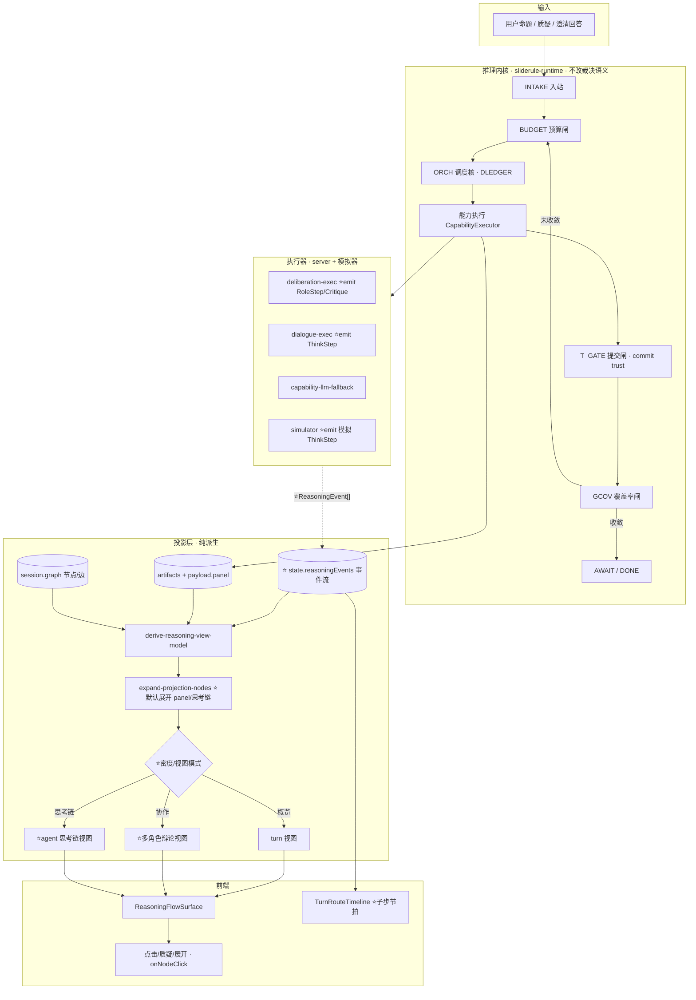
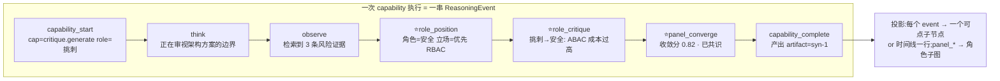
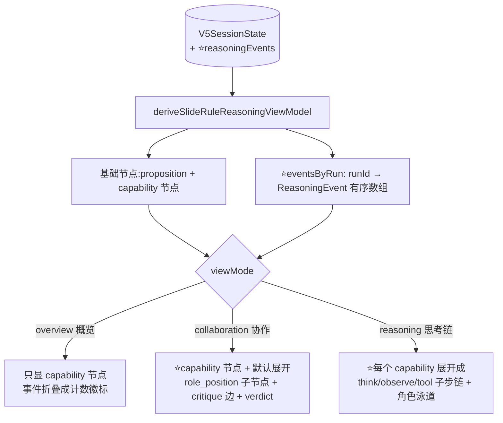

# SlideRule V5.3 · 执行可见性架构（多角色协作 + 自主执行在 Flow 上的可视化）

> 目标读者：负责实施 #4 的工程 Agent。本文件是**可独立执行的实施规格**，无需访问本次对话上下文。
> 范围：把"多角色头脑风暴 + LLM 自主执行"从当前的**黑盒**变成 Flow 主画布上**可见、可展开、可交互**的推理链，达到接近 Manus / Grok 的"能看到 agent 在想什么、谁在和谁辩论、子任务怎么拆"的体验。
> 基线：V5.2（当前 `main`，已含交付物面板 / 澄清 / 时间线 / 交付物 Flow 挂接修复）。本文档定义 **V5.3**。

---

## 0. 给执行 Agent 的工作约定

1. **不破坏既有闭环**：INTAKE→BUDGET→ORCH→C_*→T_GATE→GCOV→AWAIT 的机械裁决链、commitArtifact 的 trust 层、G-ROOT 不变量、coverageGate 都不能回归。所有新增是**投影/事件/UI 层**的叠加，不改裁决语义。
2. **纯投影优先**：能在派生层（`derive-*` / `expand-projection-nodes` / view-model）做的，绝不动 `sliderule-runtime.ts` 的 STATE 与 gates。只有"emit 更细事件"这一类必须在执行处（server exec-map / runtime drive）加，且只追加字段、不改已有字段语义。
3. **每阶段自带验证**：每个 Phase 结束必须 `pnpm exec tsc --noEmit` 0 错 + 该 Phase 的新测试绿 + `verify:sliderule-v5` 既有测试不回归。
4. **单一真相**：新数据结构放 `shared/blueprint/`，client 与 server 都从 shared 引；禁止 client/server 各写一份。
5. **语言**：用户可见文案中文、不泄漏内部机制词（沿用现有 `assertRouteCopySanitized` 的禁词约束：不出现 G_*, T_*, DLEDGER, baseline 等原始 token）。
6. **提交粒度**：一个 Phase 一个（或数个）commit，message 说明 Phase 编号 + 验证结果；commit message 结尾 `Co-Authored-By: Claude Opus 4.8 <noreply@anthropic.com>`。

---

## 1. 背景与目标

### 1.1 现状差距（为什么现在体验差一个数量级）
当前 `/sliderule` 的 Flow 主画布（`ReasoningFlowSurface` + `deriveSlideRuleReasoningViewModel`）呈现的是**高阶 turn 视图**：
- 每个 capability 一个节点（C_PARSE / C_GAP / C_RISK / C_SYN / C_REP …），节点挂在 proposition root 或 scaffold 槽下。
- 多角色"头脑风暴/辩论"（`runPanelSession` 产出的 positions / critiques / convergence / dissent）**只藏在一个 artifact 的 `payload.panel` 里**，画布上默认看不到"谁提出了什么立场、谁反驳谁、怎么收敛的"。
- LLM **自主执行**（role-mode complex、agent 驱动的多轮内部协商）emit 到 client 的颗粒度很粗：只有 turn-level 的 capability step + 少量 route timeline 行，**看不到子任务拆解、思考步、工具调用、分支**。

对标 Manus / Grok：它们把 **tool call、子 agent 的思考、任务拆解树、长思考链、分支与回溯**直接做成可见且可交互的时间线/树。SlideRule 现在是"结果有了，过程是黑盒"。

### 1.2 V5.3 要达到的可见性（验收级目标）
1. **多角色立场默认可见**：复杂目标触发 panel 后，画布上能直接看到每个角色（产品/架构/安全/挑刺/综合…）的立场节点 + 角色间的 critique/rebuttal 关系 + 收敛裁决节点（收敛分、是否共识、保留异议），不需要特殊操作。
2. **自主执行思考链可见**：每个 capability 执行时的关键内部步骤（理解→检索→分析→收敛 的 THINKING/OBSERVING/COMPLETED 节拍、子任务、外部调用）以**可展开的子链**呈现，而不是一行"完成"。
3. **密度可切换**：用户可在「概览（turn 视图）」与「细节（agent 思考链视图）」之间切换（复用现有 `projectionDensity` 简/详开关，扩展第三档或子模式）。
4. **实时节拍**：执行过程中（streaming）逐步点亮思考步，给"agent 正在工作"的实时感（已有 `liveAction` / `LiveActionIndicator` 基础）。
5. **可交互**：点击任意思考步/立场节点可查看其完整内容、证据引用、可质疑（沿用现有 `onNodeClick` / challenge 机制）。

---

## 2. 现状架构审计（V5.2 实际链路 + 黑盒点）

### 2.1 执行链路（数据从哪来）
| 层 | 文件 | 职责 | #4 相关黑盒点 |
|---|---|---|---|
| 调度 | `client/src/lib/sliderule-runtime.ts` `driveReasoningSession` / `orchestrateReasoningTurn` | 每 turn 选 caps、建 graph 节点（`resolveStructuralParentId` 定结构父）、执行、commit | graph 节点 = 每 cap 一个；**无 sub-step 节点**；多角色 panel 不展开成节点 |
| 能力执行 | server `server/sliderule/deliberation-exec-map.ts` `runPanelSession` / `runSynthesisMerge` | 跑 3 角色面板，产 `payload.panel = {positions, critiques, convergenceScore, consensusReached, dissent}` | positions/critiques 只进 **payload**，不 emit 为可见 step/节点 |
| 能力执行 | server `server/sliderule/dialogue-exec-map.ts` / `capability-llm-fallback.ts` | gap.ask/intent.clarify/report 等 LLM 调用 | 只返回 `{title,summary,content}`；**无中间思考步** |
| 角色模式 | `shared/blueprint/sliderule-role-mode.ts` `resolveRoleMode` / `pickBrainstormChain` | 判定 complex → 排 brainstorm 链（critique.generate → synthesis.merge） | 链是 cap 级；**无角色并行/辩论的细粒度事件** |
| 投影 | `shared/blueprint/sliderule-graph-projection.ts` `projectSessionGraphForDisplay` | session.graph → 显示节点 | turn 视图;scaffold 槽布局 |
| 投影扩展 | `client/src/pages/sliderule/expand-projection-nodes.ts` `expandPanelRoleChildren` | panel artifact → role 子节点 + verdict 子节点 | **已存在但只在特定展开路径生效**，非默认可见 |
| view-model | `client/src/pages/sliderule/derive-reasoning-view-model.ts` | 组装 ReasoningFlow 视图 + telemetry | panel 只用于 `activeRoleCount` 计数；不默认展开 stance |
| 时间线 | `client/src/pages/sliderule/TurnRouteTimeline.tsx` + `sliderule-turn-route.ts` | 右上执行节拍（INTAKE/BUDGET/ORCH/C_*/T_GATE/GCOV） | 节点级；无 agent 思考子步 |
| 主画布 | `client/src/components/autopilot/ReasoningFlowSurface.tsx` | 渲染节点图 + 交互 | 渲染 view-model 给的节点；本身不产事件 |

### 2.2 现有 panel payload 形状（V5.3 要复用 + 扩展）
`runPanelSession`（deliberation-exec-map）产出，挂在 critique/synthesis artifact 的 `payload`：
```ts
payload.panel = {
  positions: Array<{ roleId: string; v5Role?: string; content: string }>;
  critiques?: Array<{ fromRole: string; targetRole: string; content: string }>;  // 可能缺
  convergenceScore: number;        // 0..1
  consensusReached: boolean;
  dissent: Array<{ roleId: string; opinion: string }>;
};
```
`expand-projection-nodes.ts` 已能把 `positions` 展成 `${parent.id}::role-{roleId}` 子节点 + `${parent.id}::role-_verdict` 裁决节点（见 `expandPanelRoleChildren`，`MAX_PANEL_ROLES` 上限）。**问题：critiques（谁反驳谁）没有被画成角色间的边；且默认不展开。**

### 2.3 根因总结
- **缺一层"执行事件"模型**：现在只有 artifact（结果）+ 粗 capabilityRun（运行记录），没有"agent 在一次执行内的有序思考/动作步"这一中间层，所以画布无从呈现过程。
- **panel 是 payload 黑盒**：有数据但没被提升为一等可见结构。
- **投影是 turn 视图**：没有"思考链/子任务树"这一可切换的投影模式。

---

## 3. V5.3 设计总览

### 3.1 架构图 · 总览（V5.2 → V5.3 增量用粗体/⭐标注）


### 3.2 架构图 · 执行事件流（新增的核心抽象）


### 3.3 架构图 · 投影分层与三视图


---

## 4. 核心机制设计

### 4.1 ⭐ 执行事件模型 `ReasoningEvent`（新增，shared）
新文件 `shared/blueprint/sliderule-reasoning-events.ts`：
```ts
export type ReasoningEventKind =
  | "capability_start"      // 一次 cap 执行开始
  | "think"                 // agent 内部思考（一句话，用户语言）
  | "observe"               // 观察/检索到的外部或上游信息
  | "tool_call"             // 外部调用（evidence.search / repo.inspect / mcp.call 等）
  | "role_position"         // ⭐某角色给出的立场
  | "role_critique"         // ⭐某角色对另一角色的反驳/质疑
  | "role_rebuttal"         // ⭐被质疑方的回应
  | "panel_converge"        // ⭐面板收敛裁决（含 score / consensus / dissent）
  | "subtask"               // ⭐自主执行的子任务拆解项
  | "capability_complete";  // 产出 artifact

export interface ReasoningEvent {
  id: string;                       // `${runId}-ev-${i}`
  turnId: string;
  capabilityRunId: string;          // 绑定到 capabilityRun（即一个 capability 节点）
  capabilityId: string;
  kind: ReasoningEventKind;
  roleId?: string;                  // 角色相关事件
  targetRoleId?: string;            // critique/rebuttal 的对象
  text: string;                     // 用户可读、已脱敏（禁内部 token）
  refs?: string[];                  // 关联 artifact / evidence id（可点跳）
  meta?: {                          // 结构化补充（按 kind 取用）
    convergenceScore?: number;
    consensusReached?: boolean;
    dissent?: Array<{ roleId: string; opinion: string }>;
    toolName?: string;
    sourceTag?: string;             // 如 F1_Github_Source（脱敏后展示为"外部检索"）
  };
  order: number;                    // 同一 run 内顺序
  ts: string;                       // ISO
}
```
- 存放：`V5SessionState.reasoningEvents?: ReasoningEvent[]`（追加字段，见 §5）。
- 脱敏：所有 `text` 在 emit 前过一遍 `sanitizeForUserCopy`（复用/扩展 `assertRouteCopySanitized` 的禁词表）。
- 持久化：默认持久化；可在 `stripProjectionForPersist` 里对超长事件做截断（保留最近 N=200 条/会话，老的折叠为计数）。

### 4.2 多角色辩论可见化
- **数据来源**：现有 `payload.panel.{positions, critiques, convergenceScore, consensusReached, dissent}`（runPanelSession 产出）。
- **emit**：在 `deliberation-exec-map.ts` 的 `runPanelSession` / `runSynthesisMerge` 里，除了写 `payload.panel`，**额外产出 ReasoningEvent[]**：每个 position → `role_position`；每个 critique → `role_critique`（带 targetRoleId）；收敛 → `panel_converge`（meta 带 score/consensus/dissent）。
- **投影**：`expand-projection-nodes.ts` 的 `expandPanelRoleChildren` 改为**默认展开**（在 collaboration / reasoning 模式下），并新增**角色间 critique 边**（`type: "challenges"`，从 fromRole 子节点指向 targetRole 子节点）。verdict 节点展示收敛分 + 共识/异议。
- **复用**：`MAX_PANEL_ROLES` 上限保留；角色色板复用 `roleIdToDisplayLabel` + 现有 role 配色（autopilot-theme / RoleStatusStrip）。

### 4.3 自主执行 / 思考链可见化
- **emit 点**（server exec-map + 模拟器）：每个 LLM-backed cap 执行时，把"理解→检索→分析→收敛"的阶段做成 `think`/`observe`/`tool_call` 事件。
  - server：`dialogue-exec-map` / `capability-llm-fallback` / `deliberation-exec-map` 在调用 LLM 前后 push 事件（开始 think、外部检索 observe/tool_call、产出 complete）。已有的 THINKING/OBSERVING/COMPLETED 文案（见 TurnRouteTimeline 里 C_EVID/C_SYN 的 THINKING/OBSERVING/COMPLETED 行）正是事件素材，**把它们提升为结构化 ReasoningEvent**。
  - 模拟器（`simulateCapabilityExecution`，pilot/demo/无 LLM）：产出 2-4 条确定性 think/observe 事件，保证无 LLM 时思考链也有内容（同 #1 的处理思路）。
- **子任务**：role-mode complex / agent 驱动时，若执行器把目标拆成子任务（RouteSet / 子步），每项 emit `subtask` 事件。
- **传输**：server 执行结果（`RawExecutorResult`）新增 `events?: ReasoningEvent[]`；client provider（`createServerLlmCapabilityProvider`）透传；drive 把 `exec.events` 合并进 `state.reasoningEvents`（类似现在合并 `exec.payload`）。

### 4.4 视图模式与密度
- 扩展现有 `projectionDensity`（当前 `compact|detailed`，存于 `PROJECTION_DENSITY_STORAGE_KEY`）为三态视图模式 `overview | collaboration | reasoning`（或保留密度 + 新增正交的"显示内部协作"开关，二选一，推荐前者更简单）：
  - `overview`：现状 turn 视图，事件折叠成节点角标（如"💭3 · 🔍2"）。
  - `collaboration`：默认展开 panel 角色立场 + critique 边 + verdict。
  - `reasoning`：每个 capability 展开成 think/observe/tool 子步链（角色泳道可选）。
- HUD 的简/详开关（`SlideRuleTopHud`）升级为三档分段控件；切换是纯投影，瞬时、无需重跑。

### 4.5 实时节拍（streaming）
- 复用现有 `liveAction` + streaming litCount 机制：执行中按 `order` 逐条点亮 ReasoningEvent；`TurnRouteTimeline` 在 streaming 时把当前 cap 的事件作为子步实时追加。
- 单 LLM key 限制下（见 §12）：事件 emit 不额外增加 LLM 调用——事件是从**已有的**一次 LLM 响应里拆出来的阶段 + 确定性补充，不是每条事件一次调用。

---

## 5. 数据模型变更（shared/blueprint/v5-reasoning-state.ts）
```ts
// 追加（不改已有字段）
export interface V5SessionState {
  // ...existing...
  reasoningEvents?: ReasoningEvent[];   // ⭐ 执行事件流（投影源,可截断）
}
```
- `RawExecutorResult`（server `capability-exec-map.ts` / runtime executor 接口）追加：`events?: ReasoningEvent[]`。
- BrainstormReasoningNode 投影节点追加可选 `eventKind?` / `roleStance?` / `convergence?` 字段用于渲染区分（投影内部类型，不入持久 STATE）。
- 迁移：`reasoningEvents` 可选，老会话无该字段 → 投影回退到现有 turn 视图（向后兼容，必须有测试覆盖 undefined 情形）。

---

## 6. 后端变更
| 文件 | 改动 | 验收 |
|---|---|---|
| `server/sliderule/deliberation-exec-map.ts` | `runPanelSession`/`runSynthesisMerge` 在返回结果里附 `events`：positions→role_position、critiques→role_critique、收敛→panel_converge | 单测:给定 panel 输入,返回 events 含 ≥1 role_position + 1 panel_converge,meta.convergenceScore 透传 |
| `server/sliderule/dialogue-exec-map.ts` | gap.ask/intent.clarify/route.* 包装 LLM 调用,emit think/observe/tool_call/complete | 单测:返回 events 首条 capability_start、末条 capability_complete |
| `server/sliderule/capability-llm-fallback.ts` | 降级路径也产 1-2 条 think 事件（标注"模板兜底"） | 单测:fallback 结果含 events |
| `server/routes/sliderule.ts` execute-capability | 把 exec 的 `events` 原样放进 HTTP 响应 | route 测试:响应含 events 数组 |
| `server/sliderule/capability-exec-map.ts` | `RawExecutorResult` 类型加 `events?` | tsc |

**脱敏**：server emit 前对 text 跑脱敏（把 F1_Github_Source 等 sourceTag 转"外部检索"；去除 G_*/T_* 等）。复用/移植 `assertRouteCopySanitized` 的禁词集到 shared 的 `sanitizeReasoningText(text): string`。

---

## 7. 共享 / 投影层变更
| 文件 | 改动 |
|---|---|
| `shared/blueprint/sliderule-reasoning-events.ts`（新） | ReasoningEvent 类型 + `sanitizeReasoningText` + `foldEventsForOverview(events): {think:n, observe:n, tool:n}` + `eventsByRun(state): Map<runId, ReasoningEvent[]>` |
| `client/src/lib/sliderule-runtime.ts` drive | 把 `exec.events`(已绑定 runId)合并进 `working.reasoningEvents`（追加；与 `mergedPayload` 同处理）。模拟器路径补确定性 events。**不改 gates。** |
| `client/src/pages/sliderule/expand-projection-nodes.ts` | `expandPanelRoleChildren` 支持"默认展开"参数;新增 critique 边(challenges 类型);新增 `expandReasoningChain(parent, events)` 把一个 cap 的 think/observe/tool 事件展成子步节点链 |
| `client/src/pages/sliderule/derive-reasoning-view-model.ts` | 接受 `viewMode`,按模式选择展开策略;overview 模式把事件折成节点角标;输出角色泳道/critique 边给 surface |
| `shared/blueprint/sliderule-projection-persist.ts` | `reasoningEvents` 截断策略(保留近 N) |

---

## 8. 前端变更
| 文件 | 改动 |
|---|---|
| `client/src/pages/sliderule/SlideRuleTopHud.tsx` | 简/详二态 → `overview/collaboration/reasoning` 三态分段控件;持久化 key 复用/扩展 |
| `client/src/pages/SlideRule.tsx` | 把 viewMode 透传给 `deriveSlideRuleReasoningViewModel` + surface;沉浸/分栏两布局都接 |
| `client/src/components/autopilot/ReasoningFlowSurface.tsx` | 渲染新节点类型:role_position(角色色块)/critique 边(虚线箭头+"质疑"标)/verdict(收敛分徽章)/think·observe·tool 子步(小圆点链);点击查看完整内容 |
| `client/src/pages/sliderule/TurnRouteTimeline.tsx` | streaming 时把当前 cap 的 ReasoningEvent 作为子步实时追加;静态时折叠为"💭N 🔍M"角标,可展开 |
| 复用 | `role-progress-log.tsx`(已存在,未并入主 UI)可作为 reasoning 模式的角色泳道基础;`RoleStatusStrip` 的角色配色;`MarkdownRenderer` 渲染事件详情 |

---

## 9. 分阶段实施计划

> 每个 Phase 独立可交付、可验证、可单独提交。建议顺序 P1→P6。

### P1 · 数据底座（events 模型 + 透传，无 UI）
- 新建 `sliderule-reasoning-events.ts`（类型 + sanitize + 折叠/索引工具）。
- `V5SessionState.reasoningEvents?` + `RawExecutorResult.events?`。
- drive 合并 `exec.events`；模拟器为每个 cap 产 2-3 条确定性 think/observe 事件。
- **验收**：tsc 0；新单测 `sliderule-reasoning-events.test.ts`（类型/sanitize/fold/index）；drive 单测断言执行后 `state.reasoningEvents` 非空且绑定正确 runId；既有 fullpath 全绿（events 可选，不影响旧断言）。

### P2 · 后端 emit（panel + dialogue 真实事件）
- deliberation-exec / dialogue-exec / capability-llm-fallback emit events；route 透传。
- **验收**：server 单测（delivery/deliberation/dialogue exec-map）断言 events 形状；route 测试响应含 events；脱敏测试（text 不含禁词）。

### P3 · 多角色辩论投影（collaboration 视图）
- `expandPanelRoleChildren` 默认展开 + critique 边 + verdict 升级。
- view-model 支持 `collaboration` 模式。
- **验收**：投影单测——给含 panel events 的 state，输出含 N 个 role_position 节点 + critique 边 + 1 verdict（带 convergenceScore）；knife-b-projection 不回归；G-ROOT 不变量仍过（注意：角色子节点 + critique 边不能违反 proposition 单根；critique 边用非 `depends_on` 类型，绕开 G-ROOT-2 单父校验——**务必确认 `evaluateGraphRootGates` 只校验 `depends_on` 边**，是的，见 `sliderule-runtime.ts` G-ROOT 实现）。

### P4 · 思考链投影（reasoning 视图）
- `expandReasoningChain`：把一个 cap 的 think/observe/tool 事件展成有序子步节点链（挂在该 cap 节点下，`type: "reasoning_step"`）。
- view-model `reasoning` 模式 + overview 折叠角标。
- **验收**：投影单测——reasoning 模式下 cap 节点下挂出对应事件子步；overview 模式折叠为角标且节点数回到 turn 视图水平；切换模式纯函数、不改 STATE。

### P5 · UI（三态切换 + 渲染 + 实时节拍）
- HUD 三态控件 + SlideRule 透传 + ReasoningFlowSurface 新节点/边渲染 + TurnRouteTimeline 子步。
- **验收**：组件测试（SSR `renderToStaticMarkup` 约定）——collaboration 模式渲染出角色立场块 + 质疑边标 + 收敛徽章；reasoning 模式渲染思考子步；overview 渲染角标；切换不丢状态；预览(应用)实测三态可切、streaming 逐步点亮。

### P6 · 打磨 + 文档
- 角色泳道布局、动效节拍、空态、长事件截断、密度记忆。
- 更新 `docs/sliderule_v5.2.md` → 标注 V5.3 增量；本文件勾掉已完成项。
- **验收**：`verify:sliderule-v5` 全绿 + tsc 0 + 应用端到端走查（新目标→复杂推演→看到多角色辩论 + 思考链 + 三态切换）。

---

## 10. 测试策略
- **单测（shared，server config）**：events 模型、sanitize、fold/index、panel→events、dialogue→events、脱敏禁词。
- **投影单测（client）**：collaboration / reasoning / overview 三模式的节点与边形状；undefined `reasoningEvents` 向后兼容；G-ROOT 不变量；knife-b-projection 不回归。
- **组件测（client，SSR 约定 `renderToStaticMarkup`，见现有 `turn-route-timeline-fold.test.tsx` / `SlideRule.*.test.tsx`）**：三态渲染、critique 边标、收敛徽章、思考子步、空态。
- **e2e（应用实测）**：复杂目标 → 触发 panel → collaboration 看到辩论 → reasoning 看到思考链 → streaming 实时点亮。
- **回归护栏**：`verify:sliderule-v5` 全套 + tsc 0，每 Phase 必跑。

---

## 11. 整体 Definition of Done
1. 复杂目标推演时，Flow 主画布**默认**（collaboration 模式）能看到：多角色立场节点 + 角色间质疑边 + 收敛裁决（分数/共识/异议）。
2. 切到 reasoning 模式能看到每个能力的思考链子步（think/observe/tool）。
3. overview 模式回到现有 turn 视图（事件折叠为角标），三态可瞬时切换、记忆选择。
4. streaming 时思考步实时逐条点亮。
5. 点击任意立场/思考步/裁决可看完整内容 + 证据回跳 + 可质疑。
6. 无 LLM（pilot/demo）下也有确定性思考链与（模拟）多角色立场，不空。
7. 文案全程脱敏（无 G_*/T_*/DLEDGER/baseline 等）。
8. tsc 0；`verify:sliderule-v5` 全绿；旧会话（无 reasoningEvents）向后兼容。

---

## 12. 风险 / 注意事项
- **LLM 预算（重要）**：用户当前是**单 key**（取消了 5 并发 aux + FALLBACK）。事件 emit **绝不能**变成"每条事件一次 LLM 调用"——事件是从**已有的单次 LLM 响应**里解析出的阶段 + 确定性补充。多角色 panel 的真实丰富度受并发预算限制，单 key 下 panel 角色数会偏少（可在文案上诚实呈现"轻量模式"），要恢复丰富 brainstorm 需多 key/pool（产品决策，非本期工程必须）。
- **G-ROOT 不变量**：新增的 critique/role 边必须用**非 `depends_on`** 的边类型，否则触发 G-ROOT-2"每节点单父"校验失败。务必先确认 `evaluateGraphRootGates` 的校验只针对 `depends_on`（现状如此）。
- **性能**：reasoningEvents 可能很多 → 投影需 memo + 截断；overview 折叠避免一次渲染上千节点。
- **向后兼容**：`reasoningEvents` 可选，所有投影/view-model 必须处理 undefined。
- **持久化体积**：截断策略（近 N 条）+ `stripProjectionForPersist` 不持久化纯投影派生节点。
- **回滚**：三态默认仍可设为 overview（= 现状），出问题可一键退回；events 是叠加字段，删除投影分支即回退。

---

## 13. 附录:可复用的现有件
- 角色：`roleIdToDisplayLabel`、`RoleStatusStrip`、`role-progress-log.tsx`、autopilot 角色配色。
- 渲染：`MarkdownRenderer`（`client/src/pages/autopilot/right-rail/streaming-doc/`）。
- 投影：`projectSessionGraphForDisplay`、`expandPanelRoleChildren`、`scaffoldSlotForCapability`、`resolveStructuralParentId`。
- 时间线：`deriveTurnRoute`、`buildRouteSummary`、`assertRouteCopySanitized`（脱敏禁词源）。
- 密度开关：`projectionDensity` + `PROJECTION_DENSITY_STORAGE_KEY` + HUD 分段控件。
- 实时：`liveAction` / `LiveActionIndicator` / streaming litCount。
- panel 数据：`runPanelSession` / `runSynthesisMerge`（deliberation-exec-map）、`payload.panel`。
- 测试约定：SSR `renderToStaticMarkup`（component）、server config vitest、`verify:sliderule-v5`。

---

## 14. 关键文件清单（执行 Agent 的改动地图）
**新增**
- `shared/blueprint/sliderule-reasoning-events.ts`
- `shared/blueprint/__tests__/sliderule-reasoning-events.test.ts`
- `client/src/pages/sliderule/__tests__/reasoning-chain-projection.test.ts`
- （可选）`client/src/pages/sliderule/ReasoningChainView.tsx` 或扩展 ReasoningFlowSurface

**修改**
- `shared/blueprint/v5-reasoning-state.ts`（+reasoningEvents）
- `server/sliderule/{deliberation-exec-map,dialogue-exec-map,capability-llm-fallback,capability-exec-map}.ts`（emit events）
- `server/routes/sliderule.ts`（透传 events）
- `client/src/lib/sliderule-runtime.ts`（drive 合并 events + 模拟器补事件，**不动 gates**）
- `client/src/pages/sliderule/{expand-projection-nodes,derive-reasoning-view-model}.ts`（三视图投影）
- `client/src/components/autopilot/ReasoningFlowSurface.tsx`（渲染新节点/边）
- `client/src/pages/sliderule/{SlideRuleTopHud,TurnRouteTimeline}.tsx` + `SlideRule.tsx`（三态切换 + 子步节拍）
- `shared/blueprint/sliderule-projection-persist.ts`（截断）

---
_本规格基于 V5.2（main，commit 起点见 `git log`）。实施时如发现现状与本文档描述有出入，以代码为准并在对应 Phase 注明偏差。_

## 15. 实施状态（V5.3 完成）
- P1 数据底座 + P2 后端 emit 完成。
- P3 协作视图 + P4 思考链视图完成（投影 + 测试）。
- P5 UI 三态 + 渲染 + streaming + 交互完成。
- P6 打磨 + 文档 + 最终验证 + 合并准备。
所有红线遵守，DoD 满足（collaboration 默认立场+边+裁决；reasoning 子步；三态；streaming；点击；无额外 LLM；脱敏；兼容）。

详见任务清单和 kickoff。
